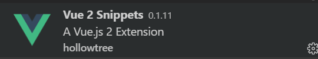
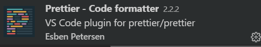
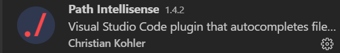

# Vue学习第一天


## 课程安排

1. 总共有27天的课程，从前几期的17天增加到27天
2. 每天上课时长4+2, 2小时自习
3. 分为三个小阶段，Vue基础、pc端项目（黑马头条后台管理系统）还有移动端（黑马头条移动端）
4. Vue基础7天课程，包括基本使用，指令，一些小的案例串起这些知识点


## Vue.js介绍

[官方文档](https://cn.vuejs.org/)

1. Vue跟jquery对比，基本不用操作DOM，只需
2. 要操作数据
3. 大家毕业过后很可能是写Vue.js


## 如何学习Vue.js

1. vue.js的学习会以项目驱动。参考Vue.js文档

2. 顺应Vue.js的语法

   

## Vue.js的基本使用

[传送门](https://cn.vuejs.org/v2/guide/#%E8%B5%B7%E6%AD%A5)


### *Vue基本使用解析


## js表达式

[传送门](https://cn.vuejs.org/v2/guide/syntax.html#%E4%BD%BF%E7%94%A8-JavaScript-%E8%A1%A8%E8%BE%BE%E5%BC%8F)


补充：

1. vue.js的引入地址 <https://cn.vuejs.org/v2/guide/index.html>
2. 导包放在body结束之前


## *Vue指令

[传送门](https://cn.vuejs.org/v2/guide/syntax.html#%E6%8C%87%E4%BB%A4)   

指令 (Directives) 是带有 `v-` 前缀的特殊特性

Vue指令是Vue给HTML标签新增的属性

使用方法：

```HTML

```

Vue指令的作用:作用在它所在的标签上，具体的作用看是什么指令了。


## v-text指令(textContent)

[传送门](https://cn.vuejs.org/v2/api/#v-text)

 

## v-html指令(innerHTML)

[传送门](https://cn.vuejs.org/v2/api/#v-html)


## *v-on指令

[传送门](https://cn.vuejs.org/v2/guide/events.html)

注册事件


## 事件处理方法的参数


### *事件修饰符

[传送门](https://cn.vuejs.org/v2/guide/events.html#%E4%BA%8B%E4%BB%B6%E4%BF%AE%E9%A5%B0%E7%AC%A6)

使用方法:

v-on：事件名.事件修饰符="事件处理方法"

```html
<!-- 阻止单击事件继续传播 -->
<a v-on:click.stop="doThis"></a>

<!-- 提交事件不再重载页面 -->
<form v-on:submit.prevent="onSubmit"></form>

<!-- 修饰符可以串联 -->
<a v-on:click.stop.prevent="doThat"></a>

<!-- 只有修饰符 -->
<form v-on:submit.prevent></form>

<!-- 只有在 `key` 是 `Enter` 时调用 `vm.submit()` -->
<input v-on:keyup.enter="submit">
```


## vue方法中的this

[传送门](https://cn.vuejs.org/v2/api/#methods)


### js表达式的作用域

[传送门](https://cn.vuejs.org/v2/guide/syntax.html#%E4%BD%BF%E7%94%A8-JavaScript-%E8%A1%A8%E8%BE%BE%E5%BC%8F)


## v-bind指令

[传送门](https://cn.vuejs.org/v2/api/#v-bind)


## Demo-计数器


### 实现步骤


### 注意点


## Demo-图片切换


### 实现步骤


### 注意点


## *表单输入绑定 v-model

[传送门](https://cn.vuejs.org/v2/guide/forms.html)


## *v-for指令

[传送门](https://cn.vuejs.org/v2/guide/list.html)


## Demo-记事本


### 实现步骤


### 注意点


## 总结


## 插件推荐

**Vetur** 让vscode提高对vue的支持，比如高亮，比如图标...


**Vue 2 Snippets** vue关键语法的提示



prettier 格式化代码




path Intellisense 路径提示




## 用户代码片段

