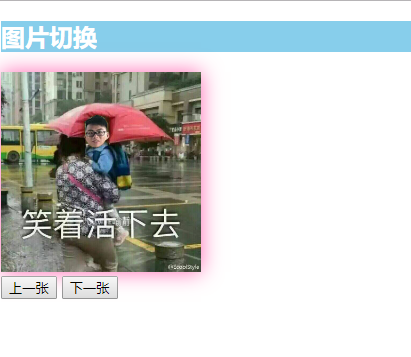

# Vue学习第一天


## 课程安排

1. 总共有27天的课程
2. 每天上课时长6小时
3. 三个小阶段，Vue基础，pc端项目还有移动端
4. Vue基础7天课程，包括基本使用，指令，一些小的案例串起这些知识点


## Vue.js介绍 

1. [官方文档](https://cn.vuejs.org/)
2. Vue.js是一个js框架，相比jquery，**基本**上不用操作DOM
3. 大家将来工作很可能是写Vue的


## Vue.js的HelloWorld

[传送门](https://cn.vuejs.org/v2/guide/#%E8%B5%B7%E6%AD%A5)

1. Vue的学习会以官方文档知识点为主线，但是以项目驱动
2. Vue的读音
   1. 官方的读音是 /fju:/
   2. 国内普通读法 /uju:/
3. 渐进式 是说Vue能够做大的项目也能做小的项目

### Vue基本使用解析

使用Vue

1. 导入vue.js
2. dom结构:Vue管理的容器
3. 实例化new Vue({})
   1. el:'id选择器' 关联到Vue管理的容器
   2. data的值是对象，是可以通过{{}}在Vue管理的容器里面进行渲染。


### js表达式

[传送门](https://cn.vuejs.org/v2/guide/syntax.html#%E4%BD%BF%E7%94%A8-JavaScript-%E8%A1%A8%E8%BE%BE%E5%BC%8F)

1. {{}}也叫插值语法，胡子语法,mustache语法。都一个概念
2. 用法 {{js表达式}}
3. js表达式是js语句，但是得返回一个值


## Vue指令

[传送门](https://cn.vuejs.org/v2/guide/syntax.html#%E6%8C%87%E4%BB%A4)

指令 (Directives) 是带有 `v-` 前缀的特殊特性。

**Vue指令是提供给HTML标签新增的属性**

使用是`v-text="值"`

```html

```


## v-text指令(textContent)

[传送门](https://cn.vuejs.org/v2/api/#v-text)

1. v-text的作用：把值作为文本插入到标签之间

2. 底层的实现textContent

3. 会覆盖掉标签之间的文本

4. {{}},推荐用简写

5. 不能够解析html str

   

## v-html指令(innerHTML)

[传送门](https://cn.vuejs.org/v2/api/#v-html)

1. v-html指令是把值作为用html插入到所在的标签之间。

2. 底层innerHTML实现的。

3. 会覆盖标签之间的文本

4. 没有简写      

5. 使用得比较少

   

## v-on指令

[基本使用](https://cn.vuejs.org/v2/guide/events.html)

注册事件

1. 使用方法 v-on:事件名=“事件处理方法”

2. 简写@，推荐用简写

3. 事件名和原生html标签里注册事件的事件名是一样的。可以是click,dblclick,mouseover,mouseenter,keyup,keydown,keypress,blur,focus

4. methods是el、data是平级的

5. 事件处理方法应该声明在methods里面

6. methods里面的方法，推荐用简洁写法

   

## 事件参数

事件处理方法里面，会默认接受一个事件对象event，比较少使用

事件传参和html注册事件一样的。

如果方法无须参数的话，就不要给括号


### 事件修饰符

[传送门](https://cn.vuejs.org/v2/guide/events.html#%E4%BA%8B%E4%BB%B6%E4%BF%AE%E9%A5%B0%E7%AC%A6)

1. 使用方法 v-on:事件名.修饰符=“事件处理方法”
2. @keyup.enter enter抬起的时候触发的事件
3. .stop阻止事件冒泡
4. .prevent阻止默认默认事件

```html
<!-- 阻止单击事件继续传播 -->
<a v-on:click.stop="doThis"></a>

<!-- 提交事件不再重载页面 -->
<form v-on:submit.prevent="onSubmit"></form>

<!-- 修饰符可以串联 -->
<a v-on:click.stop.prevent="doThat"></a>

<!-- 只有修饰符 -->
<form v-on:submit.prevent></form>

<!-- 只当在 event.target 是当前元素自身时触发处理函数 -->
<!-- 即事件不是从内部元素触发的 -->
<div v-on:click.self="doThat">...</div>

<!-- 只有在 `key` 是 `Enter` 时调用 `vm.submit()` -->
<input v-on:keyup.enter="submit">
```


## vue方法中的this

[传送门](https://cn.vuejs.org/v2/api/#methods)

1. 方法中的this就是Vue实例

2. 方法中的this可以直接访问到data和methods的属性，`this.`

3. 在Vue里面，改变data值，对应的视图会响应。

   

### js表达式的作用域

[传送门](https://cn.vuejs.org/v2/guide/syntax.html#%E4%BD%BF%E7%94%A8-JavaScript-%E8%A1%A8%E8%BE%BE%E5%BC%8F)

js表达式里面的变量都应该是data或者methods的属性


## v-bind指令

[传送门](https://cn.vuejs.org/v2/api/#v-bind)

动态地绑定一个或多个html标签属性

**如果html标签的属性不是写死的，都应该用v-bind**

1. v-bind:src=“js表达式”
2. 简写是 :src="js表达式" 当然推荐用简写
3. :src="imgUrl2" 当我们改变imgUrl2的时候，就会改变src的值，图片改变了。
4. v-bind:class ="js表达式" 可以用三元运算，值为字符串
5. v-bind:disabled="是否禁用" 值为true的时候，禁用;值为false的时候，会移除disabled


## Demo-计数器


### 实现步骤

1. 显示数字
   1. 声明数字 data.num:0
   2. {{data}}
2. +-按钮功能
   1. 点击+ @click:add num++
   2. 点击- @click:sub num--
3. 值是0~10，边界问题
   1. 值为0的时候给-加disabled属性和dislabed的样式
      1. 值为0时添加disabled属性 v-bind:disabled="num===0"
      2. 值为0时候，添加disabled样式 v-bind:class="num==0?'disabled':''"
   2. 值为10的时候给+加disalbed属性和disabled样式
      1. 值为10时添加disabled属性 v-bind:disabled="num===0"
      2. 值为10时候，添加disabled样式 v-bind:class="num==0?'disabled':''"


### 注意点

1. v-bind:disabled="是否禁用"
2. v-bind:class="添加的样式"
3. html标签的disabled属性，只要添加了，就会禁用，无论disabled的值为多少。再者有disabled属性的button，并不会触发点击事件。


## Demo-图片切换



### 实现步骤

1. 显示图片
   1. 图片数组 imgList:[img1,img2,img3,img4]
   2. 数组下标index:0
   3. 取图片 v-bind:src=imgList[index]
2. 上一张和下一张按钮功能的实现
   1. 点击上一张 @click:pre index--
   2. 点击下一张 @click:next index++
3. 图片循环展示
   1. 如果当前是最后一张，点下一张，去到第一张
   2. 如果当前是第一张，点上一张，去到最后一张


### 注意点

1. v-bind:src="imgList[index]"就取个值
2. 边界处理的问题


## 表单输入绑定 v-model

[传送门](https://cn.vuejs.org/v2/guide/forms.html)

你可以用 `v-model` 指令在表单 `<input>`、`<textarea>` 及 `<select>` 元素上创建双向数据绑定。

1. v-model只能用在input、textarea、select三个元素上
2. **获取用户的输入**
3. 双向数据绑定
   1. value改变，data的值跟着改变
   2. data值改变，radio value也改变


## v-for指令

[传送门](https://cn.vuejs.org/v2/guide/list.html)

我们可以用 `v-for` 指令基于一个数组来渲染一个列表。

v-for遍历数组，渲染列表

1. 用法 v-for="元素的别名 in 数组"

2. 用法 v-for="（元素的别名，下标） in 数组"

3. v-for需要写在需要重复的元素，比如li

4. 元素别名和下标也可以在v-for作用的标签上和标签之内使用。

5. in 是一个关键字不能改。

   

## Demo-记事本


### 实现步骤

1. 显示列表
   1. 列表的数据 todoList
   2. v-for遍历todoList ,vfor加在li标签上
2. 输入任务，回车，添加任务
   1. 获取到输入框的内容 v-model
   2. 回车 @keyup.enter:addTodo
   3. 添加任务就是给数组添加一项 todoList.push()
3. 双击删除任务
   1. 双击 @dblclick:delTodo(index)
   2. index来自v-for里面
   3. arr.splice(从哪个下标开始删除，删除多少项)

### 注意点

1. v-model的修饰符
   - [`.lazy`](https://cn.vuejs.org/v2/guide/forms.html#lazy) - 取代 `input` 监听 `change` 事件
   - [`.number`](https://cn.vuejs.org/v2/guide/forms.html#number) - 输入字符串转为有效的数字
   - [`.trim`](https://cn.vuejs.org/v2/guide/forms.html#trim) - 输入首尾空格过滤

2. 字符串的非空判断 推荐用 `if(!this.inputVal)`

3. arr.splice(从哪一项开始删除，删除多少项)

   

## 总结


## 插件推荐

**Vetur** 让vscode提高对vue的支持，比如高亮，比如图标...


**Vue 2 Snippets** vue关键语法的提示


prettier 格式化代码


path Intellisense 路径提示


## 用户代码片段

