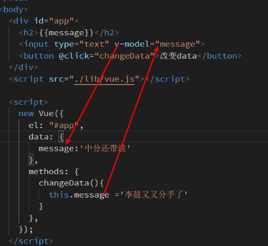

# Vue学习第一天


## 课程安排

> 1. 三个阶段  Vue基础 、黑马头条PC端、黑马头条移动端
> 2. 7天基础课程，总共27天课程


## Vue.js介绍

1. 学好Vue，找到工作没问题

[官方文档](https://cn.vuejs.org/)

>1. 看官网怎么介绍自己
   >2. 建议收藏官网
   >3. Vue是一个js框架，对比jquery, **不需要操作DOM，精力集中在数据上**。
   >4. Vue在行业内的地位，github star排名


## Vue文档简介

[传送门](https://cn.vuejs.org/v2/guide/#%E8%B5%B7%E6%AD%A5)

1. vue读音,两种都要了解
   1. /vju:/
   2. /uju:/

2. 渐进式: vue能做小的项目也能做大的项目

3. 学习Vue的前提，知识储备

4. vue hello world运行

   >1. 问：Vue.js怎么使用？
   >2. 以自己的经验来讲，如何学习Vue--根据官方文档
   >3. 接下来的学习，以文档的知识点为主线，重要的地方或实际工作中用得多的会提。但文档大而全，讲解并不会覆盖文档各个方面。我们另外以项目驱动，在实际的应用场景里面会重点补一下知识点和复习知识点。
   >4. Vue的读音
   >5. 渐进式的解释
   >6. 学习Vue.js的一个知识储备
   >7. 提一下vue.js和开发和生产版本
   >8. vue helloword，看一下代码结构，猜一下运行效果。运行起来，下一节再解释。
   >


### Vue基本使用解析

1. 引入vue.js

2. dom结构，这个Vue管理的容器

3. 实例化Vue
   1. el:'id选择器' 关联Vue管理的容器
   2. data是一个对象，里面的属性 ，在Vue管理的容器中用{{}}渲染

>1. 解释一下代码是什么意思
>2. dom结构，vue.js引入的作用。Vue构造函数是vue.js引入的
>3. el:'#app'猜想选择器关联到dom结构，改一下id验证猜想。el的作用。
>4. id选择器、class、tag选择器，推荐用id选择器
>5. 画图结合模板语法的猜想data数据通过{{}}渲染，修改数据，验证猜想
>6. 总结

```html
<div id="container" class="app">
  {{ message }}
  {{ info }}
  <!--<h2>{{const PI=3.141592653}}</h2>-->
</div>

<!-- 开发环境版本，包含了有帮助的命令行警告 jquery.js 提供错误信息提示-->
<script src="https://cdn.jsdelivr.net/npm/vue/dist/vue.js"></script>

<script>
  new Vue({
    // el: "#container",
    //  el:'.app',
    el: 'div',
    data: {
      message: 'Hello World!',
      info: '今天天气如何'
    }
  })
</script>
```


### js表达式

[传送门](https://cn.vuejs.org/v2/guide/syntax.html#%E4%BD%BF%E7%94%A8-JavaScript-%E8%A1%A8%E8%BE%BE%E5%BC%8F)

js表达式：js语句，返回一个值


>1. 回顾使用Vue使用三个步骤
>2. 渲染message
>3. {{num+1}} {{isRed?'red':''}} {{const PI=3.141592653}}  运算和三元运算是可以的，但是const不行
>4. 给出定义 **js表达式：js语句，返回一个值**
>5. 那么{{1+1}} 可以吗？ {{if}}能吗？
>6. {{}} 胡子语法（画图），插值语法。文档里面胡子语法和插值语法混着用，看文档的时候要理解
>
>

```html
<div id="app">
  <h2>{{msg}}</h2>
  <h2>{{ num + 100 }}</h2>
  <h2>{{ isRed ? 'red' : '' }}</h2>
  <!-- <h2>{{const PI = 3.141592653}}</h2> -->
  <h2>{{1+1}}</h2>
</div>
<script src="./lib/vue.js"></script>
<script>
  const app = new Vue({
    el: '#app',
    data: {
      msg:'还是吃得太饱',
      num: 100,
      isRed: true
    }
  })
</script>
```


## Vue指令

[传送门](https://cn.vuejs.org/v2/guide/syntax.html#%E6%8C%87%E4%BB%A4)

指令 (Directives) 是带有 `v-` 前缀的特殊特性。

**vue提供给HTML标签新增的属性**。

用法和HTML属性一样。 `v-text="值"`

```html

```

>1. 文档对指令的定义
>2. 翻译成我的理解 vue提供给HTML标签的新增属性
>3. HTML img的属性引出指令的语法 v-text="js表达式"
>5. 那么接下来，花一天多的时候介绍一系列指令


## v-text指令（textContent）

[传送门](https://cn.vuejs.org/v2/api/#v-text)

1. v-text把值作为**文本插入**到所在的标签之间

2. Vue内部是textContent实现的

3. 会覆盖掉标签之间的文本

4. 简写{{}}，简写用得更多

5. 不能解析html

   ```html
   <!-- dom结构 -->
   <div id="container">
     <h2>{{message}}</h2>
     <h2 v-text="message"></h2>
     <h2 v-text="message">标签之间的文本</h2>
     <h2>之前的文本{{message}}之后的文本</h2>
     {{alink}}
   </div>
   <!-- vue引入 -->
   <script src="https://cdn.jsdelivr.net/npm/vue/dist/vue.js"></script>
   <!-- 实例化vue -->
   <script>
     /*
         v-text:把值作为文本插入到它所在的标签之间 textContext，会覆盖掉标签之间的文案
         简写就是{{}}，推荐使用{{}}
         v-text不能解析html
       */
     new Vue({
       el:'#container',
       data:{
         message:'李晨又又分手了',
         alink:'<a href="http://www.baidu.com">百度</a>'
       }
     })
   </script>
   ```


>1. 复习Vue使用的三个步骤，{{}}渲染数据
>2. v-text=""的值同样为js表达式，试试message.结果一样，为什么呢。{{}}是v-text简写，工作中我全用{{}}
>3. v-text的作用，底层实现textContent
>4. 对于所有指令，都推荐简写。如果原始写法更简单，为什么要弄个一个简写呢。
>5. {{}}简写有v-text没有的特性, 不会覆盖
>6. 不能解析html
>
>

## v-html指令(innerHTML)

[传送门](https://cn.vuejs.org/v2/api/#v-html)

1. v-html是把值作为html插入到所在的标签之间，内部实现是innerHTML。会覆盖标签之间的html

2. 没有简写

   ```html
   <div id="app">
     <h2>{{alink}}</h2>
     <h2 v-html="alink"></h2>
   </div>
   <script src="./lib/vue.js"></script>
   <script>
     /*
         v-html把值作为html插入到它所在的标签之间。底层实现 innerHTML
         没有简写
         */
     new Vue({
       el: "#app",
       data: {
         alink:'<a href="http://www.baidu.com">百度</a>'
       }
     });
   </script>
   ```

>1. 换一个能解析html的指令
>2. vue-tpl生成vue模板。不需要再回顾使用Vue的三个步骤，建议同学们多敲。自定义代码片段明天再给。
>3. vue.js的引入放在本地。浏览器运行的时候，读取的是本地文件，vue.js在本地，加载速度快。
>4. {{html str}}不能解析，换v-html  引出v-html定义，底层实现
>5. 会覆盖标签之间的文本
>6. 没有简写，用得不是很频繁


## v-on指令

[基本使用](https://cn.vuejs.org/v2/guide/events.html)

1. v-on:事件名="事件处理方法"
2. 事件处理方法声明在methods对象里边，methods和el、data并列
3. 简写@事件名="事件处理方法" 当然推荐用简写
4. 事件名和原生的事件名一致，可以是dblclick,click,mouseover,keyup,keyenter.... 
5. 事件处理方法的默认参数是event对象
6. 方法传参和原来HTML注册事件方法没什么分别

>1. 来个让页面有交互的指令，v-on指令，看一下官方文档
>2. 注册事件，回顾原来HTML注册事件的方法
>3. 引出v-on注册指令。方法声明在methods里面。方法声明methods对象里面。
>4. 简写
>5. 事件名和原生的事件名一致，演示dblclick

```html
<div id="app">
  <input type="button" value="点我呀" v-on:click="sayHello" />
  <input type="button" value="简写" @click="sayHello" />
  <input type="button" value="双击" @dblclick="sayHello" />
</div>
<script src="./lib/vue.js"></script>
<script>
  new Vue({
    el: '#app',
    data: {},
    methods: {
      sayHello() {
        alert('hello')
      }
    }
  })
</script>
```


## 事件参数

1. 默认事件参数是event对象
2. 方法传参和原来HTML注册事件方法没什么分别

> 1. 回顾事件注册
> 2. 方法里面可以接受一个事件对象，Vue帮我们传过来.有些情况下会用到的。
> 3. 传参和原来HTML注册事件没什么分别
> 4. 事件处理方法的调用给括号的情况下，无法接受到Vue传过来的event对象
> 5. methods是一个对象，里面方法声明有三种，推荐ES6的方法。

```html
<div id="app">
  <input type="button" value="点我呀" @click="sayHello" />
  <input type="button" value="逼格" @click="bigger(99)" />
  <input type="button" value="带括号调用" @click="sayHello()">
</div>
<script src="./lib/vue.js"></script>
<script>
  new Vue({
    el: '#app',
    data: {},
    methods: {
      // sayHello:function(){
      //   alert('hello')
      // },
      // 方法的简洁写法
      sayHello:()=>{
        alert('hello')
      },
      // sayHello(event) {
      //   // alert('hello')
      //   console.log(event)
      // },
      bigger(num){
        alert(99*56)
      }
    }
  })
</script>
```


### 事件修饰符

[传送门](https://cn.vuejs.org/v2/guide/events.html#%E4%BA%8B%E4%BB%B6%E4%BF%AE%E9%A5%B0%E7%AC%A6)

使用方法： v-on:事件名.修饰符 = "事件处理方法"

>1. 看文档了解到.stop替代 event.stopPropagation()
>2. 举例@keyup.enter替代event.keyCode===13逻辑
>3. 修饰符的语法
>4. 各个修饰符的作用

```html
<!-- 阻止单击事件继续传播 -->
<a v-on:click.stop="doThis"></a>

<!-- 提交事件不再重载页面 -->
<form v-on:submit.prevent="onSubmit"></form>

<!-- 修饰符可以串联 -->
<a v-on:click.stop.prevent="doThat"></a>

<!-- 只当在 event.target 是当前元素自身时触发处理函数 -->
<!-- 即事件不是从内部元素触发的 -->
<div v-on:click.self="doThat">...</div>

<!-- 只有在 `key` 是 `Enter` 时调用 `vm.submit()` -->
<input v-on:keyup.enter="submit">
```

```html
<div id="app">
  <input type="text" value="李晨又分手了" @keyup.enter="sayHello">
</div>
<script src="./lib/vue.js"></script>
<script>
  new Vue({
    el:'#app',
    data:{

    },
    methods: {
      sayHello(event){
        //enter键被点击了
        // if(event.keyCode===13){
        //   alert('hello')
        // }
        alert('hello')
        // console.log(event)
        // alert('ok')
      }
    },
  })
</script>
```


## vue方法中的this

[传送门](https://cn.vuejs.org/v2/api/#methods)

方法中的 `this` 自动绑定为 Vue 实例。

1. 方法里面的this就是Vue实例
2. 方法里面的this可以访问到data的属性和methods的方法. 用法this.
3. Vue里面属性值改变，对应视图将会"响应"

> 1. vue方法中可以写this，this灵活，功能又强大
> 2. 方法中的this是什么呢？举例打印app及this，二者相等，
> 3. this.data.message没有，打印this. 直接就有message.data和methods里面的属性直接设置到vue实例
> 4. 且this可访问到data及methods的属性，不需要this.data.
> 5. this.msg打印，this.msg赋值，页面动态改变，引出属性值改变，对应视图会响应。
> 6. 方法声明箭头函数里面的this是window, 建议用es6对象里方法的简洁写法

```html
<div id="app">
  <h2>{{msg}}</h2>
  <input type="button" value="点我呀" @click="sayHello">
</div>

<script src="./lib/vue.js"></script>
<script>
  /*
      app是Vue的实例
      Vue的实例可以访问到data的属性，methods的方法
      方法里面的this是Vue实例
      */
  const app = new Vue({
    el: "#app",
    data: {
      msg:'这是一个寂寞的天。。',
      person:{
        name:'Joven',
        sex:'male'
      }
    },
    methods: {
      sayHello(){
        // console.log(this===app)
        this.msg='中分还带波浪。。。'
        // alert('ok')
      },
      print(){
        console.log('print print ...')
      }
    },
  });
  console.log(app)
</script>

```


### 表达式的作用域

[传送门](https://cn.vuejs.org/v2/guide/syntax.html#%E4%BD%BF%E7%94%A8-JavaScript-%E8%A1%A8%E8%BE%BE%E5%BC%8F)

表达式会在所属 Vue 实例的数据作用域下作为 JavaScript 被解析

1. data和methods里面的属性在表达式里面可以直接使用，不要加this

   

> 1. copy上一节课的例子，提到sayHello里面就一句话，能否写在行内。原来HTML注册事件也要以写行内。copy,点行内没有效果。
> 2. 看文档js表达式里面的作用域是Vue实例。data和methods里面的属性在表达式里面可以直接使用，不要加this
> 3. 行内放console.log没效果。能理解吗？需要写在方法里面。

```html
<div id="app">
  <h2>{{msg}}</h2>
  <input type="button" value="点我呀" @click="sayHello">
  <input type="button" value="行内" @click="msg='中分还带波浪。。。'">
  <input type="button" value="打印" @click="print">
</div>

<script src="./lib/vue.js"></script>
<script>
  const app = new Vue({
    el: "#app",
    data: {
      msg:'这是一个寂寞的天。。'
    },
    methods: {
      sayHello(){
        this.msg='中分还带波浪。。。'
      },
      print(){
        console.log('结婚证')
      }
    },
  });
</script>

```


## v-bind指令

[传送门](https://cn.vuejs.org/v2/api/#v-bind)

动态地绑定一个或多个特性

绑定属性，让我们可以动态改变属性的值

v-bind指令动态绑定HTML标签的属性

1. v-bind指令的使用 v-bind:属性名="js表达式"
2. v-bind: src=“imgUrl”， src属性绑定到imgUrl, 改变imgUrl，会动态改变src的值
3. v-bind：可以简写为  :属性名＝"js表达式"　当然推荐简写
4. ｖ-bind:class 动态改变样式
   1. 三元运算切换样式
   2. 对象语法 {类名：是否添加样式}
5. v-bind:style="js对象" 对象的key如果是中划线边连接，建议用字符串或者驼峰 `"background-color"` `backgroundColor`

>1. 看文档v-bind的定义，翻译成自己的理解：绑定属性，让我们可以动态改变属性的值
>
>2. 显示图片的需求，定义变量, {{}}显示URL的改变，猜想 src="{{}}"这种语法，其实行不通, 引入v-bind
>
>3. 查看运行后的html呢。 
>
>4. 解释v-bind:src="imgUrl"的作用，当imgUrl变了，用了v-bind的地方也会重新解析。
>
>   
>
>  5. 第二小节讲v-bind:class 用得更多，先讲解v-bind:class 绑定样式。 查看HTML结构生成的样式。
>
>  6. v-bind:class 三元运算 点击切换样式
>
>  7. v-bind:class 对象的语法 {类名:true}和 {类名:false} 演示一下，然后完成和三元运算同样的效果。
>
>  8. v-bind: class class是追加的
>
>9. 忘记加v-bind:并不会报错，但是样式不生效
>
>   
>
>10. style原始写法，让背景变红色; v-bind:style。传的是一个obj。在js里面写对象的语法。
>
>11. 实现点击切换的红色背景的效果。

```html
<div id="app">
  
  
  <!-- 简写-->
  
</div>
<script src="./lib/vue.js"></script>
<script>
  new Vue({
    el: "#app",
    data: {
      imgUrl: "./img/boy.png"
    },
    methods: {
      changeImg() {
        this.imgUrl = "./img/girl.png";
      }
    }
  });
</script>
```

```html
<div id="app">
  <div :class="bgRed"></div>
  <div :class="isRed?'red':''" @click="isRed=!isRed"></div>
  <div :class="{'green':isGreen}" @click="isGreen=!isGreen"></div>
</div>
<script src="./lib/vue.js"></script>
<script>
  /*
      v-bind：简写 :属性名="js表达式"
      */
  new Vue({
    el: "#app",
    data: {
      bgRed:'red',
      isRed:true,
      isGreen:true
    }
  });
</script>
```

```html
<div id="app">
  <div style="background-color: red"></div>
  <div :style="{'background-color':isRed?'red':'#fff','margin':'20px'}" @click="isRed=!isRed"></div>
</div>
<script src="./lib/vue.js"></script>
<script>
  // var obj ={'background-color':isRed?'red':'#fff','margin':'20px'}
  new Vue({
    el: "#app",
    data: {
      isRed:true
    }
  });
</script>
```


## Demo-计数器


### 实现步骤

1. 数字的显示
2. +-功能实现
3. 数字的范围是0=10，边界问题处理

> 1. 打开页面，查看页面上的行为
> 2. 检查HTML，disabled类名和disabled属性
> 3. 大的思路
> 4. 一边分析怎么实现一边实现功能

### 注意点

1. v-bind:class={'className':true/false} true时候，添加className样式; 否则移除className样式

```js
  /*
  1.数字的显示
    1.声明 data.num
    2.显示 {{num}}
  2.+-功能实现
    1.+ @click:add num++
    2.- @click:sub num--
  3.数字范围是0-10，边界问题的处理
    1.数字为0的时候
      1. 添加disabled属性
      2.-按钮添加'disabled'样式 v-bind:class="{'disabled':num==0}"
    2.数字为10的时候
      1. 添加disabled属性
      2. +按钮添加'disabled' 样式 v-bind:class="{'disabled':num==10}"
  */
```


## Demo-图片切换


### 实现步骤

1. 图片展示
2. 上一张和下一张功能
3. 图片循环展示

> 1. 画图分析有四张图片分析  图片数组及下标 ：src


### 注意点

1. v-bind:src="imgList[index]"

2. 数组的边界的问题

   1. 下一页： 数组元素最后一项->第一项

   2. 上一页： 第一项->数组最后一项

```js
  /*
  1.图片的展示
    1.imgList:[img1,img2,img3,img4] 下标0,1,2,3
    2.index 
    3.imgList[index]  v-bind:src="imgList[index]"
  2. 上一张和下一张的功能
    1. 上一张 @click:pre index--
    2. 下一张 @click:next index++
	3.数组边界的问题处理
    1.点下一张的时候，如果当前显示最后一张，下一张是第一张
    2.点上一张的时候，如果当前显示第一张，下一张是最后一张
  
  */
```


 

## 表单输入绑定 v-model

[传送门](https://cn.vuejs.org/v2/guide/forms.html)

你可以用 `v-model` 指令在表单 `<input>`、`<textarea>` 及 `<select>` 元素上创建双向数据绑定。

1. v-model只能用在表单标签上, input, textarea, select

3. 双向数据绑定：

   1. 表单用户输入改变引起data.message改变
   2. data.message改变引起表单用户输入值的改变

3. v-model是用来获取用户输入的



```html
<div id="app">
      <h2>{{message}}</h2>
      <input type="text" v-model="message">
      <button @click="changeData">改变data</button>
    </div>
    <script src="./lib/vue.js"></script>

    <script>
      new Vue({
        el: "#app",
        data: {
          message:'中分还带波'
        },
        methods: {
          changeData(){
            this.message ='李晨又又分手了'
          }
        },
      });
    </script>
```

>1. 查看文档
>2. v-model只能用在表单元素
>4. 举例说明联动效果
>5. 改变数据输入值改变，双向数据绑定。画图并打字解释
>5. v-model获取用户输入


## v-for指令

[传送门](https://cn.vuejs.org/v2/guide/list.html)

用 `v-for` 指令基于一个数组来渲染一个列表

1. v-for用来遍历数组并生成多个标签

2. v-for作用在需要重复的元素上

3. 语法 v-for="元素别名 in 数组" 或者 v-for="(元素别名,下标别名) in 数组"

4. 在v-for作用的标签之间就可以用使用元素别名和下标别名

5. in是固定的，不能变

   ```html
   <div id="app">
     <ul>
       <li v-for="(movie,index) in movieList">
         {{movie}} --{{index}}
    </li>
     </ul>
   </div>
   <script src="./lib/vue.js"></script>
   <script>
     new Vue({
       el: "#app",
       data: {
         // 电影列表
         movieList:[
           '战狼1',
           '战狼2',
           '战狼3'
         ]
       }
     });
   </script>
   ```


>1. 看文档，详细说明官方的例子。v-for用来遍历，v-for作用在需要重复的元素上
>2. 举例说明，检查页面生成的li元素
>3. 元素别名可以换，in不能改
>


## Demo-记事本


### 实现步骤

1. 展示任务列表
2. 添加任务
3. 删除任务

### 注意点

1. v-for=“（元素别名,下标别名） in 数组”

2. v-model修饰符

   **修饰符**：

   - [`.lazy`](https://cn.vuejs.org/v2/guide/forms.html#lazy) - 取代 `input` 监听 `change` 事件
   - [`.number`](https://cn.vuejs.org/v2/guide/forms.html#number) - 输入字符串转为有效的数字
   - [`.trim`](https://cn.vuejs.org/v2/guide/forms.html#trim) - 输入首尾空格过滤

3. array.splice(从哪个下标开始删除，删除元素的个数)

```js
  /*
  1.展示任务列表
    1. todoList:['睡觉觉','吃饭饭','打豆豆']
    2. v-for="元素别名 in 数组" li就可以使用元素别名
  2. 添加任务
    1.v-model:inputVal
    2.@keyup.enter="addTodo"
    3.todoList.push(inputVal)
  3.删除任务
    1. @dblclick:delTodo(index)
    2. index来自v-for
    3.delTodo todoList.splice(从哪个下标开始删除,删除多少项)
  */
```

> 没啥好说的，就是要讲得细


## v-if,v-else-if,v-else指令

[传送门](https://cn.vuejs.org/v2/guide/conditional.html)

`v-if` 指令用于条件性地渲染一块内容。这块内容只会在指令的表达式返回 truthy 值的时候被渲染。

1. v-if=“js表达式”和v-else-if=“js表达式"，如果表达式值为true，才会渲染该元素

2. v-else 以上的条件不满足时，添加所在有元素

   ```html
   <div id="app">
     <h2>老弟，你今年{{ age }}岁</h2>
     <input type="text" v-model="age" />
     <h2 v-if="age<18">偷偷摸摸去网吧！</h2>
     <h2 v-else-if="age<25">光明正大去网吧</h2>
     <h2 v-else>你到了晚婚的年龄了</h2>
   </div>
   <script src="./lib/vue.js"></script>
   <script>
     const app = new Vue({
       el: "#app",
       data: {
         age:18
       }
     });
   </script>
   ```

> 1. 看官方文档，把文档的例子敲一下。
> 2. 然后举例年龄
> 3. 提一下else-if的用法


## v-show指令

[传送门](https://cn.vuejs.org/v2/guide/conditional.html#v-show)

`v-show` 只是简单地切换元素的 CSS 属性 `display`。

1. v-show隐藏元素通过改变元素css属性display:none

2. v-if 隐藏元素直接移除dom

3. 对于频繁切换隐藏和显示的元素，就用v-show

   ```html
   <div id="app">
     <button @click="isShow=!isShow">切换显示</button>
     <h2>使用v-if</h2>
     <h2 v-if="isShow">中分还带波浪，是不是很萌呢</h2>
     <h2>使用v-show</h2>
     <h2 v-show="isShow">中分还带波浪，是不是很萌呢</h2>
   </div>
   <script src="./lib/vue.js"></script>
   <script>
     new Vue({
       el:'#app',
       data:{
         isShow:true
       }
     })
   </script>
   ```

> 1. 查看官方文档，简要说明v-show的功能和使用
> 2. 举例对比v-if和v-show
> 3. 对于频繁切换就用v-show


## 总结


## 插件推荐

**Vetur** 让vscode提高对vue的支持，比如高亮，比如图标...

**Vue 2 Snippets** vue关键语法的提示


## 用户代码片段

