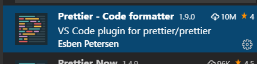
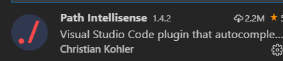

# Vue学习第一天


## 课程安排

1. 总共有27天的课程，从前几期的17天增加到27天
2. 每天上课时长6小时
3. 分为三个小阶段，Vue基础、pc端项目（黑马头条后台管理系统）还有移动端（黑马头条移动端）
4. Vue基础7天课程，包括基本使用，指令，一些小的案例串起这些知识点

> 1. 首先呢，我们来看一下课程的安排
> 2. 课程天数从上一期的17天增加到27天
> 3. 27天的课程分为3个阶段，vue基础、pc端项目和移动端项目
> 4. Vue的基础课程，总共7天，会讲到Vue语法，指令，还有一些小型的项目来把前面的知识串起来


## Vue.js介绍

1. [官方文档](https://cn.vuejs.org/)
2. Vue.js是一个js框架，相比jquery，**基本上不用**操作DOM
3. 大家将来工作很可能是写Vue的

> 1. 首先来了解一下我们要学的这个vue.js到底是个啥东东呢?好，来它的官网看看，是怎么介绍它自己的。
>
> 2. 带着大家找一个官方文档
>
> 3. 建议大家把Vue官方网站收藏了。官方文档整体翻译质量高，还有文档本身很详细,后面的学习和工作中会经常参考到官网
>
>    4. 渐进式Javascript框架，我们学过哪些js框架呢?回顾一下jquery.js的使用。相比jquery, Vue.js基本上不用
>
> 操作DOM
>
>    5. 接着我们来看一下，Vue在行业内的地位。github上star数的排名，大家毕业后，很有可能就是写Vue.js的。


## 如何学习Vue.js

1. Vue.js的学习会参考Vue官方文档，以项目驱动学习。
2. 顺应Vue的语法

> 1. 我说一下我是怎么学习vue.js。分期乐会员的前端架构是我搭的，基于Vue，但是在此之前我都没接触过Vue，我是在入职前参考这份文档，从前到尾看一了一遍，重点的代码敲了，然后实际工作中遇到问题， 再回头看看这份文档。妥妥的。
> 2. 那么接下来Vue的学习，会参考文档教程，并不会覆盖教程的各个方面，重要的地方或实际工作中 用得多的会重点练习。而且会用案例和项目把知识点串起来，在实际的应用场景里面会复习已经学过知识点和补充知识点。
> 3. 总体来说，Vue语法不算难，但是比js过滤到jquery要稍难点。先要顺应Vue的语法。在学习过程中，理解Vue的精髓。


## Vue.js的基本使用

[传送门](https://cn.vuejs.org/v2/guide/#%E8%B5%B7%E6%AD%A5)

1. Vue的读音
   1. 官方的读音 /vju:/
   2. 国内很多人读 /uju:/
2. 渐进式 是说Vue能够做大的项目也能做小的项目

> 1. 那么vue.js怎么用呢?在文档的这里有一个起步，这个就是入门教程。接下来呢，我们就参考这份文档， 把vue.js运行起来
>
> 2. vue的读音
>
> 3. 渐进式解释
>
> 4. 学习Vue.js的知识储备
>
> 5. copy helloworld代码，并对比vue.js开发和生产版本
>
> 6. 再一下代码结构，我们猜想，运行结果会是什么。好，我们运行起来看看， Hello Vue.js 。下一节我们再
>
>    来解释为什么页面上会显示Hello vue.js


### Vue基本使用解析

使用Vue步骤

1. 导入vue.js
2. dom结构:Vue管理的容器
3. 实例化new Vue({})
   1. el:'id选择器' 关联到Vue管理的容器
   2. data的值是对象，是可以通过{{}}在Vue管理的容器里面进行渲染。

```html
<!-- {{message}} -->
<div id="container" class="app">
  {{ message }}
  <h2>{{ info }}</h2>
</div>

<!-- 开发环境版本，包含了有帮助的命令行警告 jquery.js 提供更多的错误信息提示-->
<script src="https://cdn.jsdelivr.net/npm/vue/dist/vue.js"></script>
<!-- 生产环境版本，优化了尺寸和速度 jquery.min.js 更适合发上线-->
<!-- <script src="https://cdn.jsdelivr.net/npm/vue"></script> -->
<script>
  /*
        el是关联到Vue管理的容器
        id选择器，class选择器，标签选择器.
        id是唯一的，所以推荐用id
      */
  var app = new Vue({
    // el: '#container',
    // el:'div',
    el: ".app",
    data: {
      message: "Hello World!",
      info: "今天天气如何？"
    }
  });
</script>
```

> 1. Vue是一个构造函数，谁引入的呢。 Vue构造函数是vue.js引入的
> 2. el:'#app'猜想选择器关联到dom结构，改一下id验证猜想。el的作用是关联Vue管理的容器
> 3. 那么Vue管理的容器外当然不能渲染了。试试
> 4. 既然是选择器，我们还学过哪些选择器呢？class选择器和tag选择器。推荐用id选择器。 
> 5. 画图结合模板语法的猜想data数据通过{{}}渲染，修改数据，验证猜想

## js表达式

[传送门](https://cn.vuejs.org/v2/guide/syntax.html#%E4%BD%BF%E7%94%A8-JavaScript-%E8%A1%A8%E8%BE%BE%E5%BC%8F)

1. {{}}也叫插值语法，胡子语法,mustache语法。都一个概念
2. 用法 {{js表达式}}
3. js表达式是js语句，但是得返回一个值

```html
<!-- dom结构 -->
<div id="container">
  <h2>{{ message }}</h2>
  <h2>{{ num * 23 }}</h2>
  <h2>{{ isRed ? 'red' : 'green' }}</h2>
  <!-- <h2>{{const PI=3.1415926535}}</h2> -->
</div>
<!-- 导入vue.js -->
<script src="https://cdn.jsdelivr.net/npm/vue/dist/vue.js"></script>
<!-- 实例化Vue -->

<script>
  const PI=3.1415926535
  new Vue({
    el: '#container',
    data: {
      message: '中分还带波浪，是不是很萌',
      num: 99,
      isRed: true
    }
  })
</script>
```

> 1. 在Vue的基本使用里面，我们用{{}}渲染数据对吧，message和info都是字符串，其实{{}}不仅仅可以渲染 字符串，它可以解析一个js表达式。什么是js表达式呢，看传送门。 
> 2. 那么什么是js表达式呢，看代码 
> 3. 回顾使用Vue使用三个步骤 
> 4. 渲染message 
> 5. {{num+1}} {{isRed?'red':''}} {{const PI=3.141592653}} 运算和三元运算是可以的，但是const不行 6. 我的理解是：js表达式就是结果是一个值的js语句 
> 6. 那么{{1+1}} 可以吗？ {{if}}能吗？ 
> 7. {{ }} 胡子语法（画图），插值语法和mustache语法是同一个意思。文档里面胡子语法和插值语法混着 用，看文档的时候要理解


## Vue指令

[传送门](https://cn.vuejs.org/v2/guide/syntax.html#%E6%8C%87%E4%BB%A4)

指令 (Directives) 是带有 `v-` 前缀的特殊特性。

**Vue指令是提供给HTML标签新增的属性**

使用是`v-text="值"`

```html

```

> 1. Vue并不只是用来渲染数据，接下来介绍Vue的一个重要特性。--vue指令 
> 2. 文档对指令的定义 3. 翻译成我的理解 vue提供给HTML标签的新增属性 4. HTML img的属性引出指令的语法 v-text="js表达式" 5. 那么接下来，我们会花一天多的时间介绍一系列Vue指令

## v-text指令(textContent)

[传送门](https://cn.vuejs.org/v2/api/#v-text)

1. v-text的作用：把值作为文本插入到标签之间

2. 底层的实现textContent

3. 会覆盖掉标签之间的文本

4. 推荐用简写{{}}

5. 不能解析html

```html
<div id="app">
  <h3>{{msg}}</h3>
  <h3 v-text="msg"></h3>
  <h3 v-text="msg">标签之间的文本</h3>
  <h2>前面的文本--{{msg}}--之后的文本</h2>
  {{alink}}

</div>
<script src="./lib/vue.js"></script>
<script>
  /*
      v-text作用就是把值作为文本插入到所在的标签之间。
      底层实现是textContent
      会覆盖掉标签之间的文本
      {{}}是简写,推荐用简写
      不能解释html
      */
  const app = new Vue({
    el: "#app",
    data: {
      msg: '还是吃得太饱了',
      alink: '<a href="http://www.baidu.com">百度</a>'
    }
  });
</script>
```

> 1. 接下来我们来学习第一个指令，v-text，text是什么意思呢。文本，那肯定跟文本有关对吗？ 
>
> 2. 看代码，还记得使用vue的三个步骤吗？好，我这弄一个自定义代码段，一键生成基本结构。 
>
> 3. vue-tpl生成vue模板。不需要再回顾使用Vue的三个步骤，建议同学们多敲。自定义代码片段先不给大家。 
>
> 4. vue.js的引入放在本地。浏览器运行的时候，读取的是本地文件，vue.js在本地，加载速度快。 
>
> 5. v-text=""的值同样为js表达式，试试message.结果一样，为什么呢。{{}}是v-text简写 
>
> 6. v-text的作用
> 7. 内部实现textContent 
>
> 7. 对于所有指令，都推荐简写。如果原始写法更简单，为什么要弄个一个简写呢。 
>
> 8. {{}}简写有v-text没有的特性, 不会覆盖 
>
> 9. 不能解析html 
>
> 10. 工作中几乎全用{{}}


## v-html指令(innerHTML)

[传送门](https://cn.vuejs.org/v2/api/#v-html)

1. v-html指令是把值作为用html插入到所在的标签之间。
2. 底层innerHTML实现的。
3. 会覆盖标签之间的文本
4. 没有简写      
5. 使用得比较少

```html
<div id="app">
  <h4>{{alink}}</h4>
  <h4 v-html="alink"></h4>
  <h4 v-html="alink">标签之间的文本</h4>
</div>
<script src="./lib/vue.js"></script>
<script>
  /*
      v-html指令是把值作为用html插入到所在的标签之间。
      底层innerHTML实现的。
      会覆盖标签之间的文本
      没有简写
      使用得没那么多
      */
  const app = new Vue({
    el: "#app",
    data: {
      alink: '<a href="http://www.baidu.com">百度</a>'
    }
  });
</script>
```

> 1. 刚才不是说v-text指令不能解析html吗？那来一个能解析html的指令v-html 
>
> 2. {{html str}}不能解析，换v-html 引出v-html定义 
>
> 3. 内部实现是innerHTML 
>
> 4. 会覆盖标签之间的文本 
>
> 5. 没有简写，用得不是很频繁


## v-on指令

[基本使用](https://cn.vuejs.org/v2/guide/events.html)

注册事件

1. 使用方法 v-on:事件名=“事件处理方法”
2. 简写@，推荐用简写
3. 事件名和原生html标签里注册事件的事件名是一样的。可以是click,dblclick,mouseover,mouseenter,keyup,keydown,keypress,blur,focus
4. methods是el、data是平级的
5. 事件处理方法应该声明在methods里面
6. methods里面的方法，推荐用简洁写法

```html
<div id="app">
  <input type="button" value="点我呀" v-on:click="sayHello" />
  <input type="button" value="简写" @click="sayHello" />
  <input type="button" value="双击" @dblclick="sayHello" />
</div>
<script src="./lib/vue.js"></script>
<script>
  /*
        注册事件的方法 v-on:事件名="事件处理方法"
        事件处理方法声明在methods
        事件名和原生html里面注册事件的事件名是相同 dblclick,click,mouseover,input,keyup,keydown...
        简写@(at) 推荐用简写
      */
  const app = new Vue({
    el: '#app',
    data: {},
    // 一些方法
    methods: {
      // sayHello:function(){
      //   alert('function')
      // },
      sayHello: () => {
        alert('=>')
      }
      // 简洁写法
      // sayHello() {
      //   alert('Hello')
      // }
    }
  })
</script>
```

> 1. 接着我们学一个让页面有交互的指令，v-on指令，看一下官方文档 
>
> 2. 注册事件，回顾原来HTML注册事件的方法 
>
> 3. 引出v-on注册指令。方法声明在methods里面。方法声明methods对象里面。 
>
> 4. 简写 
>
> 5. 事件名和原生的事件名一致，演示dblclick 
>
> 6. methods是一个对象，里面方法声明有三种，推荐ES6的简洁写法。 


## 事件处理方法的参数

事件处理方法里面，会默认接受一个事件对象event，比较少使用

事件传参和html注册事件一样的。

如果方法无须参数的话，就不要给括号

```html
<div id="app">
  <button @click="sayHello">点我呀</button>
  <button @click="call()">括号</button>
  <button @click="bigger(77)">逼格</button>
</div>
<script src="./lib/vue.js"></script>
<script>
  /*
      方法默认接受一个事件对象，比较少使用
      */
  const app = new Vue({
    el: "#app",
    data: {},
    methods: {
      sayHello(event){
        // alert('hello')
        console.log(event)
      },
      call(event){
        console.log(event) //undefined
      },
      bigger(num){
        alert(num*55)
      }
    },
  });
</script>
```

> 1. 回顾事件注册 
>
> 2. 方法里面可以接受一个事件对象，Vue帮我们传过来。
>
> 3. 事件处理方法的调用给括号的情况下，无法接受到Vue传过来的event对象 
>
> 4. 传参和原来HTML注册事件没什么分别


### 事件修饰符

[传送门](https://cn.vuejs.org/v2/guide/events.html#%E4%BA%8B%E4%BB%B6%E4%BF%AE%E9%A5%B0%E7%AC%A6)

1. 使用方法 v-on:事件名.修饰符=“事件处理方法”
2. 常用的三个事件修饰符
   1. @keyup.enter enter键抬起的时候触发的事件
   2. .stop阻止事件冒泡
   3. .prevent阻止默认事件

```html
<!-- 阻止单击事件继续传播 -->
<a v-on:click.stop="doThis"></a>

<!-- 提交事件不再重载页面 -->
<form v-on:submit.prevent="onSubmit"></form>

<!-- 修饰符可以串联 -->
<a v-on:click.stop.prevent="doThat"></a>

<!-- 只有修饰符 -->
<form v-on:submit.prevent></form>

<!-- 只当在 event.target 是当前元素自身时触发处理函数 -->
<!-- 即事件不是从内部元素触发的 -->
<div v-on:click.self="doThat">...</div>

<!-- 只有在 `key` 是 `Enter` 时调用 `vm.submit()` -->
<input v-on:keyup.enter="submit">
```

```html
<div id="app">
  <a href="http://www.baidu.com" @click.prevent="clickHandler">百度</a>
</div>
<script src="./lib/vue.js"></script>
<script>
  /*
      使用方法: v-on:事件名.修饰符 = "事件处理方法"
      常用的三个事件修饰符
        1. @keyup.enter enter键抬起时触发
        2. .stop阻止事件冒泡
        3. .prevent阻止默认事件
     */
  const app = new Vue({
    el: '#app',
    data: {},
    methods: {
      clickHandler(event) {
        //阻止默认事件
        // event.preventDefault();
        alert('Cool')
      }
    }
  })
</script>
```

> 1. 监听事件还有一些高级的用法，事件修饰符，看文档了解到.prevent替代 event.preventDefault()
> 2. 举例.prevent替代event.preventDefault()逻辑
> 3. 修饰符的语法
> 4. 三个常用修饰符的作用

## vue方法中的this

[传送门](https://cn.vuejs.org/v2/api/#methods)

方法中的 `this` 自动绑定为 Vue 实例。

1. 方法中的this就是Vue实例
2. 方法中的this可以直接访问到data和methods的属性，`this.`
3. Vue的属性值改变，对应的视图会响应。
4. 方法声明建议用方法的简洁写法

```html
<div id="app">
  <h3>{{ message }}</h3>
  <button @click="sayHello">点我呀</button>
</div>
<script src="./lib/vue.js"></script>
<script>
  /*
      方法中的this就是Vue实例
      Vue把data和methods里面属性直接设置到Vue实例上 app.  
      改变data值，对应的视图会响应
      方法声明建议用方法的简洁写法
      */
  const app = new Vue({
    el: '#app',
    data: {
      message: '这是一个寂寞的天',
      person: {
        name: 'Joven',
        age: 30
      }
    },
    methods: {
      sayHello() {
        // alert('hello')
        // console.log(this === app) //true
        this.message = '是兄弟，就来玩贪玩蓝月'
        console.log(this.message)
      },
      // sayHello: () => {
      //   console.log(this) //window
      // }
    }
  })
  console.log(app)
</script>
```


> 1. 在事件处理方法是可以写this，功能强大，使用灵活
> 2. 方法中的this是什么呢？举例打印app及this，看似相等。全等试试，结果全等。
> 3. 重点看一下打印的app, app.data.message没有，直接就有app.message. 添加两个属性，发现app依然
>    可以访问到。 所以data和methods里面的属性直接设置到vue实例
> 4. 那么this可访问到data及methods的属性，不需要this.data.
> 5. this.message打印，this.message赋值，页面动态改变，引出属性值改变，对应视图会响应。
> 6. 方法声明箭头函数里面的this是window, 建议用方法的简洁写法


### js表达式的作用域

[传送门](https://cn.vuejs.org/v2/guide/syntax.html#%E4%BD%BF%E7%94%A8-JavaScript-%E8%A1%A8%E8%BE%BE%E5%BC%8F)

表达式会在所属 Vue 实例的数据作用域下作为 JavaScript 被解析

js表达式里面的变量是Vue实例的属性

1. data和methods的属性在表达式里可以直接使用，不要加this

```html
<div id="app">
  <h3>{{ message }}</h3>
  <button @click="sayHello">点我呀</button>
  <button @click="message = '是兄弟，就来玩贪玩蓝月'">行内</button>
  <button @click="print">打印</button>
</div>
<script src="./lib/vue.js"></script>
<script>
  const app = new Vue({
    el: '#app',
    data: {
      message: '这是一个寂寞的天'
    },
    methods: {
      sayHello() {
        this.message = '是兄弟，就来玩贪玩蓝月'
      },
      print(){
        console.log(5555)
      }
    }
  })
</script>
```


> 1. js表达式的作用域是什么意思呢。我们看文档，copy文档说明。解释。
>
> 2. copy上一节课的例子，提到sayHello里面就一句话，能否写在行内。原来HTML注册事件也要以写行内。 
>
>    copy,点行内没有效果。 
>
> 3. 看文档js表达式里面的作用域是Vue实例。data和methods里面的属性在表达式里面可以直接使用，不要 
>
>    加this 
>
> 4. 行内放console.log没效果。能理解吗？需要写在方法里面。 
>
> 5. 回顾一下，我们之写的一些页面，js表达式里面写的变量都是Vue实例的。 


## v-bind指令

[传送门](https://cn.vuejs.org/v2/api/#v-bind)

动态地绑定一个或多个html标签属性

**如果html标签的属性不是写死的，都应该用v-bind**

1. 使用方法: v-bind:属性名="js表达式"
2. v-bind:src=“imgUrl”，src属性绑定到imgUrl，改变imgUrl，会动态改变src的值
3. 简写是 :属性名="js表达式" 当然推荐用简写
4. :src="imgUrl2" 当我们改变imgUrl2的时候，就会改变src的值，图片改变了。
5. v-bind:class ="添加的类名" 可以用三元运算，值为字符串
6. v-bind:disabled="是否禁用" 值为true的时候，禁用;值为false的时候，会移除disabled

```html
<div id="app">
  <!-- {{imgUrl}} -->
  
  
</div>
<script src="./lib/vue.js"></script>
<script>
  const app = new Vue({
    el: "#app",
    data: {
      imgUrl: './img/cat.gif',
      imgUrl2: './img/girl.png'
    },
    methods: {
      changeImg() {
        this.imgUrl2 = './img/boy.png'
      }
    },
  });
</script>
```

```html
<div id="app">
  <div :class="bgRed"></div>
  <div :class="isRed?'red':''" @click="isRed=!isRed"></div>
</div>
<script src="./lib/vue.js"></script>
<script>
  const app = new Vue({
    el: '#app',
    data: {
      bgRed: 'red',
      isRed: true
    }
  })
</script>
```

```html
<div id="app">
  <button @click="isDisabled=!isDisabled">禁用</button>
  <button :disabled="isDisabled">点我呀</button>
</div>
<script src="./lib/vue.js"></script>
<script>
  const app = new Vue({
    el: "#app",
    data: {
      isDisabled: false
    }
  });
</script>
```


> 1. 看文档v-bind的定义，翻译成自己的理解：当属性值不是一个写死的值时，都需要用动态绑定v-bind 
>
> 2. 显示图片的需求，定义变量, {{}}显示URL的改变，猜想 src="{{}}"这种语法，其实行不通, 引入v-bind 
>
> 3. 查看运行后的html 
> 4.  既然是src的值和变量绑定，那我来改变一下变量。同时v-bind的简写是:
> 5. v-bind既然能绑定属性，那也可以和class属性绑定。v-bind:class=“添加类名”。查看HTML结构生成的样式
> 6. 这里来一个boolean变量，是否添加red样式，由isRed来确定。点击改变isRed.
> 7. 如果忘记写:会怎么样。整个的作为一个类名。
> 8. disabled属性的介绍，v-bind:disabled="是否添加disabled属性"。点击动态添加和移除disabled属性。


## Demo-计数器


### 实现步骤

1. 显示数字
   1. 声明数字 data.num:0
   2. 显示数字{{data}}
2. 点击+按钮，数字+1;点击-按钮，数字-1
   1. 点击+ @click:add num++
   2. 点击- @click:sub num--
3. 数字范围是0~10，边界问题的处理
   1. 值为0的时候给-加disabled属性和dislabed的样式
      1. 值为0时添加disabled属性 v-bind:disabled="num===0"
      2. 值为0时候，添加disabled样式 v-bind:class="num==0?'disabled':''"
   2. 值为10的时候给+加disalbed属性和disabled样式
      1. 值为10时添加disabled属性 v-bind:disabled="num===0"
      2. 值为10时候，添加disabled样式 v-bind:class="num==0?'disabled':''"

### 注意点

1. v-bind:disabled="是否禁用"
2. v-bind:class="添加类名"
3. html标签的disabled属性，只要添加了，就会禁用，无论disabled的值为多少。再者有disabled属性的button，并不会触发点击事件。

> 1. 打开页面，查看页面上的行为
> 2. 检查HTML,disabled类名和disabled属性
> 3. 思路分析
> 4. 思考num++，是否需要判断大于10就不再增加呢？？


## Demo-图片切换


### 实现步骤

1. 显示图片
   1. 图片数组装四张图片 imgList:[img1,img2,img3,img4]
   2. 数组下标index:0
   3. 取图片 v-bind:src=imgList[index]
2. 点击上一张按钮，显示上一张图片;点下一张按钮，显示下一张图片
   1. 点击上一张 @click:pre index--
   2. 点击下一张 @click:next index++
3. 图片循环展示
   1. 如果当前是最后一张，点下一张，去到第一张
   2. 如果当前是第一张，点上一张，去到最后一张


### 注意点

1. 图片的展示 v-bind:src="imgList[index]"就取个值
2. 数组的边界问题
   1. 上一张：最后一张->第一张
   2. 上一张： 第一张->最后一张


## 表单输入绑定 v-model

[传送门](https://cn.vuejs.org/v2/guide/forms.html)

你可以用 `v-model` 指令在表单 `<input>`、`<textarea>` 及 `<select>` 元素上创建双向数据绑定。

1. v-model只能用在input、textarea、select三个元素上
2. **获取用户的输入**
3. 双向数据绑定
   1. 获取用户的输入，value=>data属性
   2. 设置表单元素的值，data属性=>value

```html
<div id="app">
  <h2>{{message}}</h2>
  <input type="text" v-model="message">
</div>
<script src="./lib/vue.js"></script>
<script>
  const app = new Vue({
    el: "#app",
    data: {
      message: '坏得很。。。'
    }
  });
</script>
```

> 1. 查看文档
> 2. v-model只能用在表单元素上，我们学过哪些表单元素呢。
> 3. 举例说明联动效果
> 4. 这个指令也叫双向数据绑定。input的初始值是v-model设置的，message值的也是通过v-model获取的


## v-for指令

[传送门](https://cn.vuejs.org/v2/guide/list.html)

我们可以用 `v-for` 指令基于一个数组来渲染一个列表。

**v-for遍历数组，渲染列表元素**

1. 用法 v-for="元素的别名 in 数组"
2. 用法 v-for="（元素的别名，下标） in 数组"
3. v-for需要写在需要重复的元素，比如li
4. 元素别名和下标也可以在v-for作用的标签上和标签之内使用。
5. in 是一个关键字不能改。

```html
<div id="app">
  <ul>
    <li v-for="(movie,index) in movieList">{{movie}}--{{index}}</li>
  </ul>
</div>
<script src="./lib/vue.js"></script>
<script>
  const app = new Vue({
    el: "#app",
    data: {
      movieList: [
        '上海堡垒',
        '哪吒',
        '烈火英雄',
        '沉默的证人'
      ]
    }
  });
</script>
```

> 1. 看文档，详细说明官方的例子。v-for用来遍历数组生成多个标签，v-for作用在需要重复的元素上
> 2. 举例说明，检查页面生成的li元素
> 3. 元素别名可以换，in不能改


## Demo-记事本


### 实现步骤

1. 显示列表
   1. 列表的数据 todoList:['睡觉觉','吃饭饭','打豆豆']
   2. v-for遍历todoList ,vfor加在li标签上
2. 输入任务，回车，添加任务
   1. 获取到输入框的内容 v-model:inputVal
   2. 回车 @keyup.enter:addTodo
   3. 添加任务就是给数组添加一项 todoList.push()
   4. 清空输入
3. 双击删除任务
   1. 双击 @dblclick:delTodo(index)
   2. index来自v-for里面
   3. arr.splice(从哪个下标开始删除，删除多少项)

### 注意点

1. v-model的修饰符
   - [`.lazy`](https://cn.vuejs.org/v2/guide/forms.html#lazy) - 取代 `input` 监听 `change` 事件
   - [`.number`](https://cn.vuejs.org/v2/guide/forms.html#number) - 输入字符串转为有效的数字
   - [`.trim`](https://cn.vuejs.org/v2/guide/forms.html#trim) - 输入首尾空格过滤

2. arr.splice(从哪一项开始删除，删除多少项)

   


## 总结


## 插件推荐

**Vetur** 让vscode提高对vue的支持，比如高亮，比如图标...


**Vue 2 Snippets** vue关键语法的提示


prettier 格式化代码



path Intellisense 路径提示




## 用户代码片段

