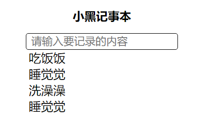

# Vue.js - day01


## Vue.js介绍

1. 自我介绍

2. Vue.js很重要，很流行

   [官方文档](https://cn.vuejs.org/)

   

## Vue文档简介

[传送门](https://cn.vuejs.org/v2/guide/#%E8%B5%B7%E6%AD%A5)

1. vue读音,两种都要了解
   1. /vju:/
   2. /uju:/

2. 渐进式: vue能做小的项目也能做大的项目

### Vue基本使用解析

1. 引入vue.js
2. dom结构，这个Vue管理的容器
3. 实例化Vue
   1. el:'id选择器' 关联Vue管理的容器，官方说法：提供Vue实例的挂载点
   2. data就是数据，在Vue管理的容器中用{{}}渲染
   3. {{js表达式}} 必须是一个值

```html
 <div id="container" class="app">
   {{ message }}
   <h2>{{num+100}}</h2>
   <h2>{{isRed?'red':''}}</h2>
   <!--<h2>{{const PI=3.141592653}}</h2>-->
</div>

<!-- 开发环境版本，包含了有帮助的命令行警告 jquery.js 提供错误信息提示-->
<script src="https://cdn.jsdelivr.net/npm/vue/dist/vue.js"></script>

<!-- 生产环境版本，优化了尺寸和速度 jquery.min.js 压缩过，适合线上 -->
<!-- <script src="https://cdn.jsdelivr.net/npm/vue"></script>-->
<script>
  /*
      el：选择器 表示：关联Vue管理的容器; Vue实例的挂载点,推荐用id
       1. id选择器,class、tag

      data: 数据在Vue容器里用{{}}渲染
      {{js表达式}} 必须返回一个结果
      */
  new Vue({
    // el: "#container",
    //  el:'.app',
    el:'div',
    data: {
      message: "Hello World!",
      num:100,
      isRed:false
    }
  });
</script>
```


## Vue指令

[传送门](https://cn.vuejs.org/v2/guide/syntax.html#%E6%8C%87%E4%BB%A4)

指令 (Directives) 是带有 `v-` 前缀的特殊特性。

Vue指令是Vue提供给HTML标签的属性。`v-xxx="js表达式"`,

指令的特性和v-xxx的xxx有关。会作用在它所在的dom元素上

```html

```


## v-text指令（textContent）

[传送门](https://cn.vuejs.org/v2/api/#v-text)

1. v-text把值作为**文本插入**到所在的标签之间，Vue内部是textContent实现的。会覆盖掉标签之间的文本

2. 简写{{}}，简写用得更多

3. 不能解析html

   ```html
   <!-- dom结构 -->
   <div id="container">
     <h2>{{message}}</h2>
     <h2 v-text="message"></h2>
     <h2 v-text="message">标签之间的文本</h2>
     <h2>之前的文本{{message}}之后的文本</h2>
     {{alink}}
   </div>
   <!-- vue引入 -->
   <script src="https://cdn.jsdelivr.net/npm/vue/dist/vue.js"></script>
   <!-- 实例化vue -->
   <script>
     /*
         v-text:把值作为文本插入到它所在的标签之间 textContext，会覆盖掉标签之间的文案
         简写就是{{}}，推荐使用{{}}
         v-text不能解析html
       */
     new Vue({
       el:'#container',
       data:{
         message:'李晨又又分手了',
         alink:'<a href="http://www.baidu.com">百度</a>'
       }
     })
   </script>
   ```
   
   

## v-html指令(innerHTML)

[传送门](https://cn.vuejs.org/v2/api/#v-html)

1. v-html是把值作为html插入到所在的标签之间，内部实现是innerHTML。会覆盖标签之间的html

2. 没有简写

   ```html
   <div id="app">
     <h2>{{alink}}</h2>
     <h2 v-html="alink"></h2>
   </div>
   <script src="https://cdn.jsdelivr.net/npm/vue/dist/vue.js"></script>
   <script>
     /*
         v-html把值作为html插入到它所在的标签之间。底层实现 innerHTML
         没有简写
         */
     new Vue({
       el: "#app",
       data: {
         alink:'<a href="http://www.baidu.com">百度</a>'
       }
     });
   </script>
   ```
   
   

## v-on指令

[基本使用](https://cn.vuejs.org/v2/guide/events.html)

1. v-on:事件名="事件处理方法"

2. 事件处理方法声明在methods对象里边，methods和el、data并列

3. 简写@事件名="事件处理方法" 当然推荐用简写

4. 事件名和原生的事件名一致，可以是dblclick,click,mouseover,keyup,keyenter.... 

5. 事件处理方法的默认参数是event对象

   ```html
   <div id="app">
     <input type="button" value="点我呀" v-on:click="sayHello">
     <input type="button" value="点我呀" @click="sayHello">
     <input type="button" value="双击" @dblclick="sayHello">
     <input type="button" value="逼格" @click="bigger(99)">
   </div>
   <script src="./lib/vue.js"></script>
   <script>
     new Vue({
       el: "#app",
       data: {},
       methods: {
         sayHello(event){
           // alert('hello')
           console.log(event)
         },
         bigger(num){
           console.log(10*num)
         }
       },
     });
   </script>
   ```
   
   

### 事件修饰符

[传送门](https://cn.vuejs.org/v2/guide/events.html#%E4%BA%8B%E4%BB%B6%E4%BF%AE%E9%A5%B0%E7%AC%A6)

使用方法： v-on:事件名.修饰符 = "事件处理方法"

```html
<!-- 阻止单击事件继续传播 -->
<a v-on:click.stop="doThis"></a>

<!-- 提交事件不再重载页面 -->
<form v-on:submit.prevent="onSubmit"></form>

<!-- 修饰符可以串联 -->
<a v-on:click.stop.prevent="doThat"></a>

<!-- 只有修饰符 -->
<form v-on:submit.prevent></form>

<!-- 添加事件监听器时使用事件捕获模式 -->
<!-- 即元素自身触发的事件先在此处理，然后才交由内部元素进行处理 -->
<div v-on:click.capture="doThis">...</div>

<!-- 只当在 event.target 是当前元素自身时触发处理函数 -->
<!-- 即事件不是从内部元素触发的 -->
<div v-on:click.self="doThat">...</div>

<!-- 只有在 `key` 是 `Enter` 时调用 `vm.submit()` -->
<input v-on:keyup.enter="submit">
```

```html
<div id="app">
  <input type="text" value="李晨又分手了" @keyup.enter="sayHello">
</div>
<script src="./lib/vue.js"></script>
<script>
  new Vue({
    el:'#app',
    data:{

    },
    methods: {
      sayHello(event){
        //enter键被点击了
        // if(event.keyCode===13){
        //   alert('hello')
        // }
        alert('hello')
        // console.log(event)
        // alert('ok')
      }
    },
  })
</script>
```


## vue方法中的this

[传送门](https://cn.vuejs.org/v2/api/#methods)

方法中的 `this` 自动绑定为 Vue 实例。

1. 方法里面的this就是Vue实例

2. 方法里面的this可以访问到data的属性和methods的方法. 用法this.

3. Vue里面属性值改变，对应视图将会"响应"

   ```html
   <div id="app">
     <h2>{{msg}}</h2>
     <input type="button" value="点我呀" @click="sayHello">
   </div>
   
   <script src="./lib/vue.js"></script>
   <script>
     /*
         app是Vue的实例
         Vue的实例可以访问到data的属性，methods的方法
         方法里面的this是Vue实例
         */
     const app = new Vue({
       el: "#app",
       data: {
         msg:'这是一个寂寞的天。。',
         person:{
           name:'Joven',
           sex:'male'
         }
       },
       methods: {
         sayHello(){
           // console.log(this===app)
           this.msg='中分还带波浪。。。'
           // alert('ok')
         },
         print(){
           console.log('print print ...')
         }
       },
     });
     console.log(app)
   </script>
   
   ```
   
   

### 表达式的作用域

[传送门](https://cn.vuejs.org/v2/guide/syntax.html#%E4%BD%BF%E7%94%A8-JavaScript-%E8%A1%A8%E8%BE%BE%E5%BC%8F)

表达式会在所属 Vue 实例的数据作用域下作为 JavaScript 被解析

1. js表达式里面的变量作用域是Vue实例，这些变量是Vue实例能够访问到的

2. js表达式里面的变量必须定义在data和methods里面

   ```html
   <div id="app">
     <h2>{{msg}}</h2>
     <input type="button" value="点我呀" @click="sayHello">
     <input type="button" value="行内" @click="msg='中分还带波浪。。。'">
     <input type="button" value="打印" @click="print">
   </div>
   
   <script src="./lib/vue.js"></script>
   <script>
     const app = new Vue({
       el: "#app",
       data: {
         msg:'这是一个寂寞的天。。'
       },
       methods: {
         sayHello(){
           this.msg='中分还带波浪。。。'
         },
         print(){
           console.log('结婚证')
         }
       },
     });
   </script>
   
   ```
   
   

## v-bind指令

[传送门](https://cn.vuejs.org/v2/api/#v-bind)

动态地绑定一个或多个特性

v-bind指令动态绑定HTML标签的属性

1. v-bind指令的使用 v-bind:属性名="js表达式"

2. v-bind: src=“imgUrl”， src属性绑定到imgUrl, 改变imgUrl，会动态改变src的值

3. v-bind：可以简写为  :属性名＝"js表达式"　当然推荐简写

4. ｖ-bind:class 动态改变样式
   1. 三元运算切换样式
   2. 对象语法 切换样式{'className':true/false} true的时候添加className，false不添加className

5. v-bind:style="js对象" 对象的key如果是中划线边连接，建议用字符串或者驼峰 `"background-color"` `backgroundColor`

   ```html
   <div id="app">
     
     <!-- 简写-->
     
   </div>
   <script src="./lib/vue.js"></script>
   <script>
     new Vue({
       el: "#app",
       data: {
         imgUrl: "./img/boy.png"
       },
       methods: {
         changeImg() {
           this.imgUrl = "./img/girl.png";
         }
       }
     });
   </script>
   ```
   
   ```html
   <div id="app">
     <div :class="bgRed"></div>
     <div :class="isRed?'red':''" @click="isRed=!isRed"></div>
     <div :class="{'green':isGreen}" @click="isGreen=!isGreen"></div>
   </div>
   <script src="./lib/vue.js"></script>
   <script>
     /*
         v-bind：简写 :属性名="js表达式"
         */
     new Vue({
       el: "#app",
       data: {
         bgRed:'red',
         isRed:true,
         isGreen:true
       }
     });
   </script>
   ```
   
   ```html
   <div id="app">
     <div style="background-color: red"></div>
     <div :style="{'background-color':isRed?'red':'#fff','margin':'20px'}" @click="isRed=!isRed"></div>
   </div>
   <script src="./lib/vue.js"></script>
   <script>
     // var obj ={'background-color':isRed?'red':'#fff','margin':'20px'}
     new Vue({
       el: "#app",
       data: {
         isRed:true
       }
     });
   </script>
   ```
   
   

## Demo-计数器


### 实现步骤

1. 数字的显示
2. +-功能实现
3. 数字的范围是0=10，边界问题处理

### 注意点

1. v-bind:class={'className':true/false} true时候，添加className样式; 否则移除className样式

```js
  /*
  1.数字的显示
    1.声明 data.num
    2.显示 {{num}}
  2.+-功能实现
    1.+ @click:add num++
    2.- @click:sub num--
  3.数字范围是0-10，边界问题的处理
    1.数字为0的时候
      1. sub不再减 num<0 return
      2.-按钮添加'disabled'样式 v-bind:class="{'disabled':num==0}"
    2.数字为10的时候
      1. add不再加 num>10 return
      2. +按钮添加'disabled' 样式 v-bind:class="{'disabled':num==10}"
  */
```


## Demo-图片切换


### 实现步骤

1. 图片展示
2. 上一张和下一张功能
3. 图片循环展示


### 注意点

1. v-bind:src="imgList[index]"

2. 数组的边界的问题

   1. 下一页： 数组元素最后一项->第一项

   2. 上一页： 第一项->数组最后一项

```js
  /*
  1.图片的展示
    1.imgList:[img1,img2,img3,img4] 下标0,1,2,3
    2.index 
    3.imgList[index]  v-bind:src="imgList[index]"
  2. 上一张和下一张的功能
    1. 上一张 @click:pre index--
    2. 下一张 @click:next index++
	3.数组边界的问题处理
    1.点下一张的时候，如果当前显示最后一张，下一张是第一张
    2.点上一张的时候，如果当前显示第一张，下一张是最后一张
  
  */
```


 

## 表单输入绑定 v-model

[传送门](https://cn.vuejs.org/v2/guide/forms.html)

你可以用 `v-model` 指令在表单 `<input>`、`<textarea>` 及 `<select>` 元素上创建双向数据绑定。

1. v-model只能用在表单标签上, input, textarea, select

2. v-model是用来获取用户输入的

3. 双向数据绑定：

   1. 表单用户输入改变引起data.message改变
   2. data.message改变引起表单用户输入值的改变

   

   ```html
   <div id="app">
         <h2>{{message}}</h2>
         <input type="text" v-model="message">
         <button @click="changeData">改变data</button>
       </div>
       <script src="./lib/vue.js"></script>
   
       <script>
         new Vue({
           el: "#app",
           data: {
             message:'中分还带波'
           },
           methods: {
             changeData(){
               this.message ='李晨又又分手了'
             }
           },
         });
       </script>
   ```
   
   

## v-for指令

[传送门](https://cn.vuejs.org/v2/guide/list.html)

用 `v-for` 指令基于一个数组来渲染一个列表

1. v-for用来遍历

2. v-for作用在需要重复的元素上

3. 语法 v-for="元素别名 in 数组" 或者 v-for="(元素别名,下标别名) in 数组"

4. 在v-for作用的标签之间就可以用使用元素别名和下标别名

5. in是固定的，不能变

   ```html
   <div id="app">
     <ul>
       <li v-for="(movie,index) in movieList">
         {{movie}} --{{index}}
    </li>
     </ul>
   </div>
   <script src="./lib/vue.js"></script>
   <script>
     new Vue({
       el: "#app",
       data: {
         // 电影列表
         movieList:[
           '战狼1',
           '战狼2',
           '战狼3',
           '战狼4',
           '战狼5',
           '战狼6',
           '战狼7',
         ]
       }
     });
   </script>
   ```
   
   

## v-if,v-else-if,v-else指令

[传送门](https://cn.vuejs.org/v2/guide/conditional.html)

`v-if` 指令用于条件性地渲染一块内容。这块内容只会在指令的表达式返回 truthy 值的时候被渲染。

1. v-if=“js表达式”和v-else-if=“js表达式"，如果表达式值为true，就会添加所在的元素否则移除所在的元素

2. v-else 以上的条件不满足时，添加所在有元素

   ```html
   <div id="app">
     <ul>
       <li v-for="(movie,index) in movieList">
         <p v-if="index%3==0" class="gray">{{movie}} --{{index}}</p>
         <p v-else-if="index%3==1"class="green">{{movie}} --{{index}}</p>
         <p v-else>{{movie}} --{{index}}</p>
       </li>
     </ul>
   </div>
   <script src="./lib/vue.js"></script>
   <script>
     new Vue({
       el: "#app",
       data: {
         // 电影列表
         movieList:[
           '战狼1',
           '战狼2',
           '战狼3',
           '战狼4',
           '战狼5',
           '战狼6',
           '战狼7',
           '复仇者联盟1',
           '复仇者联盟2',
           '复仇者联盟3',
           '复仇者联盟4'
         ]
       }
     });
   </script>
   ```
   
   

## v-show指令

[传送门](https://cn.vuejs.org/v2/guide/conditional.html#v-show)

`v-show` 只是简单地切换元素的 CSS 属性 `display`。

1. v-show隐藏元素通过改变元素css属性display:none

2. v-if 隐藏元素直接移除dom

3. 对于频繁切换隐藏和显示的元素，就用v-show

   ```html
   <div id="app">
     <button @click="isShow=!isShow">切换显示</button>
     <h2>使用v-if</h2>
     <h2 v-if="isShow">中分还带波浪，是不是很萌呢</h2>
     <h2>使用v-show</h2>
     <h2 v-show="isShow">中分还带波浪，是不是很萌呢</h2>
   </div>
   <script src="./lib/vue.js"></script>
   <script>
     new Vue({
       el:'#app',
       data:{
         isShow:true
       }
     })
   </script>
   ```
   
   


## Demo-记事本



### 实现步骤

1. 展示任务列表
2. 添加任务
3. 删除任务

### 注意点

1. v-for=“（元素别名,下标别名） in 数组”

2. v-model修饰符

   **修饰符**：

   - [`.lazy`](https://cn.vuejs.org/v2/guide/forms.html#lazy) - 取代 `input` 监听 `change` 事件
   - [`.number`](https://cn.vuejs.org/v2/guide/forms.html#number) - 输入字符串转为有效的数字
   - [`.trim`](https://cn.vuejs.org/v2/guide/forms.html#trim) - 输入首尾空格过滤

3. array.splice(从哪个下标开始删除，删除元素的个数)

```js
  /*
  1.展示任务列表
    1. todoList:['睡觉觉','吃饭饭','打豆豆']
    2. v-for="元素别名 in 数组" li就可以使用元素别名
  2. 添加任务
    1.v-model:inputVal
    2.@keyup.enter="addTodo"
    3.todoList.push(inputVal)
  3.删除任务
    1. @dblclick:delTodo(index)
    2. index来自v-for
    3.delTodo todoList.splice(从哪个下标开始删除,删除多少项)
  */
```


