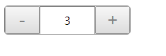
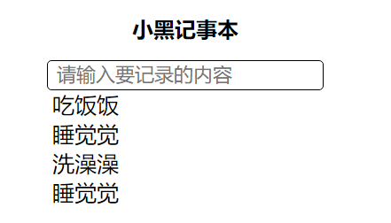

# Vue.js - day01


## Vue.js介绍

2. Vue.js很重要，很流行

   [官方文档](https://cn.vuejs.org/)

   

## Vue文档简介

[传送门](https://cn.vuejs.org/v2/guide/#%E8%B5%B7%E6%AD%A5)


## Vue基本使用解析

使用Vue的步骤

1. vue.js引入

2. dom结构

3. 实例化Vue `new Vue({el,data})`

   1. el:选择器  关联到Vue管理的容器，容器之外Vue是无法解析的

   2. data里面的属性通过{{}}来渲染

   3. {{js表达式}} 表达式必须是一个值

      

## Vue指令

[传送门](https://cn.vuejs.org/v2/guide/syntax.html#%E6%8C%87%E4%BB%A4)

指令 (Directives) 是带有 `v-` 前缀的特殊特性。

Vue指令是Vue提供给HTML标签的属性

使用方式`v-xxx="js表达式"`

作用:跟具体的指令有关。会作用在它所在的标签上

```html

```


## v-text指令（textContent）

[传送门](https://cn.vuejs.org/v2/api/#v-text)

1. v-text就是把值作为文本插入到它所在的标签之间, 内部实现是textContent ,会覆盖掉标签之间的文本
2. 简写{{}}
3. 不能解析HTML


## v-html指令(innerHTML)

[传送门](https://cn.vuejs.org/v2/api/#v-html)

1. v-html把值作为html插到到标签之间，内部实现是innerHTML,会覆盖掉标签之间的文本

2. 没有简写

   

## v-on指令

[基本使用](https://cn.vuejs.org/v2/guide/events.html)

1.注册事件

2. 使用方法 **v-on:事件名="事件处理方法"**

3. 简写 @事件名="事件处理方法"

4. 事件名和原生相同 可以是 @click @dblclick @keyup @keydown @mouseover @mouseenter @mouseleave..

  5.事件处理方法默认参数是事件对象

  6.事件处理方法的传参和js注册事件没什么不同

7. 事件处理方法声明在methods对象里边,methods和el、data平级


## 事件修饰符

[传送门](https://cn.vuejs.org/v2/guide/events.html#%E4%BA%8B%E4%BB%B6%E4%BF%AE%E9%A5%B0%E7%AC%A6)

事件修饰符是由点开头的指令后缀来表示的。

使用方法 v-on:事件名.修饰符=“事件处理方法”

```html
<!-- 阻止单击事件继续传播 -->
<a v-on:click.stop="doThis"></a>

<!-- 提交事件不再重载页面 -->
<form v-on:submit.prevent="onSubmit"></form>

<!-- 修饰符可以串联 -->
<a v-on:click.stop.prevent="doThat"></a>

<!-- 只有修饰符 -->
<form v-on:submit.prevent></form>

<!-- 添加事件监听器时使用事件捕获模式 -->
<!-- 即元素自身触发的事件先在此处理，然后才交由内部元素进行处理 -->
<div v-on:click.capture="doThis">...</div>

<!-- 只当在 event.target 是当前元素自身时触发处理函数 -->
<!-- 即事件不是从内部元素触发的 -->
<div v-on:click.self="doThat">...</div>

<!-- 只有在 `key` 是 `Enter` 时调用 `vm.submit()` -->
<input v-on:keyup.enter="submit">
```


## vue方法中的this

[传送门](https://cn.vuejs.org/v2/api/#methods)

​    方法中的this就是Vue实例

​    this可以访问data和methods里面的属性 使用`this.`

​    数据的改变，对应的视图会'响应'


## 表达式的作用域

[传送门](https://cn.vuejs.org/v2/guide/syntax.html#%E4%BD%BF%E7%94%A8-JavaScript-%E8%A1%A8%E8%BE%BE%E5%BC%8F)

这些表达式会在所属 Vue 实例的数据作用域下作为 JavaScript 被解析。

1. js表达式的变量的作用域是Vue实例，也就是说这些变量可以被Vue实例访问到

2. js表达式的变量只能是data里面的属性或者methods里面的方法

   

## v-bind指令

[传送门](https://cn.vuejs.org/v2/api/#v-bind)

动态地绑定一个或多个特性，绑定属性，动态改变属性的值

1.  使用方法 v-bind:属性名="js表达式" 
2. 对于v-bind:src js表达式需要返回一个字符串
3. `v-bind:src="imgUrl"` 当我们改变imgUrl的时候,会改变src的值
4. v-bind:class 切换样式的两种语法
   1. 三元运算
   2. 对象的语法 ｛className:true/false｝ 当为true时，会添加className;否则移除className
5. v-bind:style=“js对象”
   1. 如果对象的key是用`-`来连接的，那么建议用字符串或者驼峰 `backgroundColor` 、`"background-color"`


## Demo-计数器



###  实现步骤

1. 数字的显示
2. +-功能实现
3. 数字的范围是0-10，边界问题处理

### 注意点

1. v-bind:class="{className:true/false}" true的时候添加样式，false的时候移除样式


## Demo-图片切换


### 实现步骤

1. 展示图片
2. 上一张和下一张的功能
3. 图片循环展示


### 注意点

 

## 表单输入绑定 v-model

[传送门](https://cn.vuejs.org/v2/guide/forms.html)

你可以用 `v-model` 指令在表单 `<input>`、`<textarea>` 及 `<select>` 元素上创建双向数据绑定。

1. v-model只能用在表单元素上 input,textarea, select
2. **v-model就是用来获取用输入的**
3. 双向数据绑定
   1. 改变input value值能改变data
   2. 改变data也能改变input value值


## v-for指令

[传送门](https://cn.vuejs.org/v2/guide/list.html)

我们可以用 `v-for` 指令基于一个数组来渲染一个列表。

1. v-for用来作遍历的
2. 使用v-for作用在需要重复的元素上
3. v-for="元素别名 in 数组" , v-for="(元素别名 ,下标)in 数组" 
4. 标签之间就可以使用 元素别名和下标
5. in是固定的，不能改变


## v-if,v-else-if,v-else指令

[传送门](https://cn.vuejs.org/v2/guide/conditional.html)

`v-if` 指令用于条件性地渲染一块内容。这块内容只会在指令的表达式返回 truthy 值的时候被渲染。

1. v-if=“js表达式”， v-else-if=“js表达式” 表达式结果为true的时候，元素添加，false时不添加元素
2. v-else 不需要条件，以上条件不满足时，显示元素


## v-show指令

[传送门](https://cn.vuejs.org/v2/guide/conditional.html#v-show)

`v-show` 只是简单地切换元素的 CSS 属性 `display`。

1. v-show隐藏元素是能过切换元素的属性display:none

2. v-if指令直接移走dom

3. 频繁切换显示的情形，我们用v-show

   


## Demo-记事本



### 实现步骤

1. 展示列表
2. 输入内容，回车，添加任务
3. 双击删除功能


### 注意点

1. 数组.splice(从哪一项开始删除,删除多少项)


## 补充

1. vscode tabSize的设置

2. #### 插件推荐

   

   让vscode提高对vue的支持，比如高亮，比如图标...

   

   vue关键语法的提示

