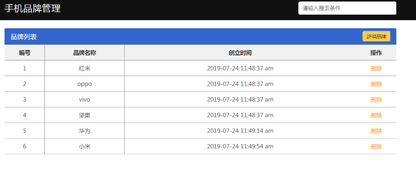

# Vue学习第2天

## 反馈

1. 感觉啥都会,就是忘记怎么写静态页面html,css了
2. 听说你想看我的反馈
3. 老师讲课太柔和了 ,,不过讲的挺详细的
4. 王...
5. 老师该换台电脑了
6. 双向绑定的 为什么改变sex的值可以改变input的选中还是有点蒙 男/女 怎么会和选中有关系呀
7. 待机时间,很长....容易犯困呢
8. 老师Vue数据双向绑定的底层原理是什么啊,不是很清楚,可以讲一下嘛
9. 老师,后面我们会学react吗???
10. 双向绑定 着实一脸懵逼,
11. 这一天感觉东西并不是很难,还是有几个地方还是不是很理解,今晚要加班消化掉
12. 老师,您上课的声音可以再大点,有的时候说快了后面听不到
13. 我觉得上课可以再稍微奔放一点
14. 第一天还OK,老师讲的还比较详细
15. 每次换老师第一天上课,首先适应老师的讲课方式,与预想中上课方式有很大差别,,加油吧!!,,阿库拉玛塔塔!,
16. 老师,好温柔哦
17. 第一天有点不适应
18. 今天的理解还不错

## 回顾

## v-if,v-else-if,v-else指令

[传送门](https://cn.vuejs.org/v2/guide/conditional.html)

## v-show指令

[传送门](https://cn.vuejs.org/v2/guide/conditional.html#v-show)

## v-cloak指令

[传送门](https://cn.vuejs.org/v2/api/#v-cloak)

## v-once（了解）

[传送门](https://cn.vuejs.org/v2/api/#v-once)

## v-pre（了解）

## Demo-天知道

### 实现步骤

### 注意点

## Demo-聊天机器人

### 实现步骤

### 注意点

## template结合v-if

[传送门](https://cn.vuejs.org/v2/guide/conditional.html#%E5%9C%A8-lt-template-gt-%E5%85%83%E7%B4%A0%E4%B8%8A%E4%BD%BF%E7%94%A8-v-if-%E6%9D%A1%E4%BB%B6%E6%B8%B2%E6%9F%93%E5%88%86%E7%BB%84)

## 滚动底部-Vue异步更新

[异步更新](https://cn.vuejs.org/v2/guide/reactivity.html#%E5%BC%82%E6%AD%A5%E6%9B%B4%E6%96%B0%E9%98%9F%E5%88%97)

## Vue生命周期钩子函数

[传送门](https://cn.vuejs.org/v2/guide/instance.html#%E5%AE%9E%E4%BE%8B%E7%94%9F%E5%91%BD%E5%91%A8%E6%9C%9F%E9%92%A9%E5%AD%90)

## 日期格式化库 moment.js

[传送门](http://momentjs.cn/docs/#/parsing/)

## 计算属性

[传送门](https://cn.vuejs.org/v2/guide/computed.html#%E8%AE%A1%E7%AE%97%E5%B1%9E%E6%80%A7)

## Demo-品牌管理

#### 实现步骤

### 注意点

## 总结

回顾

#### 练习

1. todoMVC作业
2. 其他资料中的练习案例

