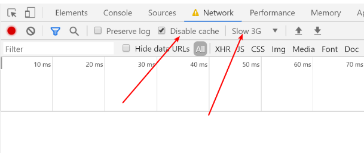
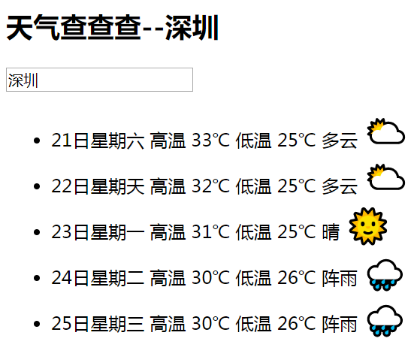

# Vue学习第2天

## 反馈

1. 希望多出一些练习题,巩固一下每天的内容
   1. 今天会给练习题
   2. jquery案例用vue实现
2. 希望老师明天能重点讲下form表单的事件修饰符 以及 vue中的this 和 vue中箭头函数的this,包括我,有部分学员也不太明白
   1. v-model.trim
   2. 方法中的this和方法箭头函数写法
3. 老师的逻辑很清楚 但是表达不是很好
   1. 。。。
4. 老师讲的很好
5. 老师 , 建议讲课时候突出一下重点和了解内容 , 注重强调一下"必须掌握"的重点和"仅需了解"的知识点 , 一节课下来感觉什么都看得懂 , 但是似乎抓不到重点 , 第一天接触vue , 还没有形成对这个框架的概念
   1. 建议挺好的
6. 感觉老师有点紧张还是怎么啦 说话稍微有点顿挫 放开来讲老师 然后感觉老师授课有点平淡 老师语气可以适当的高低起伏一点 哈哈 不知道是老师性格原因还是什么 我们班可是最活跃的一个班 上过我们的讲师都知道我们最活跃 不知道今天咋了 都不说话了 老师加油 我们可能听课入迷了
7. 老师别太紧张哈,气氛不好可能是因为刚开始的知识挺简单,同学们都有预习,等到后面就好了,或者老师可以考虑适当增加点扩展的内容,比如es6的新语法 promise函数 async 函数 之类的
   1. 最后一节看实际情况，是否需要讲一下promise
8. 希望老师多备一下课，多讲一下细节点，例如MVVM，否则 vue是怎么起作用都不知道，毕竟不能一直看其他老师的视频学习，vue基础要是没打好，后面就更难
   1. 会讲得更加细一些
   2. 原理讲的话，大部分接受了
9. 关于v-model这个指令感觉不是很清楚,希望老师明天再做个复习咯~~~


## v-model指令

1. 应用表单元素 **input** type="text",password,number,mobile,email, **select,textarea**

2. 作用 ：获取用户的输入

3. 使用:  message获取到用户的输入

   ```html
   <input type="text" v-model="message">
   //message声明在data
   ```

4. 双向数据绑定
   1. 获取用户的输入  value->data.message
   2. 设置input的值 data.message->value
5. v-model.trim可以在获取用户输入的值去掉首尾空格


## 方法中的this

1. 方法中的this就是Vue实例
2. 方法中的this可以直接访问到data或者methods里面的属性，`this.`
3. 方法中的函数声明最好用方法的简洁写法，不要用箭头函数。（箭头函数里面的this是window）


## 回顾

1. vue基本使用
2. 一堆的指令  Vue指令是vue提供给HTML标签新增的属性


## *v-if,v-else-if,v-else指令

[传送门](https://cn.vuejs.org/v2/guide/conditional.html)

根据条件决定是否渲染dom

使用方法:

1. v-if=“是否渲染当前的dom”
    1. 如果是true，渲染当前的dom
    2. 如果是false，不渲染当前的dom

 2. v-else-if="是否渲染当前dom"

 3. v-else 不需要条件，以上条件不满足，就渲染当前的dom

 4. v-if用得最多

    

## *v-show指令

[传送门](https://cn.vuejs.org/v2/guide/conditional.html#v-show)

根据条件决定是否展示dom

1. v-show隐藏dom其实是给dom添加display:none样式
2. v-if隐藏dom,移除dom
3. 对于dom的频繁显示与隐藏用v-show


## v-cloak指令

[传送门](https://cn.vuejs.org/v2/api/#v-cloak)

v-cloak指令和样式配合隐藏胡子语法

1. 添加这个指令后，dom解析完，会移走这个个指令
2. 指令的使用

```html
<h2 v-cloak>
  
</h2>
```

3. v-cloak经常是配合样式display:none来隐藏胡子语法


补充：

1. disable cache不缓存资源，让vue.js每次都请求
2. slow 3G降低网速



## v-once与v-pre（了解）

[传送门](https://cn.vuejs.org/v2/api/#v-once)

v-once只渲染一次

v-pre不渲染，语法直接显示


## Demo-天知道


### 

### 实现步骤

1. 输入城市显示城市
   1. 获取用户输入 v-model.trim:city
   2. 胡子语法显示城市 v-text {{city}}
2. 输入城市，回车，请求数据
   1. enter键抬起 @keyup.enter:queryWeather
   2. 请求数据会用到$.ajax({url, success:function(res){成功后获取的数据}})
   3. url http://wthrcdn.etouch.cn/weather_mini?city=深圳  是get请求

3. 数据回来后，展示天气列表
   1. 赋值获取天气数据 forecastList=
   2. vfor遍历数组，展示天气列表

4. emjo表情显示
   1. 根据天气类型字段里面是否包含云或者雨，包含就展示对应的emoji表情;否则都展示晴天
      1. 是否包含`云`  结合v-if="item.type.indexOf(云)"！==-1

### 注意点

1. 想判断a是否包含b a.indexOf(b) 返回b在a中的索引的位置，如果找不到-1; 是否包含就!=-1
2. a.includes(b)=true/false就是表示a中是否包含b
3. v-cloak结合display:none解析胡子语法显示的问题
4. 天气数据status===1000的时候，输入的城市是正确，这个数据才正确。


## Demo-聊天机器人


### 注意点


## 滚动底部-Vue异步更新

[异步更新](https://cn.vuejs.org/v2/guide/reactivity.html#%E5%BC%82%E6%AD%A5%E6%9B%B4%E6%96%B0%E9%98%9F%E5%88%97)


#### 课后学习


## Vue生命周期钩子函数

[传送门](https://cn.vuejs.org/v2/guide/instance.html#%E5%AE%9E%E4%BE%8B%E7%94%9F%E5%91%BD%E5%91%A8%E6%9C%9F%E9%92%A9%E5%AD%90)


## 日期格式化库 moment.js

[传送门](http://momentjs.cn/docs/#/parsing/)


## *计算属性

[传送门](https://cn.vuejs.org/v2/guide/computed.html#%E8%AE%A1%E7%AE%97%E5%B1%9E%E6%80%A7)


## Demo-品牌管理


## 总结

回顾

#### 练习

1. todoMVC作业
2. 其他资料中的练习案例


