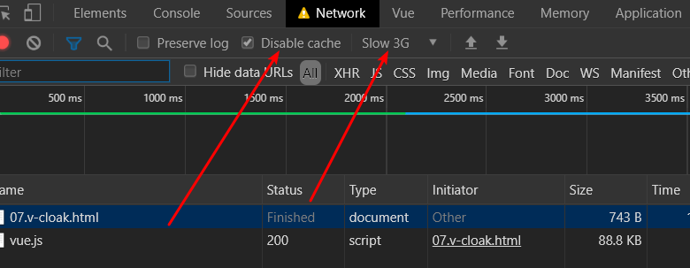
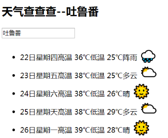
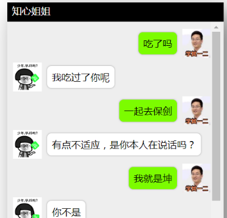

# Vue学习第2天

## 反馈

1. 感觉啥都会,就是忘记怎么写静态页面html,css了
2. 听说你想看我的反馈
3. 老师讲课太柔和了 ,,不过讲的挺详细的
   1. 今天声音会大些
4. 王...
5. 老师该换台电脑了
6. 双向绑定的 为什么改变sex的值可以改变input的选中还是有点蒙 男/女 怎么会和选中有关系呀
   1. 会重新讲一下
7. 待机时间,很长....容易犯困呢
8. 老师Vue数据双向绑定的底层原理是什么啊,不是很清楚,可以讲一下嘛
9. 老师,后面我们会学react吗???
10. 双向绑定 着实一脸懵逼,
11. 这一天感觉东西并不是很难,还是有几个地方还是不是很理解,今晚要加班消化掉
12. 老师,您上课的声音可以再大点,有的时候说快了后面听不到
13. 我觉得上课可以再稍微奔放一点
14. 第一天还OK,老师讲的还比较详细
15. 每次换老师第一天上课,首先适应老师的讲课方式,与预想中上课方式有很大差别,,加油吧!!,,阿库拉玛塔塔!,
16. 老师,好温柔哦
17. 第一天有点不适应
18. 今天的理解还不错


## 回顾


## v-if,v-else-if,v-else指令

[传送门](https://cn.vuejs.org/v2/guide/conditional.html)

1. v-if="是否渲染当前的dom"
2. v-else-if="是否渲染当前的dom"
3. v-else 不需要接条件


## v-show指令

[传送门](https://cn.vuejs.org/v2/guide/conditional.html#v-show)

`v-show` 只是简单地切换元素的 CSS 属性 `display`。

1. v-if=“是否渲染当前dom” 如果不渲染的，其实是把dom给移走了
2. v-show="是否展示当前dom" 如果不展示，其实加了一个display:none
3. 对于频繁切换元素的显示与隐藏，建议用v-show


## v-cloak指令

[传送门](https://cn.vuejs.org/v2/api/#v-cloak)

这个指令保持在元素上直到关联实例结束编译。和 CSS 规则如 `[v-cloak] { display: none }`一起用时，这个指令可以隐藏未编译的 Mustache 标签直到实例准备完毕。

1. 添加这个指令后，vue解析完后，会移除这个属性
2. 配合[v-cloak] { display: none }来隐藏胡子语法


注意点：

1. disable cache，每次都会去请求vue.js
2. slow 3g，让请求vue.js更慢




## v-once（了解）

[传送门](https://cn.vuejs.org/v2/api/#v-once)

只渲染元素和组件**一次**。


## v-pre（了解）

Vue不解析，原样输出


## Demo-天知道



### 实现步骤

1. 输入城市，显示城市
   1. 获取用户输入的城市 v-model:city
   2. 显示城市
2. 回车，请求数据
   1. enter键抬起响应 @keyup.enter:queryWeather
   2. 请求天气 $.ajax(url,success:function(){获取天气数据})
   3. 接口 http://wthrcdn.etouch.cn/weather_mini?city=深圳
3. 展示天气列表
   1. 获取天气信息forecast:[]
   2. vfor遍历天气数组，渲染天气列表
4. 天气信息emoji表情的展示
   1. 天气类型有云雨，就展示对应的表情，否则展示晴天
      1. item.type.indexOf('云')！==-1

### 注意点

1. function会绑定this为当前调用function的对象，箭头函数不会绑定this
2. a.indexOf(b) 查找b在a字符串中的索引位置，如果没有的话返回-1; 判断是否包含!=-1
3. includes字符串中是否包含字符


## Demo-聊天机器人



### 实现步骤

1. 展示聊天消息

   1. 一条消息有两个属性，一个是消息体本身，还有一个消息的所属者。所以消息必须是一个对象。

      用isme来标识是我的消息还是姐姐的消息

   2. vfor遍历数组，渲染li
   3. v-bind:isme,来渲染不同的样式

   ```js
   messageList:[
     ｛
     	msg:'你好',
     	isme:true
     ｝,
     ｛
     	msg:'好呀',
     	isme:false
     ｝,
     ｛
     	msg:'吃饭了吗?',
     	isme:true
     ｝,
     ｛
     	msg:'滚！',
     	isme:false
     ｝
   ]
   ```

   

2. 我输入消息，回车或者点击发送的时候，添加我的消息

   1. 获取我输入的消息 v-model.trim:inputVal,
   2. 回车或者发送 @keyup.enter/@click:chat
   3. 操作数组，messageList.push({msg,isme:ture})

3. 姐姐根据我的消息，请求接口获取消息，添加姐姐的消息

   1. 根据inputVal请求接口

   2. $.ajax success:()=>{}

      > - 请求地址：<http://www.tuling123.com/openapi/api>
      > - 请求方法：post
      > - 请求参数：key,info
      > - 
      > - 2162602fd87240a8b7bba7431ffd379b
      > - a618e456f0744066840ceafb6a249d9d
      > - d7c82ebd8b304abeacc73b366e42b9ed
      > - 7b1cf467c0394dd5b3e49f32663f8b29
      > - 9fbb98effab142c9bb324f804be542ba

   2. 添加姐姐的消息 messageList.push({text, isme:false})

### 注意点

1. 消息格式，得有一个属性区分是姐姐的消息还是我的消息，所以用了一个对象。isme来区分。
2. 滚动有问题
3. 


## template结合v-if

[传送门](https://cn.vuejs.org/v2/guide/conditional.html#%E5%9C%A8-lt-template-gt-%E5%85%83%E7%B4%A0%E4%B8%8A%E4%BD%BF%E7%94%A8-v-if-%E6%9D%A1%E4%BB%B6%E6%B8%B2%E6%9F%93%E5%88%86%E7%BB%84)

把一个 `<template>` 元素当做不可见的包裹元素，并在上面使用 `v-if`。最终的渲染结果将不包含 `<template>` 元素。

1. <template> 是Vue提供的标签，有包裹元素的功能，和div

2. 最终不会渲染

3. template雷锋

   

## 滚动底部-Vue异步更新

[异步更新](https://cn.vuejs.org/v2/guide/reactivity.html#%E5%BC%82%E6%AD%A5%E6%9B%B4%E6%96%B0%E9%98%9F%E5%88%97)

Vue 在更新 DOM 时是**异步**执行的

Vue会把数据的更新，缓冲起来，批量地进行更新DOM

用定时器，强制让姐姐消息添加的DOM更新后，再执行滚动到底部。


问题是：滚动了，但是并不彻底

```js
setTimeout(()=>{
  $('.content').scrollTop(88888)
},0)
```


## Vue生命周期钩子函数

[传送门](https://cn.vuejs.org/v2/guide/instance.html#%E5%AE%9E%E4%BE%8B%E7%94%9F%E5%91%BD%E5%91%A8%E6%9C%9F%E9%92%A9%E5%AD%90)

每个 Vue 实例在被创建时都要经过一系列的初始化过程——例如，需要设置数据监听、编译模板、将实例挂载到 DOM 并在数据变化时更新 DOM 等。同时在这个过程中也会运行一些叫做**生命周期钩子**的函数，这给了用户在不同阶段添加自己的代码的机会。

1. 钩子函数，就是回调函数
2. Vue生命周期就是Vue实例创建到销毁过程中，会经历一些重要的阶段
3. vue生命周期钩子函数，就是Vue实例从创建到销毁过程中，有8个重要时间点，在这个时间点，Vue提供回调函数通知我们。回调函数里面可以自定义逻辑。
4. 生命周期钩子的 `this` 上下文指向调用它的 Vue 实例
5. 生命周期钩子函数和data、el、methods是平级的
6. updated是数据更新，而且对应的dom更新完成后，触发updated


## 日期格式化库 moment.js

[传送门](http://momentjs.cn/docs/#/parsing/)

```js
// 猜想是当前的时间，默认的格式化
document.write(moment().format('YYYY-MM-DD HH:mm:ss a'))
```


## 计算属性

[传送门](https://cn.vuejs.org/v2/guide/computed.html#%E8%AE%A1%E7%AE%97%E5%B1%9E%E6%80%A7)

对于任何复杂逻辑，你都应当使用**计算属性**。

对于data里面的属性，如果不想原样的输出，都应该使用计算属性

使用

```js
computed: {
          //message的长度
          messageLen(){
            console.log('我执行了。。。')
            return this.message.length
          }
        },
```

1. computed是一个对象，和data、el、methods、updated是平级的

2. 计算属性是作为computed的一个方法

3. 计算属性这个方法必须返回一个值，这个值就是计算属性

4. 计算属性所依赖的属性有改变的时候，计算属性会重新计算

5. 计算属性的使用和data里面的属性是一样的。

   

## Demo-品牌管理


#### 实现步骤

1. 展示列表
   1. 列表数组 brandList:[]
   2. v-for 渲染tr
2. 删除功能
   1. 点击删除 @click:delBrand(index)
   2. index来自于vfor
   3. 操作数组 brandList.splice(从哪一项开始删除,1)
3. 新增品牌
   1. 控制弹层的显示与隐藏
      1. 弹层的显示与隐藏 v-show="isShow"
      2. 点击新增品牌@click="isShow=true"
      3. 添加或者取消 隐藏弹层 @click isShow=false
   2. 弹层上input,输入品牌，点添加按钮，新增品牌
      1. 获取用户输入的品牌 v-model.trim:inputVal
      2. 添加按钮 @click: isShow=false, brandList.push({})
4. 用户输入搜索关键字，展示品牌名称包含搜索结果的品牌列表
   1. 搜索结果的品牌列表是一个过滤后的数组
   2. 用户输入的关键字 v-model.trim:keyword
   3. 遍历brandList里面的每一项，如果某一项的品牌名称包含keyword,这一项就应该添加到新数组里面


### 注意点

1. Array.filter方法是遍历数组的每一项，根据过滤条件返回一个新数组
2. 搜索结果列表背后数据是原列表和关键字过滤后的数组，是计算属性
3. 弹层的显示与隐藏 v-show


## 总结

回顾

#### 练习

1. todoMVC作业
2. 其他资料中的练习案例


