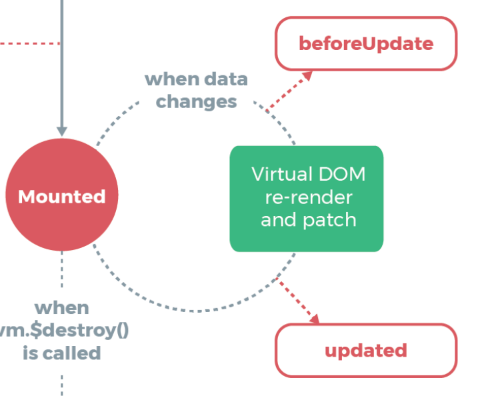

# Vue.js - day02

## 反馈

1. 老师,视频声音有点点小

2. 老师,开发中是直接使用开源的组件库,还是公司有自己的组件库,后面会教axios吗

3. 不太十分理解为何要用事件修辞符,在实际开发中有何用处 ?老师在讲VUE能否多结合实际开发场景应用来讲,便于更好理解它的用处.

4. 老师讲文档的时候慢一点,没预习的,嘻嘻嘻

5. 感觉Vue的语法怪怪的,不过用起来好像还挺方便的

6. 老师太别好,技术精湛,敲代码娴熟,健步如飞

7. 要不是俺预习了下,估计是听不懂了

   

## 回顾


1. vue基本使用

2. vue指令

   ```html
   <!DOCTYPE html>
   <html lang="en">
     <head>
       <meta charset="UTF-8" />
       <meta name="viewport" content="width=device-width, initial-scale=1.0" />
       <meta http-equiv="X-UA-Compatible" content="ie=edge" />
       <title>Document</title>
       <style>
         #app > div {
           width: 100px;
           height: 100px;
           border: 1px solid #666;
           margin: 10px;
         }
       </style>
     </head>
     <body>
       <div id="wrapper">
         <h2>{{ message }}</h2>
         <!-- <h2 v-text="message"></h2> -->
         <h2 v-html="alink"></h2>
         <input type="button" value="点我呀" @click="sayHello" />
         <div :class="{'red':isRed}" @click="isRed=!isRed"></div>
         <input type="text" v-model="message" />
         <input type="button" value="改变data" @click="changeData" />
         <ul>
           <li v-for="(song,index) in songList">
               {{ song }}--{{ index }}
           </li>
         </ul>
         <p v-if="isShow">这是一个寂寞的天，下着有些伤心的雨</p>
         <p v-show="isShow">这是一个寂寞的天，下着有些伤心的雨</p>
       </div>
       <!-- 引入vue.js -->
       <script src="./lib/vue.js"></script>
       <!-- 实例化Vue -->
       <script>
         /*
           Vue的指令是vue提供给HTML标签的属性
         */
         new Vue({
           el: "#wrapper",
           data: {
             message: "中分还带波浪，是不是很萌呢",
             alink: '<a href="http://www.baidu.com">百度</a>',
             isRed: true,
             songList: ["两只蝴蝶", "终于等到你", "可惜不是你"],
          isShow:true
           },
           methods: {
             sayHello() {
               alert("ok");
             },
             changeData() {
               this.message = "李晨又又分手了";
             }
           }
         });
       </script>
     </body>
   </html>
   ```
   
   

## v-cloak指令

[传送门](https://cn.vuejs.org/v2/api/#v-cloak)

这个指令保持在元素上直到关联实例结束编译。和 CSS 规则如 `[v-cloak] { display: none }`一起用时，这个指令可以隐藏未编译的 Mustache 标签直到实例准备完毕。

1. 添加了这个指令之后, Vue解析完后，会移除该指令
2. v-cloak和 display:none结合使用，可以隐藏未编译的{{}}语法

### 注意：

1. disable cache 请求的资源不会在浏览器缓存，下一次请求同一资源还会请求服务器
2. slow 3G 模拟低速网络


```html
<!DOCTYPE html>
<html lang="en">
  <head>
    <meta charset="UTF-8" />
    <meta name="viewport" content="width=device-width, initial-scale=1.0" />
    <meta http-equiv="X-UA-Compatible" content="ie=edge" />
    <title>Document</title>
    <style>
      [v-cloak]{
        display: none;
      }
    </style>
  </head>
  <body>
    <div id="app">
      <h2 v-cloak>{{ message }}</h2>
    </div>
    <!-- 开发环境版本，包含了有帮助的命令行警告 -->
    <script src="https://cdn.jsdelivr.net/npm/vue/dist/vue.js"></script>
    <!-- <script src="./lib/vue.js"></script> -->
    <script>
      new Vue({
        el: "#app",
        data: {
          message: "Hello World"
        }
      });
    </script>
  </body>
</html>
```


## v-once指令(了解)

[传送门](https://cn.vuejs.org/v2/api/#v-once)

只渲染元素和组件**一次**。

只渲染一次

```html
<div id="app">
<h3>没有用v-once--{{msg}}</h3>
<h3 v-once>用v-once--{{msg}}</h3>
<input type="text" v-model="msg">
</div>
<script src="./lib/vue.js"></script>
<script>
  new Vue({
    el:'#app',
    data:{
      msg:'中分还带波浪，是不是很萌呢？'
    }
  })
</script>
```


## Demo-天气预报


### 实现步骤

1. 显示搜索城市
2. 输入城市，回车，请求
3. 展示天气搜索结果

### 注意点

1. function会绑定this到function所在的对象，箭头函数不会绑定this

2. a.indexOf(b) 查找b在a字符串中的索引位置，如果没有的话返回-1

3. includes 字符串中是否包含字符 

   ```js
     /*
     1. 显示搜索城市
       1. v-model:city
       2. {{city}}
     2. 输入城市，回车，请求
       1. @keyup.enter:queryWeather
       2. $.ajax(url) http://wthrcdn.etouch.cn/weather_mini?city=深圳
     3. 展示天气搜索结果
       1. forecastList[]
       2. v-for
       3. v-if
     */
   ```
   
   

## Demo-聊天机器人


### 实现步骤

1.  我发送消息
2. 姐姐回复消息


```html
1.我发送消息
  1.v-model.trim:inputVal 
  2.@keyup.enter @click:chat
  3.messageList.push
  4.messageList v-for 展示

2. 姐姐回复消息
    请求地址：http://www.tuling123.com/openapi/api
    请求方法：post
    请求参数：key,info
    2162602fd87240a8b7bba7431ffd379b
    a618e456f0744066840ceafb6a249d9d
    d7c82ebd8b304abeacc73b366e42b9ed
    7b1cf467c0394dd5b3e49f32663f8b29
    9fbb98effab142c9bb324f804be542ba
  1. $.ajax
  2. messageList.push

3.消息格式调整 
  1. messageList:
    [
      {
        content:'你好',
        isme:true
      },
      {
        content:'好呀',
        isme:false
      },
      {
        content:'吃饭了吗',
        isme:true
      },
      {
        content:'滚！',
        isme:false
      }
    ]

  2. 我的消息添加 messageList.push({
    content:'xx',
    isme:true
  })
  3. 我的消息添加 messageList.push({
    content:'xx',
    isme:false
  })
	4. v-bind: 绑定属性，根据是我的消息还是姐姐的消息，显示不同的样式
```


### 注意点

1. 消息数组元素为一个对象，对象有isme来区分是我的消息，还是姐姐的消息
2. v-bind:src和v-bind:class配合isme来区分姐姐和我的消息样式
3. v-cloak vue解析完后移除这个属性，一般结合display:none样式，在解析前隐藏元素
4. 留有问题：添加姐姐的消息后，需要手动滚动滚动条.


### template结合v-if

[传送门](https://cn.vuejs.org/v2/guide/conditional.html#%E5%9C%A8-lt-template-gt-%E5%85%83%E7%B4%A0%E4%B8%8A%E4%BD%BF%E7%94%A8-v-if-%E6%9D%A1%E4%BB%B6%E6%B8%B2%E6%9F%93%E5%88%86%E7%BB%84)

把一个 `<template>` 元素当做不可见的包裹元素，并在上面使用 `v-if`。最终的渲染结果将不包含 `<template>` 元素。

1. template是包裹元素，功能上类似于div
2. 但是并不渲染template标签


### 滚动底部-Vue异步更新

[异步更新](https://cn.vuejs.org/v2/guide/reactivity.html#%E5%BC%82%E6%AD%A5%E6%9B%B4%E6%96%B0%E9%98%9F%E5%88%97)

Vue 在更新 DOM 时是**异步**执行的。

Vue会把数据的改变，缓冲起来，批量更新DOM

使用定时器强制让滚动在DOM更新完后执行

```JS
// 让消息列表滚动底部
setTimeout(()=>{
 $('.content').scrollTop(999999999)
},100)
```


### 滚到底部-事件循环

Vue 在内部对异步队列尝试使用原生的 `Promise.then`、`MutationObserver` 和 `setImmediate`，如果执行环境不支持，则会采用 `setTimeout(fn, 0)` 代替。

1. Vue更新DOM的延时时间不会超过setTimeout 0

2. js的**事件循环**（Event Loop）

   1. 主线程执行同步代码
   2. 任务队列存放异步任务
   3. 主线程空闲的时候，会取任务队列的第一个任务执行
   4. 重复1,2,3

   

   

```js
 // 滚动条滚到底部
setTimeout(() => {
  $('.content').scrollTop(999999999)
}, 0);
```


## Vue生命周期钩子

[传送门](https://cn.vuejs.org/v2/guide/instance.html#%E5%AE%9E%E4%BE%8B%E7%94%9F%E5%91%BD%E5%91%A8%E6%9C%9F%E9%92%A9%E5%AD%90)



同时在这个过程中也会运行一些叫做**生命周期钩子**的函数，这给了用户在不同阶段添加自己的代码的机会。

1. Vue提供给开发者的一系列的回调函数，方便我们添加自定义的逻辑

2. 钩子函数和data，el、methods是并列的

3. 生命周期钩子的 `this` 上下文指向调用它的 Vue 实例。用methods里面的方法是一样的

4. `updated`在数据改变，对应的视图已经更新完后，会触发updated方法.

   

## 日期格式化库 moment.js

[传送门](http://momentjs.cn/docs/#/parsing/)

```html
<script>
  //当前的时间，默认的格式化
  document.write(moment().format('YYYY-MM-DD HH:mm:ss a'))
</script>
```


## vue计算属性

[传送门](https://cn.vuejs.org/v2/guide/computed.html#%E8%AE%A1%E7%AE%97%E5%B1%9E%E6%80%A7)

任何复杂逻辑，你都应当使用**计算属性**。

1. computed和el、data平级。计算属性作为computed里面的一个方法，必须return

2. 使用的时候和data里面的属性一样

3. 计算属性所依赖的属性有变化的时候，计算属性会重新计算

   ```html
   <div id="app">
     <h2>成为京东会员的日期：{{date}}</h2>
     <h2>您已经京东会员{{vipDays}}天</h2>
     <input type="text" v-model="date">
   </div>
   <script src="./lib/vue.js"></script>
   <script>
     /*
         （当前的日期-成为京东会员的日期）/每一天的毫秒数
         小数的处理
       */
     new Vue({
       el:'#app',
       data:{
         date:'2019-7-23'
       },
       computed: {
         vipDays(){
           console.log('重新计算')
           return Math.ceil((Date.now()-new Date(this.date.replace(/\-/g,'/')).getTime())/(24*60*60*1000))
         }
       },
     })
   </script>
   ```

   

## Demo-品牌管理


#### 实现步骤

1. 展示列表
2. 删除一项
3. 添加
4. 搜索

```js
	1. 展示列表
        1. 品牌列表数组 brandList:[
            {
              name:'小米',
              time:'2019-07-26 10:36:38 am'
            },
            {
              name:'红米',
              time:'2019-07-24 10:36:38 am'
            }
          ]
        2. 列表展示: v-for tr
    2.删除一项
      1. 点击事件 @click:delBrand(index)
      2. 数组移除元素 brandList.splice(从哪一个元素开始删除，删除多少个)
    3.新增品牌
      1.弹层的显示与隐藏
        1. 弹层 v-show="isShow"
        1. 点击新增品牌，显示 @click isShow=true
        2. 添加与取消 隐藏 @click isShow=false
       
      2.新增品牌
        1. v-model.trim:inputVal
        2. @keyup.enter或者添加 addBrand
        3. brandList.push({
          name:'商品名称',
          time: 当前的时间
        })
    4.搜索功能
        1.v-model.trim:keywords
        2.计算属性 filterBrandList 
          1. brandList根据keywords过滤后数组 item.name.includes(keywords)
```


### 注意点

1. 品牌列表是一个过滤的数组，过滤条件是品牌名称包含搜索的关键词

2. 计算属性可以用在for 里面

3. 字符的非空判断建议用`if(!str)`  等价于 `if(str=='')`

4. Array的filter返回一个符合条件的所有元素的新数组

   

## 练习

1. todoMVC作业
2. 其他资料中的练习案例