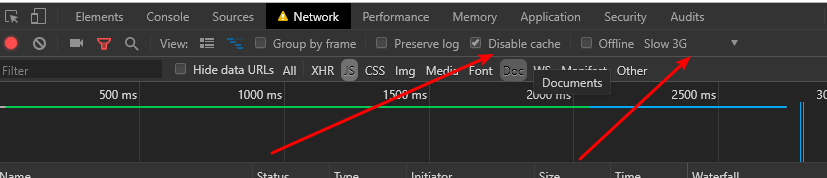

# Vue学习第2天

## 反馈

1. 希望多出一些练习题,巩固一下每天的内容
   1. 放心，今天会有练习题
   2. 大家也可以把jquery的案例，用Vue来实现
2. 希望老师明天能重点讲下form表单的事件修饰符 以及 vue中的this 和 vue中箭头函数的this,包括我,有部分学员也不太明白
   1. 
3. 老师的逻辑很清楚 但是表达不是很好
4. 老师讲的很好
5. 老师 , 建议讲课时候突出一下重点和了解内容 , 注重强调一下"必须掌握"的重点和"仅需了解"的知识点 , 一节课下来感觉什么都看得懂 , 但是似乎抓不到重点 , 第一天接触vue , 还没有形成对这个框架的概念
6. 感觉老师有点紧张还是怎么啦 说话稍微有点顿挫 放开来讲老师 然后感觉老师授课有点平淡 老师语气可以适当的高低起伏一点 哈哈 不知道是老师性格原因还是什么 我们班可是最活跃的一个班 上过我们的讲师都知道我们最活跃 不知道今天咋了 都不说话了 老师加油 我们可能听课入迷了
7. 老师别太紧张哈,气氛不好可能是因为刚开始的知识挺简单,同学们都有预习,等到后面就好了,或者老师可以考虑适当增加点扩展的内容,比如es6的新语法 promise函数 async 函数 之类的
8. 希望老师多备一下课，多讲一下细节点，例如MVVM，否则 vue是怎么起作用都不知道，毕竟不能一直看其他老师的视频学习，vue基础要是没打好，后面就更难
9. 关于v-model这个指令感觉不是很清楚,希望老师明天再做个复习咯~~~

v-model指令

## 回顾

1. vue基本使用

2. vue指令

   ```html
   <!DOCTYPE html>
   <html lang="en">
   
   <head>
     <meta charset="UTF-8">
     <meta name="viewport" content="width=device-width, initial-scale=1.0">
     <meta http-equiv="X-UA-Compatible" content="ie=edge">
     <title>Document</title>
     <style>
       #app>div {
         width: 100px;
         height: 100px;
         border: 1px solid #ccc;
       }
   
       .red {
         background-color: red;
       }
     </style>
   </head>
   
   <body>
   
     <!-- dom结构-->
     <div id="app">
       {{message}}
       <h2 v-text="message"></h2>
       <p v-html="alink"></p>
       <button @click="sayHello">点我呀</button>
       <div :class="bgRed"></div>
       <input type="text" v-model="message">
       <ul>
         <li v-for="(item,index) in movieList">{{item}} -- {{index}}</li>
       </ul>
     </div>
     <!-- vue.js的引入 -->
     <script src="./lib/vue.js"></script>
     <!--实例化Vue-->
     <script>
       new Vue({
         el: '#app',
         data: {
           message: '这是一个寂寞的天',
           alink: '<a href="http://www.baidu.com">百度</a>',
           bgRed: 'red',
           movieList: [
             '哪吒',
             '战狼1',
             '战狼2',
             '战狼3'
           ]
         },
         methods: {
           sayHello() {
             alert('ok')
           }
         },
       })
     </script>
   </body>
   
   </html>
   ```
   

## v-cloak指令

[传送门](https://cn.vuejs.org/v2/api/#v-cloak)

这个指令保持在元素上直到关联实例结束编译。和 CSS 规则如 `[v-cloak] { display: none }`一起用时，这个指令可以隐藏未编译的 Mustache 标签直到实例准备完毕。

1. 添加了这个指令之后, Vue解析完后，会移除该指令
2. v-cloak和 display:none结合使用，可以隐藏未编译的{{}}语法

### 注意：

1. disable cache 请求的资源不会在浏览器缓存，下一次请求同一资源还会请求服务器
2. slow 3G 模拟低速网络



```html
<!DOCTYPE html>
<html lang="en">
  <head>
    <meta charset="UTF-8" />
    <meta name="viewport" content="width=device-width, initial-scale=1.0" />
    <meta http-equiv="X-UA-Compatible" content="ie=edge" />
    <title>Document</title>
    <style>
      [v-cloak]{
        display: none;
      }
    </style>
  </head>
  <body>
    <div id="app">
      <h2 v-cloak>{{ message }}</h2>
    </div>
    <!-- 开发环境版本，包含了有帮助的命令行警告 -->
    <script src="https://cdn.jsdelivr.net/npm/vue/dist/vue.js"></script>
    <!-- <script src="./lib/vue.js"></script> -->
    <script>
      new Vue({
        el: "#app",
        data: {
          message: "Hello World"
        }
      });
    </script>
  </body>
</html>
```


## v-once（了解）

[传送门](https://cn.vuejs.org/v2/api/#v-once)

只渲染元素和组件**一次**。

```html
<div id="app">
  <h2>{{message}}</h2>
  <h2 v-once>{{message}}</h2>
  <input type="text" v-model="message">
</div>
<script src="./lib/vue.js"></script>
<script>
  const app = new Vue({
    el: "#app",
    data: {
      message:'是兄弟，就一起玩贪玩蓝月'
    }
  });
</script>
```


## v-pre（了解）

跳过这个元素和它的子元素的编译过程。

```html
<div id="app">
  <span v-pre>{{ 这是一个寂寞的天 }}</span>
</div>
<script src="./lib/vue.js"></script>
<script>
  const app = new Vue({
    el: '#app',
    data: {}
  })
</script>
```


## Demo-天知道

### 实现步骤

1. 输入城市，显示搜索城市
   1. 获取输入的城市 v-model.trim
   2. 显示城市 {{city}}
2. 回车，请求数据
   1. enter键点击响应@keyup.enter
   2. 请求天气 $.ajax(url,success（获取数据）)
   3. 接口 http://wthrcdn.etouch.cn/weather_mini?city=深圳
3. 展示天气搜索结果
   1. 获取天气信息 forecastList[]
   2. v-for展示天气
4. emoji表情的展示
   1. 判断item.type里面是否包含 云 雨 v-if

### 注意点

1. function会绑定this到function所在的对象，箭头函数不会绑定this

2. a.indexOf(b) 查找b在a字符串中的索引位置，如果没有的话返回-1

3. includes 字符串中是否包含字符 


## Demo-聊天机器人

### 实现步骤

1. 展示消息

   1. 很多条消息，得有一个消息数组messageList[]

   2. 姐姐的消息和我的消息是不一样的，所以消息得有两个属性，一个是消息体，一个是所有者（属性谁的消息）。所以一条消息必须是一个对象

      ```js
      messageList:
      [
        {
          content:'你好',
          isme:true
        },
        {
          content:'好呀',
          isme:false
        },
        {
          content:'吃饭了吗',
          isme:true
        },
        {
          content:'滚！',
          isme:false
        }
      ]
      ```

   3. 展示消息v-for

   4. v-bind: 绑定属性，根据是我的消息还是姐姐的消息，显示不同的样式

2. 我输入消息，回车，或者点击发送，添加我的消息

   1. 获取输入消息 v-model.trim:inputVal

   2. 回车/点击发送 @keyup.enter/@click: chat

   3. 添加我的消息 

      ```js
      messageList.push({
        content:inputVal,
        //标志是我的消息
        isme:true
      })
      ```

3. 姐姐回复消息

   1. 添加完我的消息后，请求接口获取姐姐的消息

   2. 请求接口获取姐姐的消息 $.ajax()

      ```html
      请求地址：http://www.tuling123.com/openapi/api
          请求方法：post
          请求参数：key,info
          2162602fd87240a8b7bba7431ffd379b
          a618e456f0744066840ceafb6a249d9d
          d7c82ebd8b304abeacc73b366e42b9ed
          7b1cf467c0394dd5b3e49f32663f8b29
          9fbb98effab142c9bb324f804be542ba
      ```

      

   3. 添加姐姐的消息

      ```js
      messageList.push({
        // 标志不是我的消息
        isme:false,
      })
      ```


### 注意点

1. 消息数组元素为一个对象，对象有isme来区分是我的消息，还是姐姐的消息

2. v-bind:src和v-bind:class配合isme来区分姐姐和我的消息样式

3. v-cloak vue解析完后移除这个属性，一般结合display:none样式，在解析前隐藏元素

4. 留有问题：添加姐姐的消息后，需要手动滚动滚动条.


## template结合v-if

[传送门](https://cn.vuejs.org/v2/guide/conditional.html#%E5%9C%A8-lt-template-gt-%E5%85%83%E7%B4%A0%E4%B8%8A%E4%BD%BF%E7%94%A8-v-if-%E6%9D%A1%E4%BB%B6%E6%B8%B2%E6%9F%93%E5%88%86%E7%BB%84)

把一个 `<template>` 元素当做不可见的包裹元素，并在上面使用 `v-if`。最终的渲染结果将不包含 `<template>` 元素。

1. template是包裹元素，功能上类似于div
2. 但是并不渲染template标签


## 滚动底部-Vue异步更新

[异步更新](https://cn.vuejs.org/v2/guide/reactivity.html#%E5%BC%82%E6%AD%A5%E6%9B%B4%E6%96%B0%E9%98%9F%E5%88%97)

Vue 在更新 DOM 时是**异步**执行的。

Vue会把数据的改变，缓冲起来，批量更新DOM

使用定时器强制让滚动在DOM更新完后执行

```JS
// 让消息列表滚动底部
setTimeout(()=>{
 $('.content').scrollTop(999999999)
},100)
```


## Vue生命周期钩子函数

[传送门](https://cn.vuejs.org/v2/guide/instance.html#%E5%AE%9E%E4%BE%8B%E7%94%9F%E5%91%BD%E5%91%A8%E6%9C%9F%E9%92%A9%E5%AD%90)


同时在这个过程中也会运行一些叫做**生命周期钩子**的函数，这给了用户在不同阶段添加自己的代码的机会。

1. Vue的生命周期钩子函数是从创建到销毁，有个8个重要节点，8个节点事件发生的时候，Vue以回调函数的形式通知我们
2. 钩子函数和data，el、methods是并列的
3. 生命周期钩子的 `this` 上下文指向调用它的 Vue 实例。用methods里面的方法是一样的
4. `updated`在数据改变，对应的视图已经更新完后，会触发updated方法.


## 日期格式化库 moment.js

[传送门](http://momentjs.cn/docs/#/parsing/)

```html
<script>
  //当前的时间，默认的格式化
  document.write(moment().format('YYYY-MM-DD HH:mm:ss a'))
</script>
```


## 计算属性

[传送门](https://cn.vuejs.org/v2/guide/computed.html#%E8%AE%A1%E7%AE%97%E5%B1%9E%E6%80%A7)

任何复杂逻辑，你都应当使用**计算属性**。

1. computed和el、data平级。计算属性作为computed里面的一个方法，必须return
2. 使用的时候和data里面的属性一样
3. 计算属性所依赖的属性有变化的时候，计算属性会重新计算

```html
<div id="app">
  <h2>成为京东会员的日期：{{ date }}</h2>
  <input type="text" v-model="date" />
  <h2>格式化后的日期 {{ formatDate }}</h2>
  <h2>您已经京东会员{{ vipDays }}天</h2>
</div>
<script src="./lib/vue.js"></script>
<script src="./lib/moment.js"></script>
<script>
  const app = new Vue({
    el: '#app',
    data: {
      date: '2019-8-8'
    },
    computed: {
      formatDate() {
        return moment(this.date).format('YYYY-MM-DD HH:mm:ss a')
      },
      vipDays() {
        console.log('重新计算')
        return Math.ceil((Date.now() - new Date(this.date.replace(/\-/g, '/')).getTime()) / (24 * 60 * 60 * 1000))
      }
    }
  })
</script>
```


## Demo-品牌管理


#### 实现步骤

1. 展示列表

   1. 品牌列表数组

      ```js
      brandList:[
                  {
                    name:'小米',
                    time:'2019-07-26 10:36:38 am'
                  },
                  {
                    name:'红米',
                    time:'2019-07-24 10:36:38 am'
                  }
                ]
      ```

   2. 列表的展示 v-for tr

2. 删除一项

   1. 点击事件 @click:delBrand(index)
   2. 数组移除元素 brandList.splice(从哪一个元素开始删除，删除多少个)

3. 新增品牌

   1. 弹层的显示与隐藏

      1. 弹层 v-show="isShow"
      2. 点击新增品牌，显示 @click isShow=true
      3. 添加与取消 隐藏 @click isShow=false

   2. 弹层输入框，输入品牌，回车或者点击添加，新增品牌

      1. 获取用户输入的品牌 v-model.trim:inputVal

      2. 回车或者点击添加 @keyup.enter/@click addBrand

      3. 新增品牌，给数组添加一项 

         ```js
         brandList.push({
           name:'商品名称',
           time: 当前的时间
         })
         ```

4. 输入关键字，展示包含关键字的品牌名称项

   1. 获取用户的输入 v-mode.trim:keyword
   2. 列表展示的内容是过滤后的数组，需要用到计算属性 filterBrandList
      1. 取出brandList里面的每一项，每一项的品牌名称是否包含keyword，如果包含就展示这一项

### 注意点

1. 品牌列表是一个过滤的数组，过滤条件是品牌名称包含搜索的关键词

2. 计算属性也是属性，可以用在for 里面

3. 字符的非空判断建议用`if(!str)`  等价于 `if(str=='')`

4. Array的filter返回一个符合条件的所有元素的新数组

   1. 取出数据的每一项，根据回调函数的返回来确定是否添加元素。
      1. 更细一点，可以举例直接返回true/false的效果
   2. 在方法里面打印，看调用情况
   3. item>50 看filter的结果
   
   ```js
   let arr =[4,6,67,78,234,345,33,543,53,34,34,534,53,534,5,345]
   
   let filterArr = arr.filter(function(item){
     console.log(item)
     return item>50
   })
   console.log(arr,filterArr)
   ```


## 总结

回顾

#### 练习

1. todoMVC作业
2. 其他资料中的练习案例


