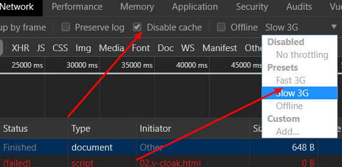
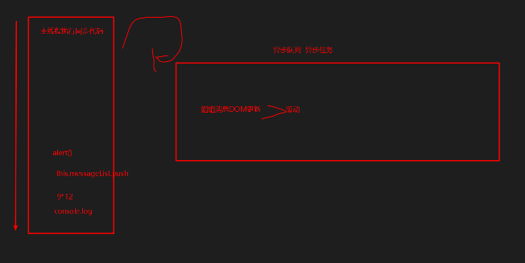
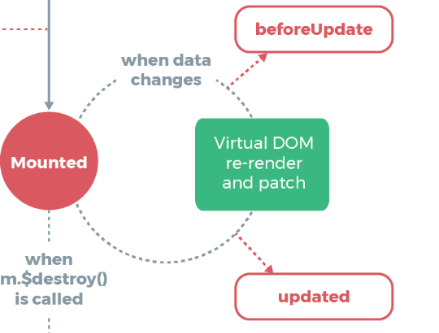

# Vue.js - day02

## 反馈

1. 老师,视频声音有点点小
   1. 对着话筒，更多有激情
2. 老师,开发中是直接使用开源的组件库,还是公司有自己的组件库,后面会教axios吗
   1. 参考公司内部的组件库或者开源的组件库
   2. axios 专注于发请求的。
3. 不太十分理解为何要用事件修辞符,在实际开发中有何用处 ?老师在讲VUE能否多结合实际开发场景应用来讲,便于更好理解它的用处.
   1. @keyup.enter, @click.stop @click.prevent
4. 老师讲文档的时候慢一点,没预习的,嘻嘻嘻
5. 感觉Vue的语法怪怪的,不过用起来好像还挺方便的
   1. 顺应它的语法
6. 老师太别好,技术精湛,敲代码娴熟,健步如飞
7. 后面的有点快,没预习铁定懵逼
   1. 今天把握好节奏


## 回顾

1. vue基本使用

2. vue指令

   

## v-cloak指令

[传送门](https://cn.vuejs.org/v2/api/#v-cloak)

这个指令保持在元素上直到关联实例结束编译。和 CSS 规则如 `[v-cloak] { display: none }`一起用时，这个指令可以隐藏未编译的 Mustache 标签直到实例准备完毕。

1. mustache引入了{{}}，art template沿用了这个语法。Mustache 标签就是{{}}
2. 添加了v-cloak这个指令后，vue解析完后，会移除这个指令
3. v-cloak指令配合display:none样式，隐藏{{}}语法



1. disabled cache让资源不缓存，每次重新请求资源

2. slow 3G弱网测试

   

## v-once指令(了解)

[传送门](https://cn.vuejs.org/v2/api/#v-once)

只渲染元素和组件**一次**。

只 渲染一次 


## Demo-天气预报


#### 实现步骤

1. 输入城市，显示城市
2. 回车，查询天气信息
3. 展示天气信息


#### 注意点

1.  emoji[官网](https://emojipedia.org/fog/)
2. $.ajax{success:function(this)} 这个this是function所在的对象。
3. 建议用箭头函数，不绑定this
4. a.includes(b)=true/false 更直观，建议使用。


## Demo-聊天机器人


#### 实现步骤

1. 我输入消息，回车或者点发送，添加我的消息

2. 依据我的消息，请求拿到姐姐的消息，添加姐姐的消息

   

#### 注意点

1. 消息数组是一个对象

2. 根据消息数组里面的isme来判断是我的消息还是姐姐的消息，分别应用样式

3. 留有问题：滚动的问题

   ```js
   1.messageList:[
         {
           content:'你好',
           isme:true
         },
         {
           content:'好呀',
           isme:false
         },
         {
           content:'吃饭了吗',
           isme:true
         },
         {
           content:'滚',
           isme:false
         }
       ]
   ```


## template结合v-if

[传送门](https://cn.vuejs.org/v2/guide/conditional.html#%E5%9C%A8-lt-template-gt-%E5%85%83%E7%B4%A0%E4%B8%8A%E4%BD%BF%E7%94%A8-v-if-%E6%9D%A1%E4%BB%B6%E6%B8%B2%E6%9F%93%E5%88%86%E7%BB%84)

`<template>` 元素当做不可见的包裹元素，并在上面使用 `v-if`。最终的渲染结果将不包含 `<template>` 元素。

1. template有包裹效果，跟div一样

2. 最终不会渲染template标签

3. 雷锋。。。 做好事不留名。

   

## 滚动底部-Vue异步更新

[异步更新](https://cn.vuejs.org/v2/guide/reactivity.html#%E5%BC%82%E6%AD%A5%E6%9B%B4%E6%96%B0%E9%98%9F%E5%88%97)

可能你还没有注意到，Vue 在更新 DOM 时是**异步**执行的。只要侦听到数据变化，Vue 将开启一个队列，并缓冲在同一事件循环中发生的所有数据变更。

1. Vue更新DOM是异步执行的

2. 数据的变更，会缓冲起来，批量更新DOM

3. 用定时器强制让滚动在姐姐消息DOM更新完后

   ```js
   // 滚动条滚到底部
   setTimeout(()=>{
     $('.content').scrollTop(9999988)
   },100)
   ```

   

## 滚到底部-事件循环

Vue 在内部对异步队列尝试使用原生的 `Promise.then`、`MutationObserver` 和 `setImmediate`，如果执行环境不支持，则会采用 `setTimeout(fn, 0)` 代替。

1. Vue更新DOM的时候，延时不会超过setTimeout 0 

2. **事件循环**（Event Loop）

   

   1. 同步任务在主线程执行
   2. 异步任务在任务队列
   3. 主线程空闲的时候才会挑第一个异步任务进行执行
   4. 重复1，2，3

3. ```js
   // 滚动条滚到底部
   setTimeout(()=>{
     $('.content').scrollTop(9999988)
   },0)
   ```

   

## Vue生命周期钩子

[传送门](https://cn.vuejs.org/v2/guide/instance.html#%E5%AE%9E%E4%BE%8B%E7%94%9F%E5%91%BD%E5%91%A8%E6%9C%9F%E9%92%A9%E5%AD%90)

同时在这个过程中也会运行一些叫做**生命周期钩子**的函数，这给了用户在不同阶段添加自己的代码的机会。



1. vue提供给我们8个回调函数，供我们写自定义逻辑
2. 生命周期钩子的 `this` 上下文指向调用它的 Vue 实例。 和methods里面的方法里的this是一样的
3.  生命周期钩子函数跟data、el平级
4. updated 数据更新后，引起dom更新完成，会触发updated


## 日期格式化库 moment.js

[传送门](http://momentjs.cn)

```js
/*
      2019-08-01 11:50:08 am
      当前的时间，默认的格式
    */
document.write(moment().format('YYYY-MM-DD HH:mm:ss a'))
```


## vue计算属性

[传送门](https://cn.vuejs.org/v2/guide/computed.html#%E8%AE%A1%E7%AE%97%E5%B1%9E%E6%80%A7)

对于任何复杂逻辑，你都应当使用**计算属性**。

1. 计算属性是computed对象里面的一个方法，必须return

2. computed属性和el、data平级

3. 计算属性里面的和this都是Vue实例

4. 计算属性所依赖的data属性，如果所依赖和属性有改变的时候，计算属性会重新计算

5. 计算属性的使用和data里面的属性没什么不同

   

## Demo-品牌管理


#### 实现步骤

1. 展示列表
2. 删除
3. 添加品牌
4. 搜索功能

#### 注意点

1. 搜索的结果列表是一个过滤后的数组，过滤的条件是原数组的品牌名称是否包含搜索的keywords
2. Array.filter（item=>{true/false}） 方法会返回一个新的数组，true/false决定哪一项会添加进数组
3. 计算属性可以放结合v-for


## 练习

1. todoMVC作业
2. 其他资料中的练习案例