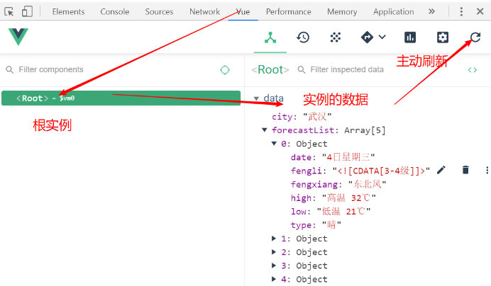
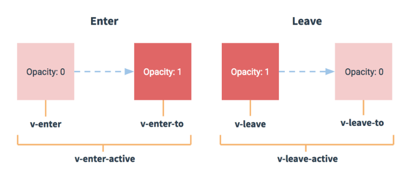

# Vue学习第三天

## 反馈

## 回顾

1. 计算属性
   1. data属性，如果不想原样输出，那么可以使用计算属性
   2. 计算属性是`computed`属性里面的一个方法 
   3. 方法必须有返回值
   4. 方法名可以像data的属性一样使用
   5. 方法名的值就是方法的返回值
   6. 方法所依赖的data属性有改变时，方法会重新计算

2. 方法
   1. 事件处理方法都应该被声明在`methods`
3. updated
   1. Vue生命周期钩子函数，Vue从创建到销毁过程中会经历8个重要的时间节点，在每个节点上，会以回调函数的形式通知我们，在回调函数里面我们可以自定义逻辑。
   2. updated当数据改动，对应的dom更新后，会触发updated
   3. 生命周期钩子函数和el、data是平级的


## 滚动底部-Vue.nextTick

[传送门](https://cn.vuejs.org/v2/api/#Vue-nextTick)

在下次 DOM 更新循环结束之后执行延迟回调。在修改数据之后立即使用这个方法，获取更新后的 DOM。

应用场景: 数据修改，对应的dom更新完后执行一些逻辑，都需要放在nextTick里边。

```js
Vue.nextTick(function () {
  // 姐姐消息添加后，且dom更新完，强制让滚动条滚到底部
  $('.main').scrollTop(99999)
})

this.$nextTick(() => {
  $('.main').scrollTop(99999)
})
```


## 网络请求库axios

[传送门](https://github.com/axios/axios)

1. axios是一个专注于发请求的库，不能操作dom
2. axios能独立使用，也可以结合Vue.js使用，也可以结合react.js
3. vue-resource已经不推荐，官方推荐用axios
4. 使用
   1. 导包 `<script src="https://unpkg.com/axios/dist/axios.min.js"></script>`
   2. 使用方法 get和post

```js
// Make a request for a user with a given ID
axios.get('/user?ID=12345')
  .then(function (response) {
  // 成功后可以在这里拿到数据
  console.log(response);
})
  .catch(function (error) {
  // 处理失败
  console.log(error);
})
  .finally(function () {
  // 成功或者失败都会执行
});

axios.post('/user', {
  firstName: 'Fred',
  lastName: 'Flintstone'
})
  .then(function (response) {
  console.log(response);
})
  .catch(function (error) {
  console.log(error);
});
```

### 注意点

1. .then回调，成功在这里可以拿到数据
2. .catch处理失败
3. .finally成功或者失败都会进入这里
4. .then(function(res){this})这里的this被绑定了，指向window,建议用箭头函数


## Vue.js-DevTools

Vue辅助开发工具，其实一个chrome插件。常用的功能是查看Vue实例的数据

1. 安装

   1. 推荐chrome应用商店安装，但是需要VPN <https://chrome.google.com/webstore/category/extensions?hl=zh-CN>
   2. .crx文件拖拽安装,需要打开开发者模式

2. 设置 **允许文件网址** 让本地文件在浏览器打开的时候，Vue开发工具也生效。

3. 生效 图标变亮且有Vue标签栏

4. 使用

   

5. 异常情况
   1. 页面必须是使用**开发版本的vue.js**，如果使用生产版本的Vue.js，无法生效
   2. 设置 **允许文件网址**
   3. 重启


## v-bind 使用补充

如果标签的属性不是写死的，那么需要使用v-bind绑定属性

1. v-bind与class的对象语法 {类名:是否添加类名}

   1. 为true的时候，添加类名
   2. 为false的时候，不添加类名

2. :class和class并不冲突，:class是追加的

   ```html
   <div class="box" :class="{'red':isRed}" @click="isRed=!isRed"></div>
   ```

   

3. v-bind与style {样式的属性名1：属性值;样式属性名2:属性值。。。。}

   1. 属性名如果有`-`,那么换成驼峰命名或者加字符串


## Demo-天知道

### 实现步骤

1. 输入城市，回车或者点击搜索，发送请求查询天气，展示天气信息列表
   1. 获取用户输入的城市 v-model:city
   2. 回车或者点击搜索 @keyup.enter/@click:queryWeather
   3. 发送请求 axios.get(url)
   4. 接口 http://wthrcdn.etouch.cn/weather_mini?city=深圳
   5. .then(res=>).catch(err) 获取到成功的数据
   6. vfor遍历数组，渲染列表:forecastList
   7. item.type.includes()结合vif条件渲染天气图标

2. loading状态的实现
   1. .input_sub是否添加loading这个类名
   2. 需要动态添加loading :class={类名：是否添加该类(isLoading)}
      1. isLoading为true时就添加loading类名
      2. isLoading为false时就不添加loading类名
   3. 请求中，需要loading，isLoading:true
   4. 其他时候，都是isLoading:false. 初始化时，和请求结束后
3. 点击北上广深，输入框显示点击的城市名，同时查询点击的城市天气信息
   1. 点击 @click:clickSearch(城市名)
   2. 输入框显示点击的城市名 city=城市名
   3. 查询天气 queryWeather


### 注意点

1. 天气信息列表的城市名来自ajax请求的数据里边的city。如果直接取用户输入的城市名的话，就会联动
2. loading状态是由v-bind与class动态添加loading类名
3. 在axios().finally里边，统一关闭loading状态
4. 热门城市的渲染用数组结合v-if, 避免了重复的HTML代码


## Vue动画-单个元素动画

[传送门](https://cn.vuejs.org/v2/guide/transitions.html#%E5%8D%95%E5%85%83%E7%B4%A0-%E7%BB%84%E4%BB%B6%E7%9A%84%E8%BF%87%E6%B8%A1)

vue动画就是元素在显示与隐藏时，**在恰当的时机Vue会添加和删除6个类名**，在类名我们可以自定义动画

1. 元素的显示与隐藏是由v-show或者v-if控制
2. 元素由<transition>包裹
3. transition的name属性值和动画类名首个单词一致。如果没有name属性，动画类名首个单词默主为`v`
4. 在进入/离开的过渡中，会有 6 个 class 切换。
    1. v-enter-ative 出现动画整个过程中都存在
    2. v-enter 出现动画前
    3. v-enter-to 出现动画结束



## Vue动画-结合animate.css

[传送门](https://cn.vuejs.org/v2/guide/transitions.html#CSS-%E5%8A%A8%E7%94%BB)

animate.css一个比较流行的css库，包含一些流行的css动画效果。

使用：就animate.css官网挑选合适的css动画效果，copy keyframe部分到代码里边，应用动画效果

工作上动画不会太过复杂，拿成熟的动画效果，改改参数


## Vue动画-列表过渡

[传送门](https://cn.vuejs.org/v2/guide/transitions.html#%E5%88%97%E8%A1%A8%E8%BF%87%E6%B8%A1)

Vue列表动画：Vue在列表元素添加或移除过程中，在恰当的时机会添加或移除6个类名，在类名里边我们可以自定义动画

1. vfor标签必须包裹在transition-group里面
2. vfor必须给key值
3. transition-group的name和6个类名的首个单词是一致的
4. transition-group tag会解析成标签
5. 改变数据，并不会触发动画


## Demo-天知道-动画整合

1. 天气信息列表添加列表过渡效果

   1. transition-group包裹vfor所在的标签
      1. vfor所在的标签一定给key值
      2. name:list
      3. tag:ul
   2. 样式 用官网例子里面的样式，改改
   3. 在每一个次天气信息查询之前先清空天气信息数组，让动画重新生效
   4. 用tranisition-delay让过渡延迟，那么天气信息列表元素就会有依次出现的效果
      1. 最好在行内用v-bind:style动态设置每个一个li的transition-delay


## Vue动画钩子

[传送门](https://cn.vuejs.org/v2/guide/transitions.html#JavaScript-%E9%92%A9%E5%AD%90)

Vue动画执行过程中，在重要的时间节点会以回调函数的形式通知我们，在回调函数里面可以自定义逻辑

1. 元素出现过程中有钩子：前，中，后还有取消

2. 元素消失过程中有钩子：前，中，后还有取消

   ```html
   <transition
     v-on:before-enter="beforeEnter"
     v-on:enter="enter"
     v-on:after-enter="afterEnter"
     v-on:enter-cancelled="enterCancelled"
   
     v-on:before-leave="beforeLeave"
     v-on:leave="leave"
     v-on:after-leave="afterLeave"
     v-on:leave-cancelled="leaveCancelled"
   >
   ```

3. 动画的钩子函数注册在transtion标签上，或者transtion-group标签上

4. 动画钩子函数声明在methods里面，接受一个el参数，这个el就是dom

```html
<!DOCTYPE html>
<html lang="en">

<head>
  <meta charset="UTF-8" />
  <meta name="viewport" content="width=device-width, initial-scale=1.0" />
  <meta http-equiv="X-UA-Compatible" content="ie=edge" />
  <title>Document</title>
  <style>
    .list-enter-active,
    .list-leave-active {
      transition: all 1s;
    }

    .list-enter,
    .list-leave-to

    /* .list-leave-active for below version 2.1.8 */
      {
      opacity: 0;
      transform: translateX(30px);
    }
  </style>
</head>

<body>
  <div id="app">
    <button @click="add">添加</button>
    <transition-group name="list" tag="ul" v-on:after-enter="afterEnter">
      <li v-for="(item, index) in arr" :key="item">{{item}}</li>
    </transition-group>
  </div>
  <script src="./lib/vue.js"></script>
  <script>
    const app = new Vue({
      el: "#app",
      data: {
        arr: [1, 2, 3, 4, 5]
      },
      methods: {
        add() {
          this.arr.push(parseInt(Math.random() * 1000))
        },
        afterEnter(el) {
          //console.log('ok')
          console.log(el)
        }
      },
    });
  </script>
</body>

</html>
```


> 1. 在昨天实现的天知道案例里面，有一个小细节和演示的案例不太一样。打开案例，这个差别肉眼还看不出来呢，降低网速。注意到天气列表元素出现的时候，是依次延迟的，但是消失的时候是一起消失的。对比我们的实现，消失的时候，也是依次消失的。
> 2. 如果想实现消失动画一起消失，怎么实现。依次消失是由于设置了transition-delay。所以我们需要在元素出现动画结束后清除transition-delay样式。这里涉及到一个知识点Vue动画的钩子函数。
> 3. 看文档，解释。我们说Vue动画其实是元素在显示与隐藏时的动画，那么显示与隐藏时并不是瞬间的，是有阶段的，在这些阶段的重要时间节点也会以回调函数的形式通知给我们。这个和Vue生命周期钩子函数可以对照起来理解
> 4. Vue动画钩子定义。
> 5. 看基本使用，然后举例说明
> 6. 总结用法，这些钩子函数不用去记忆。


## 天知道-结合Vue动画钩子

### 实现步骤

1. transition-group上注册after-enter
2. after-enter事件处理方法里面移除transition-delay


## vfor key

[传送门](https://cn.vuejs.org/v2/api/#key)

1. 如果数组的下标没有变化，不给key也是可以的。给`:key="index"`和不给一样的效果

2. 如果数组的下标有变化，必须给唯一的key，不要给`:key="index"`

3. vfor的key必须是string/number类型

   

## Demo-播放器

[接口文档地址](https://autumnfish.cn/)

### 实现步骤 

1. 输入关键字，回车，请求搜索接口，渲染搜歌结果列表
   1. 获取关键字 v-model:keywords
   2. 回车 @keyup.enter:search
   3. axios.get(url)
   4. 接口的url https://autumnfish.cn/search?keywords= 海阔天空
   5. 歌曲搜索结果数组 songList，vfor遍历songList，渲染列表
2. 双击一首歌，播放歌曲
   1. 双击一首歌 @dblclick:playMusic(id)
   2. axios.get(url)
   3. 接口url https://autumnfish.cn/song/url?id=33894312
   4. 设置audio的src :src="musicUrl"
3. 双击一首歌，更新封面
   1. 双击一首歌 @dblclick:playMusic(id,albumID)
   2. axios.get
   3. 接口url https://autumnfish.cn/album?id=32311
   4. 封面url coverUrl  
   5. 设置封面:src="coverUrl "
4. 双击一首歌，获取评论
   1. 双击一首歌 @dblclick:playMusic(id,albumID)
   2. axios.get
   3. 接口url https://autumnfish.cn/comment/hot?id=186016&type=0
   4. 热门评论列表数组 comments
   5. vfor遍历comments,渲染评论列表
   6. 设置头像 v-bind:src
   7. 昵称{{}}, 评论内容{{}}

### 注意点

1. 前端调后端接口的时候，很可能后端接口返回的数据结构比较复杂，一层层一地拨，就可以找到。


## 补充前端兼容性

1. 移动端只用关注android chrome和ios safari，兼容性还可以 
2. shim提供ES6语法  <https://github.com/aFarkas/html5shiv>
3. PC端一般是官网或者管理端，兼容不好主要考虑的是IE，现在IE分额也越来越小的。提示升级浏览器也是可以 的
4. 新的API才是未来，掌握新的API对自己成长更有利
5.  https://caniuse.com/ 查看一些WebAPI的兼容性


## 总结
