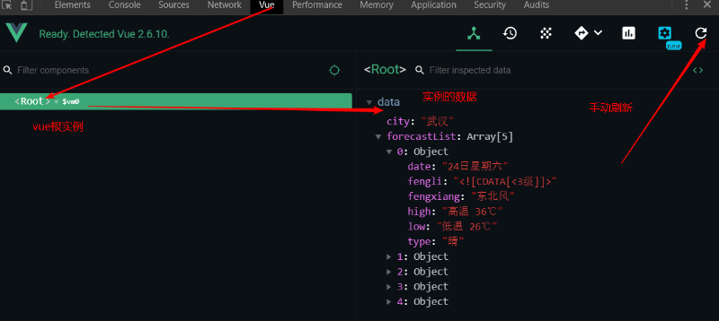
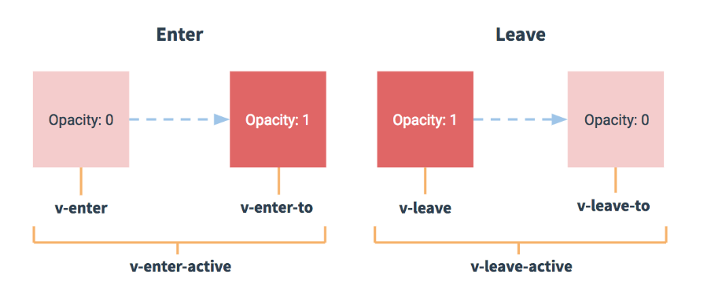

# Vue学习第三天

## 反馈

1. 讲课的方式听着沉闷

2. 有个问题不知当讲不当讲，所谓的大陆流行音乐人都死光了？为什么要那么大声的放周杰伦的歌！这种吊着半口气、舌头都拉不直的歌是来催命的吗？

   1. 当讲不当讲，然后不讲得很不客气。这种语气，让我怀疑上次玩dota，中路送人头的就是你了。
   2. 希望你不是认真的，是开玩笑的？
   3. 我自己也不算Jay的粉丝，但是不得不承认喜欢Jay的歌的人最多。
   4. 所以，大家推荐一些歌，或者课间不用放歌？

3. computed这个还是不太明白,为什么手机品牌中关键字找到对应品牌的不是计算也能放在computed里面去运行代码. 天气报道中ajax中没用dataType: 'json',一样可以获取data中的属性并渲染dom树,可以理解为jq中没用dataType: 'json',也会自动将返回的转成json对象吗?

   1. computed属性一会儿会再复习一下
   2. 天气信息查询接口ajax请求，返回的就不是json格式，无论在Vue的案例里面，还是在jquery的案例里面，都要用dataType:json
   3. 是否需要加dataType:json，这个跟我们要调的这个接口有关。接口返回给前端的数据本身都是字符串的，但是返回数据的附加的数据格式说明。嗨，我传你的是文本格式的哦，我传你的json格式的哦。如果附加的数据格式说明是json，$.ajax会聪明地把字符串转成json对象。但是如果附加格式说明是文本，那$.ajax返回的就是文本; 如果我们想把文本转成json，那么就需要用dataType:json了。

4. 有些**能不能上课安静点，影响老师上课了，视频都是你的声音了，安安静静上课不好吗，非要打断老师的思路，影响我们上课，真的是diào nīyà miè zī bià

5. 就是希望能够把事件循环的原理稍微提一下 ！！！

6. 老师，建议授课时组织一下表达语言，表达语言和思维跳跃的幅度比较大，有点跟不上节奏，现在还没进入vue学习状态，深知vue框架重要性，好担心跟不上啊

7. 老师备课充分,讲课时业务逻辑清晰,就是语言表达上有一点点的不流畅,老师您放开了讲 , 骚点也是可以的...

   


## 回顾

1. 计算属性
   1. data属性，如果不想原样输出，那么可以使用计算属性
   2. 计算属性是`computed`属性里面的一个方法 
   3. 方法必须有返回值
   4. 方法名可以像data的属性一样使用
   5. 方法名的值就是方法的返回值
   6. 方法所依赖的data属性有改变时，方法会重新计算

2. 方法
   1. 事件处理方法都应该被声明在`methods`
3. updated
   1. Vue生命周期钩子函数，Vue从创建到销毁过程中会经历8个重要的时间节点，在每个节点上，会以回调函数的形式通知我们，在回调函数里面我们可以自定义逻辑。
   2. updated当数据改动，对应的dom更新后，会触发updated
   3. 生命周期钩子函数和el、data是平级的

```html
<div id="app">
  <h2>{{date}}</h2>
  <h2>日期格式化{{formatDate}}</h2>
  <input type="text" v-model="date">
</div>
<script src="./lib/vue.js"></script>
<script src="./lib/moment.js"></script>
<script>
  const app = new Vue({
    el: "#app",
    data: {
      date: '2019-8-22'
    },
    computed: {
      formatDate() {
        return moment(this.date).format('YYYY-MM-DD HH:mm:ss a')
      }
    }
  });
</script>
```

```html
<div id="app">
  <button @click="sayHello">鹏鹏你好</button>
</div>
<script src="./lib/vue.js"></script>
<script>
  const app = new Vue({
    el: "#app",
    data: {},
    methods: {
      sayHello() {
        alert('bye bye ...')
      }
    },
  });
</script>
```

```html
<div id="app">
  <button @click="isRed=!isRed">切换显示</button>
  <h2 v-show="isRed">这是一个寂寞的天</h2>
  <h2>{{ message }}</h2>
  <input type="text" v-model="message" />
  <br><br>
</div>
<script src="./lib/vue.js"></script>
<script>
  const app = new Vue({
    el: '#app',
    data: {
      message: '李晨又分手了',
      isRed: true
    },
    updated() {
      console.log('数据改变了')
    }
  })
</script>
```


## 滚动底部-Vue.nextTick

[传送门](https://cn.vuejs.org/v2/api/#Vue-nextTick)

在下次 DOM 更新循环结束之后执行延迟回调。在修改数据之后立即使用这个方法，获取更新后的 DOM。

使用方法:

```js
// 数据变更后
Vue.nextTick(()=>{
  //姐姐消息添加的数据改变，并且对应的dom更新完成后
  $('.content').scrollTop(9999999)
})

this.$nextTick(()=>{
  $('.content').scrollTop(999999)
})
```

updated: data中的数据变更，DOM更新完成后，就会触发

nextTick: 一次数据改后变，DOM更新完成后，就会触发

> 1. 聊天机器人的案例里面，我们把滚动到底部的逻辑放到updated钩子函数里面，所有数据修改后，对应的dom更新后都会触发滚动到底部的逻辑。如果我们想只有姐姐的消息添加，对应的dom更新完后，触发滚动到底部的逻辑，会不会更好些？Vue.nextTick
> 2. 来，看文档，解释官方例子。写法和setTimeout很像，不需要加时间。
> 3. 实现两种方案都可以，演示updated会触发多次 而nextTick只会触发一次
> 4. 这个是终极解决方案，实际项目里面应用得挺多的。


## 网络请求库axios

[传送门](https://github.com/axios/axios)

1. 专注于发请求

2. axios能独立使用，也能够结合vue和react等其他框架使用

3. 使用

   1. 导包   <script src="https://unpkg.com/axios/dist/axios.min.js"></script>
   2. 用法

   ```js
   // Make a request for a user with a given ID
   axios.get('/user?ID=12345')
     .then(function (response) {
       // 成功可以在这里拿到数据
       console.log(response);
     })
     .catch(function (error) {
       // 处理失败逻辑
       console.log(error);
     })
     .finally(function () {
       // 成功或失败都需要做的处理
     });
   
   axios.post('/user', {
       firstName: 'Fred',
       lastName: 'Flintstone'
     })
     .then(function (response) {
       console.log(response);
     })
     .catch(function (error) {
       console.log(error);
     });
   ```

### 注意点

1. .then的回调里面，成功了可以在这里拿到数据
2. .catch的回调里面，处理失败
3. .finally的回调，成功或者失败都会进入这里
4. 回调函数里面，如果用function,this就是window,推荐用箭头函数
   

```html
<!DOCTYPE html>
<html lang="en">
  <head>
    <meta charset="UTF-8" />
    <meta name="viewport" content="width=device-width, initial-scale=1.0" />
    <meta http-equiv="X-UA-Compatible" content="ie=edge" />
    <title>Document</title>
  </head>
  <body>
    <button onclick="search()">查询天气</button>
    <div id="app">
      <input type="text" v-model="city" @keyup.enter="queryWeather" />
    </div>
    <script src="https://unpkg.com/axios/dist/axios.min.js"></script>
    <script src="./lib/vue.js"></script>
    <script>
      function search() {
        axios
          .get('http://wthrcdn.etouch.cn/weather_mini?city=深圳')
          .then(function(res) {
            // 成功可以在这里拿到数据
            console.log(res.data.data.forecast)
          })
          .catch(function(error) {
            // 处理失败逻辑
            console.log(error)
          })
          .finally(function() {
            // 成功或失败都需要做的处理
          })
      }

      //实例化Vue
      new Vue({
        el: '#app',
        data: {
          city: '武汉',
          forecastList:[]
        },
        methods: {
          queryWeather() {
            axios
              .get(`http://wthrcdn.etouch.cn/weather_mini?city=${this.city}`)
              // .then(function(res) {
                .then(res=>{
                // 成功可以在这里拿到数据
                console.log(res.data.data.forecast)
                console.log(this)// 如果用function这里是window
                this.forecastList = res.data.data.forecast
              })
              .catch(function(error) {
                // 处理失败逻辑
                console.log(error)
              })
              .finally(function() {
                // 成功或失败都需要做的处理
                console.log('总是被执行')
              })
          }
        }
      })
    </script>
  </body>
</html>

```

> 1. 强调
> 2. 昨天的案例天气查查查和聊天机器人，我们都调接口了吧？是怎么调接口的呢？jquery的ajax对吧。那么从今天的学习开始，翻篇了，不再使用$.ajax，我们有一个用一个专门发网络请求的库.axios
> 3. 为什么不用jquery呢？我们回顾下，我们主要用jquery来做什么？主要是用来操作DOM对吗？$.ajax对于jquery来说只是一个附属功能。专业的人做专业的事。而axios是一个专注于发请求的库，不包括操作DOM, 体积也更小些
> 4. axios可以独立使用，也可以用vue或者react等一系列的框架结合起来使用。
> 5. 首先来看一下，它是怎么读的。ok
> 6. 接着我们来看一下axios官网。
> 7. 首先来看一下数字，stars数，6.4万，大概是vue的一半，挺多的。
> 8. 从上往下滚动，这些列了它的一些特点。第一项，小黄人对吧。axios内部也是封装了xhr，我们用js实现ajax也是xhr对吧，所以axios也是ajax的一种实现
> 9. 接着往下看，浏览器的支持，只支持IE11以上。兼容必不是很好，不用担心，用着。今天课程最后，我会给大家说一下前端兼容性的问题
> 10. 接着往下看，axios的安装，script src引入对吗？ok,axios的使用，导包（笔记）
> 11. 接着来看它的使用。 axios.get，先用着它的基本使用。copy过来
> 12. post请求，copy过来
> 13. 来，我们写个页面，在实际的案例里面来用axios，就调用天气查询接口。
> 14. 返回数据，和$.ajax不同，但是我们是可以获取到数据的，看着这个数据结构。
> 15. axios再结合vue, 其实和独立使用没啥不一样。整个代码copy过来。
> 16. 我们说$.ajax function里面的this不Vue实例对吧。那axios里面的呢。打印一下。window。如果我们想让this为Vue实例，怎么做呢？箭头函数。
> 17. 在data里面我们定义一个forecastList,赋值。那赋值是否成功呢，可以console.log(), 有更好的方式。好下一节我们学习一下调试工具，方便我们查看Vue实例的数据。
> 18. 回到笔记我们总结一下axios的使用。


## Vue.js-DevTools

Vue调试工具，一个chrome的插件, 有一个常用功能可以查看Vue实例的数据

1. 安装
   1. 推荐chrome商店安装   <https://chrome.google.com/webstore/category/extensions?hl=zh-CN>
   2. .crx文件拖拽安装 需要打开开发者模

2. 设置 **允许文件网址**，浏览器打开本地文件时也能够生效

3. 使用

   1. 图标变亮且有Vue标签栏
   2. 

   

4. 异常情况

   1. 浏览器访问的页面必须使用开发者版本的vue.js
   2. 要设置允许文件网址
   3. 尽量安装在chrome商店安装
   4. 重启

> 1. 我这里安装一个叫Vue调试工具，我先演示一下用它来查看Vue实例的数据。对吧。能看到上这个数据是赋值成功的。
> 2. Vue  devTools是一个Vue调试工具，一个chrome的插件, 有一个常用功能可以查看Vue实例的数据
> 3. 它的安装方式
> 4. 不管用什么方式安装，都要设置允许文件网址。
> 5. 再详细说一下，它是怎么使用的。这个图标亮，且一个Vue tab栏，说明调试工具是生效的。
> 6. 有一些异常情况，使用不了的话，大家可以对照检查一下。


## v-bind 使用补充

如果标签的属性不是写死的，就应该用v-bind来绑定属性

1. v-bind与class的对象方式

   1. :class="{类名:是否添加类名}"
      1. 如果true，就添加类名
      2. 如果为false，就不添加类名
   2. :class和原有的class不冲突，:class是追加类名
   
```html
   <div class="box" :class="{red:isRed}" @click="isRed=!isRed"></div>
```

2. v-bind:style 

   1. v-bind:style="{样式的属性名:属性值, 属性名2：属性值。。。。。}"

   2. 属性名如果是`-`分隔的话，换成驼峰命名或者是加字符串

      ```html
      <div :style="{backgroundColor: changeRed?'red':'','margin-top':'100px'}" @click="changeRed=!changeRed"></div>
      ```

```html
<!DOCTYPE html>
<html lang="en">
  <head>
    <meta charset="UTF-8" />
    <meta name="viewport" content="width=device-width, initial-scale=1.0" />
    <meta http-equiv="X-UA-Compatible" content="ie=edge" />
    <title>Document</title>
    <style>
      #app>div{
        width: 100px;
        height: 100px;
        border:1px solid green;
        margin:10px;
      }
      .red{
        background-color: red;
      }
    </style>
  </head>
  <body>
    <div id="app">
      <div class="red" :class="{red:isRed,green:true}" :class="{green:true}" @click="isRed=!isRed"></div>
      <div :style="{backgroundColor: changeRed?'red':'','margin-top':'100px'}" @click="changeRed=!changeRed"></div>
    </div>
    <script src="./lib/vue.js"></script>
    <script>
      let style={
        // 'background-color': 'red'
        backgroundColor: 'red'
      }
      
      const app = new Vue({
        el: "#app",
        data: {
          isRed:true,
          changeRed:true
        }
      });
      </script>
  </body>
</html>
```

> 1. 对于v-bind这个指令，我们说如果标签的属性不是写死的，就应该用v-bind来绑定属性
> 2. 前面我们学习v-bind的基本用法，它还有一些高级的用法。这里补充一下。
> 3. 回顾v-bind:class,三元运算切换div的背景是怎么做的。这里它有一种对象的写法。类名:是否添加类名，效果是不是和三元运算一样的。这个对象的写法更简洁一些，大家可以根据自己的喜欢，灵活运用。
> 4. 目前标签只有一个:class，那如果它已经有一个class属性呢，会不会冲突？ 并不冲突，:class是追加的
> 5. v-bind也能结合style属性使用。比如这个red类，里面就一个css属性，我们也可以写在style里面。
> 6. 那如果我想同样实现点击切换红色背景怎么做的呢，那style属性的值就不是写死的吧。所以得用v-bind。
> 7. v-bind:style的语法是一个对象，所以写法是。。。对象可以直接写在js里边。
> 8. 然后...


## Demo-天知道

### 实现步骤

1. 输入城市，回车或者点搜索，请求数据，展示天气信息列表
   1. 获取城市名 v-model:city
   2. 回车或者点搜索 @keyup.enter/@click: queryWeather
   3. 请求 axios.get(url)
   4. 接口：http://wthrcdn.etouch.cn/weather_mini?city=深圳
   5. .then(res=>获取数据)
   6. vfor遍历数组，生成天气信息的列表:forecastList
   7. item.type.includes 结合v-if展示图标
2. loading状态的问题
   1. .input_sub这个按钮是否添加 loading这个样式
   2. 是否添加loading样式  :class=“{loading:是否添加样式isLoading}”
      1. isLoading为true,就添加loading样式
      2. isLoading为false，不添加loading样式
   3. 发请求前，isLoading=true
   4. 请求完成后.finally isLoading:false
3. 点击北上广深,输入的城市改变且查询点击的城市天气
   1. 点击城市名 @click:clickSearch(城市名)
   2. 输入城市改变 city=城市名
   3. 查询点击城市天气   queryWeather

### 注意点

1. 加载效果是由isLoading来控制是否添加loading类名
2. v-bind:class的对象方式语法，class="{类名:是否添加类名}"
3. axios().finally统一关闭loading
4. 热门城市的展示用数组渲染，避免写重复的html

> 1. 接下来我们来完成一个案例 天知道，是天气查查查的升级版本
> 2. 它的功能有输入查询天气，loading,热门城市点击，天气信息列表动画效果
> 3. 检查HTML结构
> 4. 分析查询天气的功能实现， 这部分功能和昨天的一样，我们一起来回顾一下。
> 5. 对于这个loading状态，我们看一下它的html结构，其实就一个类名的添加和移除对吧。


## Vue动画-单个元素过渡动画

[传送门](https://cn.vuejs.org/v2/guide/transitions.html#%E5%8D%95%E5%85%83%E7%B4%A0-%E7%BB%84%E4%BB%B6%E7%9A%84%E8%BF%87%E6%B8%A1)

**元素在显示与隐藏时，Vue会在恰当的时机添加/删除6个类名，在类名里让我们自定义动画。**

使用方法：

1. v-if或者v-show控制元素的显示与隐藏
2. <transition>标签包裹显示与隐藏的元素
3. transtion name属性的值和类名首个单词一致
4. 在进入/离开的过渡中，会有 6 个 class 切换

   1. v-enter-active 整个动画出现过程中都有
   2. v-enter 动画出现前
   3. v-enter-to 完全出现

```html
<!DOCTYPE html>
<html lang="en">

<head>
  <meta charset="UTF-8" />
  <meta name="viewport" content="width=device-width, initial-scale=1.0" />
  <meta http-equiv="X-UA-Compatible" content="ie=edge" />
  <title>Document</title>
  <style>
    img {
      width: 200px;
      height: 200px;
      /* transition: all 2s; */
    }

    /* img:hover {
      width: 400px;
    }
    */

    .list-enter-active {
      transition: all 2s;
    }

    .list-enter-to {
      width: 400px;
    }
  </style>
</head>

<body>
  <div id="app">
    <button @click="isShow = !isShow">切换显示</button>
    <br>
    <br>
    <transition name="list">
      <!--  -->
      
    </transition>
  </div>
  <script src="./lib/vue.js"></script>
  <script>
    const app = new Vue({
      el: "#app",
      data: {
        isShow: true
      }
    });
  </script>
</body>

</html>
```

> 1. 天知道这个案例是有动画效果的，这块我们没学，先来学习动画的知识点，回来把天知道的动画补充上去
> 2. 首先来看单个元素的动画，看文档，效果是显示和隐藏hello时有一个淡入淡出的效果对吧。
> 3. 我们来实现同样的效果，展式正常显示与隐藏逻辑
> 4. 添加transition，看看解析后的标签，没有啥。其实给img加了类名。只是因为Vue是在显示与隐藏过程中插入类名，而显示与隐藏过程是一瞬间完成的。
> 5. 查看文档，截图解释插入的类名
> 6. 我把官方的样式copy过来，来看一下，是否有动画。能看到添加的样式吧
> 7. 解析transtion name
> 8. v-if也可以。
> 9. 笔记


## Vue动画-结合animate.css

[传送门](https://cn.vuejs.org/v2/guide/transitions.html#CSS-%E5%8A%A8%E7%94%BB)

animate.css是比较流行的动画库, 包括一些流行的css动画效果

使用: 挑选合适的css动画样式，copy进代码，替换掉原来的动画

工作中的动画并不会很复杂。

```html
<!DOCTYPE html>
<html lang="en">

<head>
  <meta charset="UTF-8" />
  <meta name="viewport" content="width=device-width, initial-scale=1.0" />
  <meta http-equiv="X-UA-Compatible" content="ie=edge" />
  <title>Document</title>
  <style>
    img {
      width: 200px;
      height: 200px;
    }

    @keyframes slideInLeft {
      from {
        -webkit-transform: translate3d(-100%, 0, 0);
        transform: translate3d(-100%, 0, 0);
        visibility: visible;
      }

      to {
        -webkit-transform: translate3d(0, 0, 0);
        transform: translate3d(0, 0, 0);
      }
    }

    @keyframes zoomOut {
      from {
        opacity: 1;
      }

      50% {
        opacity: 0;
        -webkit-transform: scale3d(0.3, 0.3, 0.3);
        transform: scale3d(0.3, 0.3, 0.3);
      }

      to {
        opacity: 0;
      }
    }

    @keyframes rotate {
      0% {
        transform: rotate(0deg);
      }

      100% {
        transform: rotate(360deg);
      }
    }

    .list-enter-active {
      /* animation: rotate 6.25s infinite linear; */
      /* animation: zoomOut 2s; */
      animation: slideInLeft 2s;
    }
  </style>
</head>

<body>
  <div id="app">
    <button @click="isShow = !isShow">切换显示</button>
    <br>
    <br>
    <transition name="list">
      
    </transition>
  </div>
  <script src="./lib/vue.js"></script>
  <script>
    const app = new Vue({
      el: "#app",
      data: {
        isShow: true
      }
    });
  </script>
</body>

</html>
```

> 1. 我们说Vue的单个元素动画是元素在显示与隐藏时，Vue会在恰当时机添加或者移除一些类名，刚刚这个案例里边，我们在类名里面写了啥？过渡，过渡也是动画的一种，我们还可以添加一些关键帧动画
> 2. 先给img添加动画
> 3. 把动画添加到元素出现期间
> 4. 自己添加的动画效果粗糙，animate.css包含了一些常用的动画样式，可以选择一些效果，然后修改。
> 5. animate.css网站，选择一些效果。


## Vue动画-列表过渡

[传送门](https://cn.vuejs.org/v2/guide/transitions.html#%E5%88%97%E8%A1%A8%E8%BF%87%E6%B8%A1)

列表动画，列表元素的增加和删除时，Vue会在恰当的时机给元素增加和移除一些类名，在类名里面我们可以自定义样式。

使用：

1. v-for的标签必须包裹在<transition-group>
2. v-for必须给Key
3. transtion-group的tag会自动生成一个标签
4. 添加和移除的类名和单元素动画一致
5. 改变数组本身并不会触发动画

```html
<!DOCTYPE html>
<html lang="en">

<head>
  <meta charset="UTF-8" />
  <meta name="viewport" content="width=device-width, initial-scale=1.0" />
  <meta http-equiv="X-UA-Compatible" content="ie=edge" />
  <title>Document</title>
  <style>
    .list-enter-active,
    .list-leave-active {
      transition: all 2s;
    }

    .list-enter,
    .list-leave-to {
      transform: translateX(30px)
    }
  </style>
</head>

<body>
  <div id="app">
    <button @click="add">添加</button>
    <button @click="remove">删除</button>
    <!-- <ul> -->
    <transition-group name="list" tag="ul">
      <li v-for="(num, index) in arr" :key="num">{{num}}</li>
    </transition-group>
    <!-- </ul> -->
  </div>
  <script src="./lib/vue.js"></script>
  <script>
    const app = new Vue({
      el: "#app",
      data: {
        arr: [1, 2, 3, 4, 5, 6, 7, 8, 9]
      },
      methods: {
        add() {
          this.arr.push(parseInt(Math.random() * 1000))
        },
        remove() {
          this.arr.splice(0, 1)
        }
      },
    });
  </script>
</body>

</html>
```

> 1. 试想一个场景，列表元素给它新添加元素，要求元素出来的动画都一样。单个元素动画做不到？这里就有列表动画
> 2. 看文档，解释，然后截图看使用
> 3. 先来一个列表，添加和删除元素
> 4. 添加transition-group，添加到哪里呢。渲染列表vfor上边
> 5. 报错，vfor需要添加key。为什么呢。后面再解释，先添加vfor key
> 6. 回头看看我们添加的代码，name和单个元素是一样的，类名的首个单词。tag是什么意思呢，标签，是不是添加这个后，会自动生成一个ul标签呢？试试
> 7. 找找Vue给我们添加的样式。一闪而过，截不到。看文档，发现类名一致。直接定义。
> 8. copy单个元素的动画，改改。


## Demo-天知道-动画整合

1. 天气信息列表添加列表过渡效果
   1. transition-group包裹vfor所在的标签
      1. vfor所在的标签一定给key值
      2. name:list
      3. tag:ul
   2. 样式 用官网例子里面的样式，改改
   3. 在每一个次天气信息查询之前先清空天气信息数组，让动画重新生效
   4. 用tranisition-delay让过渡延迟，那么天气信息列表元素就会有依次出现的效果
      1. 最好在行内用v-bind:style动态设置每个一个li的transition-delay


## Vue动画钩子

[传送门](https://cn.vuejs.org/v2/guide/transitions.html#JavaScript-%E9%92%A9%E5%AD%90)

Vue动画钩子就是元素出现和隐藏的动画过程中，Vue在会恰当的时机以回调函数的形式通知我们。在回调函数里可以自定义一些逻辑。

1. 元素出现动画 前，中，后，还有取消
2. 元素消失动画的前，中后还有取消

```html
<transition
  v-on:before-enter="beforeEnter"
  v-on:enter="enter"
  v-on:after-enter="afterEnter"
  v-on:enter-cancelled="enterCancelled"

  v-on:before-leave="beforeLeave"
  v-on:leave="leave"
  v-on:after-leave="afterLeave"
  v-on:leave-cancelled="leaveCancelled"
>
```

使用方法

1. 动画钩函数是注册在transition,transition-grup上

2. 钩子函数的声明是放在methods，默认接受一个el参数，就是动画元素的DOM


## 天知道-结合Vue动画钩子

### 实现步骤

1. 在transition-group上注册after-enter
2. after-enter事件处理方法里面重置transition-delay


## vfor key 待总结

[传送门](https://cn.vuejs.org/v2/api/#key)

1. **重用和重新排序现有元素**, 及transition-group里面vfor, key值要唯一
2. 数组元素下标不变的话，不添加key值和key=index效果一样。
3. vfor的key只能为string和number

```html
<!DOCTYPE html>
<html lang="en">

<head>
  <meta charset="UTF-8" />
  <meta name="viewport" content="width=device-width, initial-scale=1.0" />
  <meta http-equiv="X-UA-Compatible" content="ie=edge" />
  <title>Document</title>
</head>

<body>
  <div id="app">
    <button @click="reverseArr">反转</button>
    <ul>
      <li v-for='(brand,index) in brandList' :key="brand.id">
        {{brand.name}}
        <input type="text">
      </li>
    </ul>
  </div>
  <script src="./lib/vue.js"></script>
  <script>
    const app = new Vue({
      el: "#app",
      data: {
        brandList: [{
          name: '华为',
          id: 1234
        }, {
          name: '小米',
          id: 2345
        }]
      },
      methods: {
        reverseArr() {
          this.brandList.reverse()
        }
      },
    });
  </script>
</body>

</html>
```


> 1. 列表元素动画里面，vfor不给key就报错了。
> 2. 其实很多场景下，vfor不给key, 编程器会警告，浏览器的console会也警告的。
> 3. 为什么呢，看文档
> 4. 举例，页面渲染反转了，数据也反转了，貌似都OK. 然后我们在输入框里面输入值，可以看到输入值并没反转
> 5. 为什么呢？当输入框为空的情况下，如果想让显示反转，用js的方式，怎么做呢? 把已经渲染的dom进行交换，还是在已经生成的dom上修改值？后者的效率更高些，Vue的vfor默认也是这样偷赖。
> 6. 我们这里需求是让dom交换位置，按目前vfor的渲染，Vue根本不知道两个dom有什么不同。所以需要给个key唯一标识dom.这个就是key
> 7. 大家很容易想到:key="index" 可以吗？为什么不行呢。
> 8. 终级方案:key="item.id"
> 9. vfor的key只能为string和number
> 10. 元素的下标有变化的话，key要给唯一值; 元素下标没有变化的话，不添加key值和key=index效果一样


## 补充前端兼容性

1. 移动端只用关注android chrome和ios safari，兼容性还可以 
2. shim提供ES6语法  <https://github.com/aFarkas/html5shiv>
3. PC端一般是官网或者管理端，兼容不好主要考虑的是IE，现在IE分额也越来越小的。提示升级浏览器也是可以 的
4. 新的API才是未来，掌握新的API对自己成长更有利
5.  https://caniuse.com/ 查看一些WebAPI的兼容性


## 总结
