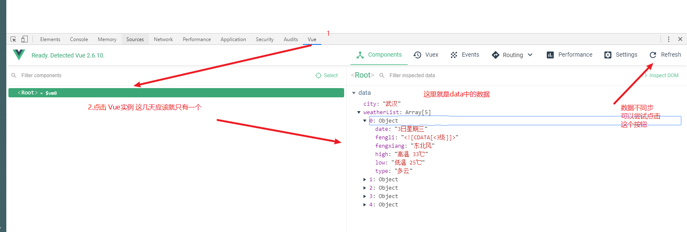

# Vue学习第三天

## 反馈


## 回顾

1. 计算属性
   1. 声明在computed里面的一个方法，方法名作为属性使用
   2. 方法必须有return返回一个值

```html
<div id="app">
  <h2>{{ message }}</h2>
  <input type="text" v-model="message" />
  <h2>我输入了{{ num }}字</h2>
</div>
<script src="./lib/vue.js"></script>
<script>
  const app = new Vue({
    el: '#app',
    data: {
      message: '这是一个寂寞的天，下着有些伤心的雨'
    },
    computed: {
      num() {
        return this.message.length
      }
    }
  })
</script>
```


## 滚动底部-Vue.nextTick

[传送门](https://cn.vuejs.org/v2/api/#Vue-nextTick)

在下次 DOM 更新循环结束之后执行延迟回调。在修改数据之后立即使用这个方法，获取更新后的 DOM。

```html
this.$nextTick(()=>{
  $('.content').scrollTop(999999999)
})

Vue.nextTick(()=>{
	$('.content').scrollTop(9999988)
})
```


## 网络请求库axios

[传送门](https://github.com/axios/axios)

1. 主要就是用来发请求，没有dom操纵的功能
2. 专注于发请求，
3. 在axios之前，还有一个流行过一段时间的`vue-resource`vue官方已经不再推荐他，市面上页没什么人再用

使用步骤

1. 导包  <script src="https://unpkg.com/axios/dist/axios.min.js"></script>

2. 用包

   1. get请求
   2. post请求

   4.  注意：结合vue使用时，内部的函数不要用 `function(){}` ，用箭头函数，让this固定

   ```js
   axios.get('/user?ID=12345')
    .then(function (response) {
       // handle success
    console.log(response);
     })
     .catch(function (error) {
       // handle error
       console.log(error);
     })
     
     
     axios.post('/user', {
       firstName: 'Fred',
       lastName: 'Flintstone'
     })
     .then(function (response) {
       console.log(response);
     })
     .catch(function (error) {
       console.log(error);
     });
   ```
   


## Vue.js-DevTools

1. 安装
2. 检查是否变绿
   1. 绿了，这个页面用了vue
   2. 灰色，这个页面没用vue
3. 
4. vue图标命名绿了，但却无法在开发者界面看到数据
   1. vue的版本，如果是开发版本，课堂使用的版本可以看到数据
   2. 上线的网站一般用的是`生产版本`，无法通过开发者工具查看数据
5. 如果有梯子，建议直接去chrome商店下载


## v-bind 使用补充

1. 对象的方式绑定class
   1. isRed的值是true，有red这个类名
   2. isRed的值是false，就移除red这个类名
   3. 默认class，和:class不冲突，后面的会作为追加，或者移除来解析

```html
<div class="box" :class="{ red: isRed }"></div>
```

2. 对象的方式绑定style
   1. 左边的会解析为样式的名字，不能用`-`
   2. 后面的size会被解析为 data中的值，如果不存在直接报错了

```html
<!-- style 绑定 -->
<div :style="{ fontSize: size + 'px' }"></div>
```


## Demo-天知道

### 实现步骤

1. 输入内容，点击回车，开启loading动画，请求数据
   1. 获取用户输入 v-model.trim :city
   2. enter键抬起事件 @keyup.enter=searchWeather
   3. .input_sub   按钮 添加loading类名
      1. data中 使用isLoading来标记 loading 显示与否
      2. loading状态 isLoading:true
   4. 请求天气数据 axios.get()
2. 数据回来之后，关闭loading动画，把数据渲染到页面上
   1. .then（）获取请求成功的数据
   2. input_sub   按钮 移除loading类名
      1. 不显示loading isLoading:false
   3. 展示天气数组信息 v-for  weatherList
3. 点击北 上 广 深，修改文本框的值，重新查询天气
   1. 修改city和当前点击的城市一致即可
   2. 调用`searchWeather `即可

### 注意点

1. axios请求数据的时候 .then(backData=>{})
3. loading动画时通过data中的`isLoading`
   1. :class="{loading:isLoading}" 
      1. true 有类名
      2. false 移除类名
4. 点击搜索可以通过行内搞定，也可以抽取为方法
   1. 建议用，抽取，代码的可读性和封装性更好一些
   2. 行内的写法，没有语法高亮，找bug也不方便
   3. 工作中只有取反会写在行内，其他全写在方法里面。


## Vue动画-单个元素动画

[传送门](https://cn.vuejs.org/v2/guide/transitions.html#%E5%8D%95%E5%85%83%E7%B4%A0-%E7%BB%84%E4%BB%B6%E7%9A%84%E8%BF%87%E6%B8%A1)

注意点

1. transition 如果不包裹元素，没有动画
2. name属性和动画的样式，首个单词一致
3. 元素在显示和隐藏时才会出现动画
   1. v-show
   2. v-if
4. 动画的各个阶段的类名是不同的 具体有哪些
5. 在进入/离开的过渡中，会有 6 个 class 切换。
   
   
6. 工作中动画的时候不会太过复杂，基本的直接copy改

```html
<!DOCTYPE html>
<html lang="en">
  <head>
    <meta charset="UTF-8" />
    <meta name="viewport" content="width=device-width, initial-scale=1.0" />
    <meta http-equiv="X-UA-Compatible" content="ie=edge" />
    <title>Document</title>
    <style>
      .fade-enter-active,
      .fade-leave-active {
        transition: opacity 0.5s;
      }
      .fade-enter, .fade-leave-to /* .fade-leave-active below version 2.1.8 */ {
        opacity: 0;
      }
    </style>
  </head>
  <body>
    <div id="app">
      <button @click="isShow=!isShow">Toggle</button>
      <br>
      <br>
      <transition name="fade">
        
      </transition>
    </div>
    <script src="./lib/vue.js"></script>
    <script>
      const app = new Vue({
        el: '#app',
        data: {
          isShow: true
        }
      })
    </script>
  </body>
</html>

```


## Vue动画-结合animate.css

[传送门](https://cn.vuejs.org/v2/guide/transitions.html#CSS-%E5%8A%A8%E7%94%BB)

1. 比较流行的免费开源的动画库  `animate.css`<https://daneden.github.io/animate.css/> 

   1. 直接导包，太大了

   ```html
   <!DOCTYPE html>
   <html lang="en">
     <head>
       <meta charset="UTF-8" />
       <meta name="viewport" content="width=device-width, initial-scale=1.0" />
       <meta http-equiv="X-UA-Compatible" content="ie=edge" />
       <title>Document</title>
       <style>
         .bounce-enter-active {
           animation: jackInTheBox 0.5s;
         }
         .bounce-leave-active {
           animation: jackInTheBox 0.5s reverse;
         }
   
         @keyframes jackInTheBox {
           from {
             opacity: 0;
             -webkit-transform: scale(0.1) rotate(30deg);
             transform: scale(0.1) rotate(30deg);
             -webkit-transform-origin: center bottom;
             transform-origin: center bottom;
           }
   
           50% {
             -webkit-transform: rotate(-10deg);
             transform: rotate(-10deg);
           }
   
           70% {
             -webkit-transform: rotate(3deg);
             transform: rotate(3deg);
           }
   
           to {
             opacity: 1;
             -webkit-transform: scale(1);
             transform: scale(1);
           }
         }
         @keyframes bounce-in {
           0% {
             transform: scale(0);
           }
           50% {
             transform: scale(1.5);
           }
           100% {
             transform: scale(1);
           }
         }
         body {
           text-align: center;
         }
       </style>
     </head>
     <body>
       <div id="app">
         <div id="example-2">
           <button @click="show = !show">Toggle show</button>
           <transition name="bounce">
             <p v-if="show">
               Lorem ipsum dolor sit amet, consectetur adipiscing elit. Mauris facilisis enim libero, at lacinia diam
               fermentum id. Pellentesque habitant morbi tristique senectus et netus.
             </p>
           </transition>
         </div>
       </div>
       <script src="./lib/vue.js"></script>
       <script>
         new Vue({
           el: '#example-2',
           data: {
             show: true
           }
         })
       </script>
     </body>
   </html>
   
   ```


## Vue动画-列表过渡

[传送门](https://cn.vuejs.org/v2/guide/transitions.html#%E5%88%97%E8%A1%A8%E8%BF%87%E6%B8%A1)

1. 需要使用`transition-group`
   1. name: 动画样式的开始类名
   2. tag：解析为的标签名
   
2. transition-group包裹的循环生成的结构
   1. v-for
   2. 结合key属性
      1. key的取值：字符串，数字
   
3. 动态的增删元素的，就会触发进入动画，以及移除动画

   ```html
   <!DOCTYPE html>
   <html lang="en">
     <head>
       <meta charset="UTF-8" />
       <meta name="viewport" content="width=device-width, initial-scale=1.0" />
       <meta http-equiv="X-UA-Compatible" content="ie=edge" />
       <title>Document</title>
       <style>
         .list-item {
           display: inline-block;
           margin-right: 10px;
         }
         .list-enter-active,
         .list-leave-active {
           transition: all 1s;
         }
         .list-enter, .list-leave-to
   /* .list-leave-active for below version 2.1.8 */ {
           opacity: 0;
           transform: translateX(300px);
         }
       </style>
     </head>
     <body>
       <div id="app">
         <button @click="add">添加</button>
         <button @click="remove">移除</button>
         <!-- 列表动画-->
         <transition-group name="list" tag="p">
           <li v-for="(item, index) in arr" :key="index">{{ item }}</li>
         </transition-group>
       </div>
       <script src="./lib/vue.js"></script>
       <script>
         const app = new Vue({
           el: '#app',
           data: {
             arr: []
           },
           methods: {
             add() {
               this.arr.push(parseInt(Math.random() * 100))
             },
             remove() {
               this.arr.splice(0, 1)
             }
           }
         })
       </script>
     </body>
   </html
   ```
   


## vfor key

[传送门](https://cn.vuejs.org/v2/api/#key)

有相同父元素的子元素必须有**独特的 key**

建议vfor的所在的元素，给一个唯一标识的key


## Demo-天知道-动画整合

1. 动画整合
   1. 循环生成的标签用`transition-group`包裹
      1. name:list
      2. tag:ul
   2. 准备 动画的样式
2. 第二次没有动画
   1. 元素的个数没有变
   2. 每次查询天气的时候清空数组即可
3. 间隔动画
   1. 使用transition-delay:让每一个元素比上一个的时间晚一些即可
   2. v-for的时候，动态的设置transitionDelay的值即可`{transitionDelay:index*50+'ms' }`


## Demo-播放器

[文档地址](https://autumnfish.cn/)

### 实现步骤

1. 输入内容，点击回车，查询数据，渲染页面
   1. 获取用户输入 v-model :music
   2. enter键抬起事件@keyup.enter:searchMusic
   3. 发送请求 axios.get('<https://autumnfish.cn/search?keywords=%E5%91%A8%E6%9D%B0%E4%BC%A6> ')
   4. 成功的回调里获取数据 .then() musicList
   5. 展示搜索结果 v-for 
2. 双击歌曲列表，播放双击的歌曲
   1. dblclick: playMusic（歌曲的id）
   2. axios接口调用 <https://autumnfish.cn/song/url?id=33894312> 
   3. .then()
   4. 放歌要设置src，歌曲的url地址
      1. src属性
      2. v-bind:src=musicUrl
   5. 歌曲封面获取:<https://autumnfish.cn/song/detail?ids=347234> 
   6. 获取评论：<https://autumnfish.cn/comment/hot?id=186015&type=0> 

### 注意点

3. 工作中，基本上所有的数据都是由接口提供，不同的接口功能不同，前端开发中，天天调不同的接口


## 补充前端兼容性

1. 移动端只用关注android chrome和ios safari，兼容性还可以

2. shim提供ES6语法

3. PC端一般是官网或者管理端，兼容不好主要考虑的是IE，现在IE分额也越来越小的。提示升级浏览器也是可以的

4. 新的API才是未来，掌握新的API对自己成长更有利

5. <https://caniuse.com/>  查看一些WebAPI的兼容性

   

## 课后学生完成播放器需要的接口

1. 封面

2. 热门评论接口

   

## 总结