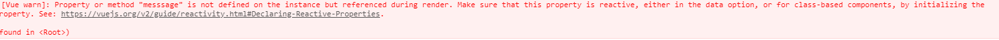
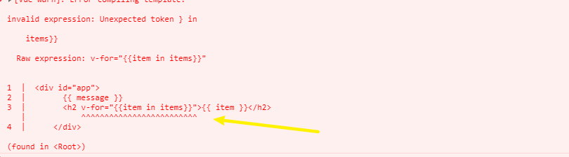
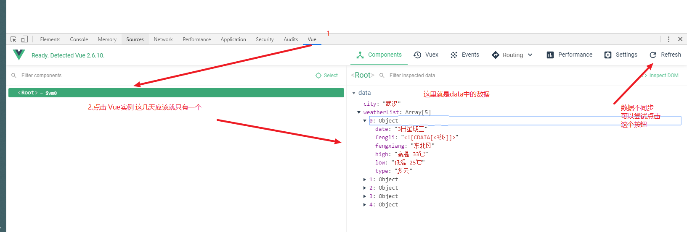

# Vue.js - day03

## 反馈

1. 老师,能不能将类似于日期comment.js那种类型的其他类型的东西,一次性把能分享的东西都分享出来....蛮好用的....
   1. moment.js
2. 食梦者动漫教会我敢于最求梦想,食梦者电影教会我看清现实(＾Ｕ＾)ノ~ＹＯ
   1. 励志
   2. 画漫画的故事
3. 老湿 computed 还是有些不太清楚可以再讲讲不
4. 嘤嘤嘤 小拳拳 捶你胸口
5. 请说出一共有多少人代替夜神月制裁过犯人.
6. 不要为了眼前的不幸而感到悲伤,也许明天就更绝望了
7. 以后上班都是996吗?
8. 你既然都把照片换成了 你媳妇儿 , 你还挡起来 -. - 还有什么时候 晚自习 来我们班? 上个月不是隔壁班吗 , 这个月不是我们班吗
9. 花姐 感觉凉了呀 咋整??
10. 老师 ,说说传智招老师的条件 ,顺便透露下您的薪资(大概就好),好让我更有信心的活下去.
11. 老斯你多大 ，何时才能变得像你一样优秀
12. 老师今年多大了
13. 天天婚纱照 干嘛？？？？真的很烦躁了 我是来听课的 不是来吃狗粮的 特别是每次一出来还说一遍媳妇媳妇 ？？？？
14. 哎呀
15. 不想看到婚紗照，不想聼你媳婦，很難受，想回家
16. 为什么现在的框架无法像曾经的jquery库一样一家独大呢？这样就可以专注的只学一个了，所以jquery的历史地位是不是最高的？毕竟只有jquery做到了近乎垄断。
17. 老师这次的备课非常充分，课程安排环环相扣，丝丝入华。 我等听的都雄起了。月入2w指日可待。这话虽然看起来想舔狗， 我举个例子。第一个是下拉框的，当使用了计时器解决的时候，他引出了钩子函数。 当商品查找的时候，引入了计算属性。
18. 一晚上自习都没视频回顾 有些地方需要翻看视频却没得看 学习受影响 连续两次视频都发错 希望下次不要再出现这种低级错误了
19. VUE舒服啊
20. 秀～～～😍😍😍
21. 好
22. 日子和我，都很难过。
23. 计算属性不是很理解....
24. 都选b
25. 五星好评是一种习惯.
26. 总觉得老师没把我们当成零基础讲。。。。┭┮﹏┭┮

## 回顾

1. 计算属性
   1. computed
   2. 返回的结尾要 return
2. bug查找
   1. 
      1. 找到提示属性或方法，在vue实例中是否定义即可
   2. 
      1. 查看错误的位置即可
   3. vue中 {{}}只在v-text指令的简写时才需要

## 网络请求库axios

[传送门](https://github.com/axios/axios)

1. 主要就是用来发请求，没有dom操纵的功能
2. 专注于发请求，
3. 在axios之前，还有一个流行过一段时间的`vue-resource`vue官方已经不再推荐他，市面上页没什么人再用

使用步骤

1. 导包  <script src="https://unpkg.com/axios/dist/axios.min.js"></script>

2. 用包

   1. get请求
   2. post请求

   3.特点

    	1. 之前的嵌套调用
    	2. 变成了 链式调用

   4.注意：结合vue使用时，内部的函数不要用 `function(){}` ，用箭头函数，让this固定

   ```js
   axios.get('/user?ID=12345')
     .then(function (response) {
       // handle success
       console.log(response);
     })
     .catch(function (error) {
       // handle error
       console.log(error);
     })
     
     
     axios.post('/user', {
       firstName: 'Fred',
       lastName: 'Flintstone'
     })
     .then(function (response) {
       console.log(response);
     })
     .catch(function (error) {
       console.log(error);
     });
   ```

   

## Vue.js-DevTools

1. 安装
2. 检查是否变绿
   1. 绿了，这个页面用了vue
   2. 灰色，这个页面没用vue
3. 
4. vue图标命名绿了，但却无法在开发者界面看到数据
   1. vue的版本，如果是开发版本，课堂使用的版本可以看到数据
   2. 上线的网站一般用的是`生产版本`，无法通过开发者工具查看数据
5. 如果有梯子，建议直接去chrome商店下载
6. <https://chrome.google.com/webstore/search/vue?hl=zh-CN> 

## v-bind 使用补充

1. 对象的方式绑定class
   1. isRed的值是true，有red这个类名
   2. isRed的值是false，就移除red这个类名
   3. 默认class，和:class不冲突，后面的会作为追加，或者移除来解析

```html
<div class="box" :class="{ red: isRed }"></div>
```

2. 对象的方式绑定style
   1. 左边的会解析为样式的名字，不能用`-`
   2. 后面的size会被解析为 data中的值，如果不存在直接报错了

```html
<!-- style 绑定 -->
<div :style="{ fontSize: size + 'px' }"></div>
```


## Demo-天知道

### 实现步骤

1. 输入内容，点击回车，开启loading动画，请求数据
   1. v-model:data  city
   2. @keyup.enter=searchWeather
   3. .input_sub   按钮 添加loading类名
      1. data中 使用isLoading来标记 loading 显示与否
      2. isLoading:true
   4. axios.get()
2. 数据回来之后，关闭loading动画，把数据渲染到页面上
   1. .then（）
   2. input_sub   按钮 移除loading类名
      1. isLoading:true
   3. v-for  weatherList
3. 点击北 上 广 深，修改文本框的值，重新查询天气
   1. 修改city和当前点击的城市一致即可
   2. 调用`searchWeather `即可
4. 动画整合
   1. 循环生成的标签用`transition-group`包裹
      1. name:list
      2. tag:ul
   2. 准备 动画的样式
5. 第二次没有动画
   1. 元素的个数没有变
   2. 每次查询天气的时候清空数组即可
6. 间隔动画
   1. 使用transition-delay:让每一个元素比上一个的时间晚一些即可
   2. v-for的时候，动态的设置transitionDelay的值即可`{transitionDelay:index*50+'ms' }`

### 注意点

1. axios请求数据的时候 .then(backData=>{})
2. 服务器返回了数据之后具体使用什么值，需要根据情境来决定，比如高温
   1. 工作中，偶尔会碰到服务器返回的数据不是你要的格式
3. loading动画时通过data中的`isLoading`
   1. :class="{loading:isLoading}" 
      1. true 有类名
      2. false 移除类名
4. 点击搜索可以通过行内搞定，也可以抽取为方法
   1. 建议用，抽取，代码的可读性和封装性更好一些
   2. 行内的写法，没有语法高亮，找bug也不方便

## Vue动画-单个元素动画

[传送门](https://cn.vuejs.org/v2/guide/transitions.html#%E5%8D%95%E5%85%83%E7%B4%A0-%E7%BB%84%E4%BB%B6%E7%9A%84%E8%BF%87%E6%B8%A1)

注意点

1. transition 如果不包裹元素，没有动画
2. name属性和动画的样式，开头部分一致
3. 元素在显示和隐藏时才会出现动画
   1. v-show
   2. v-if
4. 动画的各个阶段的类名是不同的 具体有哪些
5. 在进入/离开的过渡中，会有 6 个 class 切换。
   1. `v-enter`：定义进入过渡的开始状态。在元素被插入之前生效，在元素被插入之后的下一帧移除。
   2. `v-enter-active`：定义进入过渡生效时的状态。在整个进入过渡的阶段中应用，在元素被插入之前生效，在过渡/动画完成之后移除。这个类可以被用来定义进入过渡的过程时间，延迟和曲线函数。
   3. `v-enter-to`: **2.1.8版及以上** 定义进入过渡的结束状态。在元素被插入之后下一帧生效 (与此同时 `v-enter` 被移除)，在过渡/动画完成之后移除。
   4. `v-leave`: 定义离开过渡的开始状态。在离开过渡被触发时立刻生效，下一帧被移除。
   5. `v-leave-active`：定义离开过渡生效时的状态。在整个离开过渡的阶段中应用，在离开过渡被触发时立刻生效，在过渡/动画完成之后移除。这个类可以被用来定义离开过渡的过程时间，延迟和曲线函数。
   6. `v-leave-to`: **2.1.8版及以上** 定义离开过渡的结束状态。在离开过渡被触发之后下一帧生效 (与此同时 `v-leave` 被删除)，在过渡/动画完成之后移除。
6. 工作中动画的时候不会太过复杂，基本的直接 c + v 即可
7. 真的碰到了酷炫动画
   1. 直接动画库搞定
   2. 复杂在到都找不到动画库的动画，一般会**有专人来做**
8. 比较流行的免费开源的动画库  `animate.css`<https://daneden.github.io/animate.css/> 
   1. 直接导包，太大了
9. 了解即可
   1. three.[js ](https://threejs.org) 3d效果
   2. [d3](https://github.com/d3/d3/wiki/Gallery) 数据可视化

## Vue动画-列表过渡

1. 需要使用`transition-group`
   1. name: 动画样式的开始类名
   2. tag：解析为的标签名
2. transition-group包裹的循环生成的结构
   1. v-for
   2. 结合key属性
      1. key的取值：字符串，数字
3. 动态的增删元素的，就会触发进入动画，以及移除动画

## Demo-播放器

[文档地址](https://autumnfish.cn/)

### 实现步骤

1. 输入内容，点击回车，查询数据，渲染页面
   1. v-model :music
   2. @keyup.enter:searchMusic
   3. axios.get('<https://autumnfish.cn/search?keywords=%E5%91%A8%E6%9D%B0%E4%BC%A6> ')
   4. .then() musicList
   5. v-for 
2. 双击歌曲列表，播放双击的歌曲
   1. dblclick: playMusic（歌曲的id）
   2. axios接口调用 <https://autumnfish.cn/song/url?id=33894312> 
   3. .then()
   4. 放歌要设置src，歌曲的url地址
      1. src属性
      2. v-bind:src=musicUrl
   5. 歌曲封面获取:<https://autumnfish.cn/song/detail?ids=347234> 
   6. 获取评论：<https://autumnfish.cn/comment/hot?id=186015&type=0> 

### 注意点

1. 不同的接口返回的数据时不同的，这个例子换了一个接口
2. 数据回来之后如果比较复杂，依次逐级的去找，不要害怕
3. 工作中，基本上所有的数据都是由接口提供，不同的接口功能不同，前端开发中，天天调不同的接口
4. audio 通过设置src可以放歌，vue中不要认为操纵dom元素，要通过数据去间接操纵
   1. v-bind:src="musicUrl"
5. 版权问题
   1. 企业中，如果要做播放器，一定要考虑版权问题
   2. 学习节点，个人玩耍，只要不商用，不盈利，不会设置侵权


