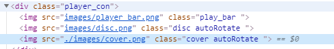

# Vue学习第4天

## 反馈


## 回顾

1. 数据的设置放在了定时器的外面

```js
axios
  .get(`http://wthrcdn.etouch.cn/weather_mini?city=${this.city}`)
  .then(backData => {
  // 这里赋值，loading动画还没结束，数据就显示，消失的动画来没来得及播放，重新加载
  this.weatherList = backData.data.data.forecast
  setTimeout(() => {
    // 关闭loading
    this.isLoading = false
    // 成功
    // console.log(backData)
    // this.weatherList = backData.data.data.forecast
  }, 1000)
})
```

2. axios 是什么？
   1. 专注于网络请求的一个库
   2. 和ajax的关系
      1. 浏览器中，基于Ajax的封装，和jQ的封装 大同小异
      2. axios.get().then():相比于jQ的从嵌套变为链式
      3. Promise

> 1. 看情况学生会不会问。如果问的话，就讲
> 2. weatherList放在外边的话，请求太快，没有消失的动画，且动画出现后,loading还在进行中。
> 3. ajax是一种技术，实现可以有xmlHTTPRequest, jquery.ajax和axios。只不过axios更优
>
> 我们设置setTimeout 1000,模拟请求慢的情形，方便看到loading的效果和天气列表的动画效果。
>
> 有同学问ajax和axios的区别，我们百度一下。AJAX 是一种用于创建快速动态网页的技术，而xhr、$.ajax和axios都是一种实现。
>
> 回顾axios vue动画


## Vue动画钩子

[传送门](https://cn.vuejs.org/v2/guide/transitions.html#JavaScript-%E9%92%A9%E5%AD%90)

1. Vue提供的让程序员可以在动画的各个时机，添加`自定义逻辑`的回调函数，也可以称之为(动画钩子)
2. 进入动画的 开始 ，中，结束，取消时执行
3. 离开动画的 开始 ，中，结束，取消时执行
4. jQ动画回调函数的高级版本
5. afterEnter:注册的位置是 `methods`
6. 把el：动画应用的dom元素传递给你

```
<transition
  v-on:before-enter="beforeEnter"
  v-on:enter="enter"
  v-on:after-enter="afterEnter"
  v-on:enter-cancelled="enterCancelled"

  v-on:before-leave="beforeLeave"
  v-on:leave="leave"
  v-on:after-leave="afterLeave"
  v-on:leave-cancelled="leaveCancelled"
>
  <!-- ... -->
</transition>
```

> 1. 对比实现的版本和我们完成的版本的动画，需要在天气元素消失时transitionDelay设置为0
>
> 2. 引出钩子函数，看文档。afterEnter，打印el，清空样式
>
> 有同学问我们实现的天知道和例子中的天知道，在天气列表消失的时候，动画不一样。怎么不一样呢，查看HTML。需要设置transitionDelay为0.
>
> 查看文档，动画钩子。。。我们应该用afterEnter。 注册打印el. 可以。然后重置样式即可。总结。。。
>
> 1. 天知道存在的问题  对比实现的版本和我们完成的版本的动画,.天气元素隐藏的时候动画也是依次隐藏。
> 2. 分析问题原因  元素消失的时候需要把transitionDelay是依次变大
> 3. 解决方案  天气列表出现以后，去掉transitionDelay
> 4. 应该写在什么地方呢？
> 5. 钩子函数分别是啥作用，我们应该用afterEnter
> 6. 打印el, 重置样式
> 7. 解决问题


## Demo-播放器

### 实现步骤

1. 双击播放歌曲，获取封面，获取歌曲评论
   1.  双击的事件中，添加下列逻辑即可
   2. 封面 接口 <https://autumnfish.cn/song/detail?ids=347230> 
      1. v-bind:src="coverUrl"
   3. 评论接口 <https://autumnfish.cn/comment/hot?id=862101001&type=0> 
      1. v-for commentList:[]
2. 歌曲播放，停止播放的动画效果切换
   1. 
   2. 添加是否播放的标记：isPlaying
   3. 上述的3个img 播放时，添加`playing`类名
      1. audio的 play触发
   4. 暂停播放时，移除`playing`即可
      1. audio的pause触发
3. 双击的时候，获取歌曲的mv，如果有的话
   1. 获取到mv之后开始播放
   2. video  v-bind:src=""
   3. 获取mv的接口 <https://autumnfish.cn/mv/url?id=522362> 
   4. 传入的是mvid不要传错了
4. 设置左侧滚动 使用的是`iScroll`
   1. 保证结构满足，容器，内容容器，内容
   2. 哪个钩子中实例化IScroll mounted
   3. data中保存`iScroll`的实例
   4. 获取dom元素 
      1. .song_wrapper 添加ref='wrapper'
      2. 通过this.$refs.wrapper
   5. updated中 调用 iScroll的 refresh方法

### 注意点

1. 如果涉及到接口数据获取基本的逻辑都是

   1. 在某些时候 调用接口
   2. 数据回来之后操纵页面
2. 数据的获取一般都需要通过接口
3. 特定的时候基本都提供了对应的钩子函数给我们让我们添加自己的逻辑

   1. window.onload
   2. $().aniamte(,function(){})
   3. updated
   4. onplay
   5. onpause
   6. ..
4. 不停的旋转，过渡还是动画实现？

   1. 动画
5. 操纵杆如何旋转的？

   1. transform:rotate 
6. v的播放和歌曲的播放类似，重点是要找到接口以及传入对应的参数即可

> 1. 双击获取封面，接口. 默认封面。
>
> 2. 评论，接口，和官网对比，一致。获取评论，展示。
>
> 3. audio事件，播放过程中，所以事件是由audio触发的，和接口没关系。play和pause打印。检查滑杆等的样式。控制样式添加和删除。解释一下样式。
>
> 4. mv的功能 接口需要的是mvid，验证。有就展示mv,点击播放。
>
>    好，昨天封面和评论的接口已经给了，同学们是不是把封面和评论的功能完成了？
>
>    检查封面的HTML。请求数据，完成功能。热评，检查HTML，请求数据，展示
>


## iScroll

[传送门](https://github.com/cubiq/iscroll)

[中文文档传送门](http://caibaojian.com/iscroll-5/)

### 使用步骤

1. 准备一个3层嵌套的页面结构
   1. 标签可以随意，但是结构需要保证如下

```html
    <div id="wrapper">
      <div>
        <li>剁辣椒</li>
        <li>剁辣椒</li>
        <li>剁辣椒</li>
        <li>剁辣椒</li>
        <li>剁辣椒</li>
        <li>剁辣椒</li>
        <li>剁辣椒</li>
        <li>剁辣椒</li>
        <li>剁辣椒</li>
        <li>剁辣椒</li>
        <li>剁辣椒</li>
        <li>剁辣椒</li>
      </div>
    </div>
```

2. 最外层容器的高度 要固定
3. 导入iScroll
4. 创建一个IScroll的对象即可

```html
<script src="./lib/iscroll.js"></script>
<script>
  // 获取dom
  const wrapper = document.querySelector('#wrapper')
  // 创建iScroll
  const myScroll = new IScroll(wrapper)
  
  // 也可以
  const myScroll = new IScroll('#wrapper')
</script>
```

5. 内容更新了之后需要通过`refresh()`通知库，内容更新了，重新计算尺寸

```js
  // 通知IScrolldom更新了
    myScroll.refresh();
```

> 1. overflow:hidden 无法滚动，auto播放器需要滚动，引出iscroll
> 2. 单独的HTML，重现问题，可以滚动，又不丑陋
> 3. 怎么用呢？官网。运行例子。容器的高度必须比内容小。
> 4. 三层嵌套的结构
> 5. 内容更新之后，需要refresh，重新计算尺寸


## Vue生命周期钩子 - mounted

1. 执行的时机：
   1. vue把内部的data和页面的内容同步之后就会执行
   2. 挂载到页面上之后
2. 当我们碰到需要获取vue解析的页面内部的dom元素时，基本上都是写在这个钩子函数中
3. 执行一次
4. 数据改变之后，updated这个会多次执行

>1. iscroll的初始化放在new Vue的上边，有问题. 解释原因，高度只有一个。
>2. 如果数据过多，Vue渲染需要一段时间，依然可能会导致iScroll的初始化有问题。
>3. 不能保证所有的li被解析。updated, 第二个引出mounted，干什么的。能解决问题
>4. 生命周期钩子函数beforeCreate, created,beforeMount,mounted, 打印看啥时候mounted
>
>

## $refs属性

[ref属性传送门](https://cn.vuejs.org/v2/api/#ref)

[$refs属性传送门](https://cn.vuejs.org/v2/api/#vm-refs)

1. 给要获取的元素添加ref属性，名字随便起：有意义即可
2. 通过`vue实例.$refs.属性名`即可获取标记的元素
3. 这个才是vue推荐的元素获取方式
4. 如果ref重名后面的会吧前面的覆盖

> 1. 优化去全局变量
> 2. vue不建议操作dom，即使要操作，兼容性不好，至少用Vue推荐的方式来获取。获取元素的别名$refs
> 3. 多来几个ref，consolel里面查看
> 4. 如果重名，就会覆盖


## Demo-播放器结合iscroll

1. ref可以帮我们 获取元素 
   1. 元素上加ref属性
   2. 获取用的是 this.$refs
2. data的中的数据一定要渲染到页面上吗？
3. 如果要获取vue管理的元素，最起码写在哪个钩子中？mounted


## Vue组件基本使用

> 功能的抽取

[传送门](https://cn.vuejs.org/v2/guide/components.html)

### 基本使用

1. 组件的注册`Vue.component('组件名',{参数})`
2. 结构用`template`
   1. 直接写字符串：不好
   2. template:"#模板id"
      1. 抽取到模板中`script type='html/text' id="tem"`
3. 页面中使用的时候，直接把 组件名当做标签名即可


### 方法和数据绑定

1. 方法的使用和之前没有区别
2. 数据的绑定data不在是对象，而是 函数
3. 数据的使用和之前一样没有区别

```js
    data: function() {
      return {
        message: '阿尼阿瑟哟,欧巴！'
      }
    },
```


### 组件的数据为什么是一个函数

画图解释

所有组件都引用同一份数据，任何一个组件修改了数据，所有引用数据的其他组件，都同步更新，互相干扰


用了函数之后

!1562234906144](assets/1562234906144.png)

每次使用组件，都会执行这个函数，返回一个组件独有的数据对象，保证互不干扰

> 1. 有一块，在a、b、c页面上显示，或者A页面上有两个块显示。以前我们copy粘贴是吗？
> 2. 开通乐黑卡页的支付组件。可维护性和分工。多年经验的程序员就要考虑分工的问题。
> 3. 选择就是一个组件。引入组件。定义一个组件，什么地方要用，就用就好了。
> 4. 组件的使用，按钮点击
> 5. template必须有一个根元素
> 6. 抽取到页面上
> 7. 把组件名当标签名来使用


## Vue路由基本使用

[传送门](https://router.vuejs.org/zh/)

> 高级的tab栏

前端路由：url地址和组件的对应关系

>1. 网易云音乐引出，url地址不变，高级的tab栏
>
>2. vue-router官方文档
>
>3. 解释一下代码
>
>4. 改改内容，内容换成网易云音乐界面的相关图片
>
>5. 来四个tab栏，模仿网易云音乐
>
>6. 在项目里面补充高级功能。
>
>   
>
>1. 点A显示1,点B显示2 网易云音乐
>2. VueRouter并不包含在vue.js里面。渐进式，有些项目不用啊
>3. 导包 
>4. 先准备组件
>5. 定义路由规则 path和to是对应的 router-link里面相当于是a link
>6. 路由 挂载
>7. router-view显示 
>
>


