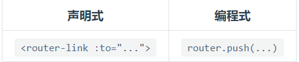
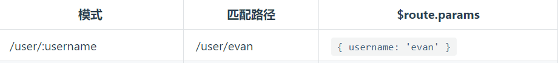
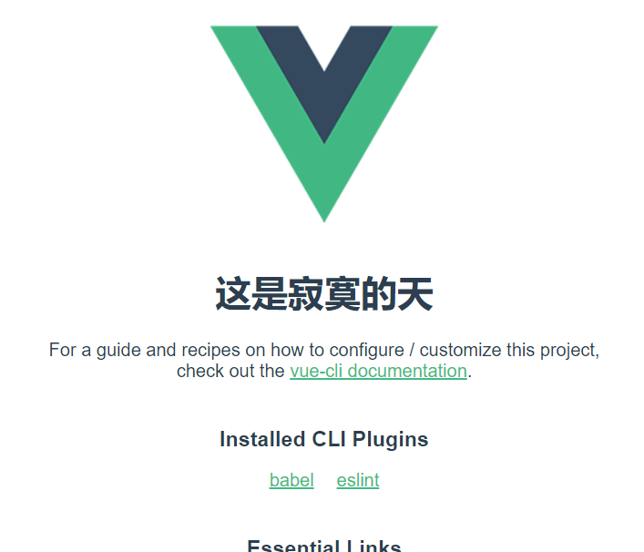

# Vue学习第五天

## 反馈

1. 老师,讲的好....

2. 这些知识真的有点杂乱,要说什么都没讲吧,讲了一天,要说讲了什么吧,印象里就是iScroll的使用,mounted,组件,至于播放器的细节处理忘光光了

3. 老师,第1次歌单滚动是正常的,但是再次搜索然后滚动歌单会滚动到下面空白的地方???

<<<<<<< HEAD
4. 不是说代码来源生活??? 老师讲的语法可以举生活例子来说明
   这样知识点就会有更好的理解

=======
   1. TODO

4. 不是说代码来源生活??? 老师讲的语法可以举生活例子来说明
   这样知识点就会有更好的理解

   1. mounted 最早能在这里获取到dom
   2. ref与$refs 用Vue的方式来获取dom

>>>>>>> vue38
5. 老师可以看出您的技术水平非常的丰厚,实战经历也非常的强,但是小的愚钝 需要您的帮助 问题:有时候并不知道老师讲到了哪个地方还是哪个概念!! 看法:因为老师您 在讲题的过程中几乎都是一个调调 知识点与知识点之间跳得太快
   没有间隔 必须要精力十分的集中才能跟得上,才能知道是哪个概念 哪个知识点, 但是根据
   科学研究 一节课45分钟 能保持高度集中三十分钟以上就已经是非常不错的了, 有时候真的需要您去
   提醒我们一下, 这个知识点讲完了 开始进入下一个知识点 ,即使上一个知识点没弄清楚
   也能在老师你不一样的语调当中帮助我们把灵魂出窍的自己拉回来 拉拉拉, 这样会好很多 比如:( 提高音调下面一个知识点 比较难啊, 大家注意听, 下面一个知识点只是了解, 企业用的并不多...)也可以让我们清晰的知道哪个知识点 相对重要 需要重点击破 (个人看法)

<<<<<<< HEAD
6. 元气满满的加油

=======
   1. 知识点 比较难啊, 大家注意听,

6. 元气满满的加油

   1. 加油

>>>>>>> vue38
7. 知识点有点杂 , 要整理下

8. 生命周期能在讲讲么,好懵啊,mounted没懂,钩子啥的真不清除

9. 又是充满忧虑的一天 ,我太难了 rm -rf/*

10. 加油

11. 有点杂,不知道怎么管理,还是得多花点时间记知识点啊

12. 讲真的很多时候其实我连需求都没搞明白,尤其是那种细节的需求搞不明白前后有什么区别,就开始分析用什么方法来解决了,怎么学啊.感觉越学越退步了,第三天和第四天真的很懵逼,勉强自己敲出来的代码悦听也能放歌了

13. 今天的知识点有点难,得多敲几遍才行了,还好明天是自习

    

## 回顾

1. mounted

   Vue实例从被创建到销毁过程中，有8个重要的的阶段，其中data里面的数据被解析完成后，会触发mounted回调函数。在mounted回调函数里面我们可以自定义逻辑


2. ref与$refs

<<<<<<< HEAD
   ref="dom别名"标记dom，vm.$refs.dom别名就可以访问到dom了。
=======
   **用Vue的方式来获取DOM**
   
   ref="dom别名"标记dom
   
   vm.$refs[dom别名] 就可以访问到dom了。
>>>>>>> vue38


3. 组件基本使用

<<<<<<< HEAD
=======
   1. template 这个结构
   2. data必须是一个函数
   3. methods 注册事件，钩子函数，双向数据绑定，都是一样的
   4. 先注册再使用

>>>>>>> vue38


## Vue路由基本使用 

[传送门](https://router.vuejs.org/zh/)

<<<<<<< HEAD
=======
**Vue路由就是用来做高级的Tab栏**

vue-router.js不在vue.js里面，需要单独去引用

>>>>>>> vue38


## Demo-高级播放器-路由整合

### 实现步骤

<<<<<<< HEAD
=======
1. 路由整进来，4个组件，就只有文字，有切换效果即可
   1. a link换成了router-link
   2. router-view来显示tab content
2. 整搜索歌曲组件
   1. 把results.html里面内容放到组件里面
   2. template模板的方式 `template:'#xx_tpl'`
   3. 内容是放在<script type="text/x-template" id="xx_tpl">
   4. 对应的样式了要引入
3. 所有的组件都整进来
   1. 跟上边一样

>>>>>>> vue38


## 路由高亮样式

[传送门](https://router.vuejs.org/zh/api/#active-class )

<<<<<<< HEAD
=======
1. vue-router在切换router-link时，默认会添加和移除一个高亮的类名

2. 实例化VueRouter里面可以设置linkActiveClass=“自定义高亮样式”

   ```js
   const router = new VueRouter({
     // routes 
     routes:route,
     linkActiveClass:'active'
   })
   ```

   

>>>>>>> vue38


## 编程式导航

[传送门](https://router.vuejs.org/zh/guide/essentials/navigation.html)

<<<<<<< HEAD
=======
就是用来切换路由的

1. 编程式导航的本质是

   ```js
   router.push('/sing')
   ```

2. 声明式导航的本质

   ```html
   <router-link to="/sing"></router-link>
   ```

3. 适用情景
   1. 声明式导航：点了就跳转，没有任何逻辑，类似于 `<a href>` 写在html里面
   2. 编程式导航: 可以添加一些逻辑. 写在js里面的。类似location.href



>>>>>>> vue38


## 动态路由匹配

<<<<<<< HEAD
[传送门](https://router.vuejs.org/zh/guide/essentials/dynamic-matching.html#%E5%93%8D%E5%BA%94%E8%B7%AF%E7%94%B1%E5%8F%82%E6%95%B0%E7%9A%84%E5%8F%98%E5%8C%96)


=======
[传送门](https://router.vuejs.org/zh/guide/essentials/dynamic-matching.html#%E5%93%8D%E5%BA%94%E8%B7%AF%E7%94%B1%E5%8F%82%E6%95%B0%E7%9A%84%E5%8F%98%E5%8C%96

组件获取路由参数

```html
<router-link to="/user/qiqi"></router-link>
// 路由规则
const routes=[
{
	path:'/user/:username',
	component:Song
}
]
```

1. 路由规则的path  `/user/:key` key就是获取参数
2. 导航里面 `/user/value` value就是获取值
3. 最终在组件里面可以获取到传递的参数 `$route.params.key` 就是value


>>>>>>> vue38


## Demo-歌曲搜索


### 实现步骤

<<<<<<< HEAD
=======
1. 输入框回车或者点击搜索按钮，显示歌曲搜索组件（路由切换搜索组件）
   1. 编程式导航 router.push('/results')
   2. 输入框回车或者点击搜索按钮 @keyup.enter/@click: queryMusic
2. 输入关键字，传递关键字
   1. 获取用户的输入 v-model:keywords
   2. 动态路由匹配
      1. 用哪个参数接受传递的值 模式 `/results` => `/results/:keywords`
      2. 在url把上参数传过去  匹配路径  /results  => `/results/大碗宽面`

>>>>>>> vue38
### 注意点


## 生命周期钩子 -created

<<<<<<< HEAD

=======
`created`里面可以尽早地获取data里面的属性

mounted 在这里能尽早地获取到dom
>>>>>>> vue38


## Demo-高级播放器-结果搜索

### 实现步骤

<<<<<<< HEAD


## 过滤器基本使用

[过滤器](https://cn.vuejs.org/v2/guide/filters.html)

=======
1. 获取到搜索关键字，发请求，拿到数据，渲染
   1. 搜索关键字的获取 `$route.params.keywords`
   2. 发请求 axios.get() 在created里面发请求
   3. 接口：[https://autumnfish.cn/search?keywords=%E6%B5%B7%E9%98%94%E5%A4%A9%E7%A9%BA](https://autumnfish.cn/search?keywords=海阔天空)
   4. 列表我们用数组接受 songList
   5. 渲染 v-for：songList


## 过滤器基本使用 

[过滤器](https://cn.vuejs.org/v2/guide/filters.html)

**过滤器用来作文本格式化**

1. {{原始文本|过滤器1}}
2. 过滤器声明 filters:{过滤器1是一个方法}
3. 过滤器1实参是原始文本
4. 过滤器1 return的值就是{{}}需要显示的值
5. 过滤器能接受参数，计算属性不能接受参数。

>>>>>>> vue38


## Demo-过滤器处理result中搜索的结果


### 实现步骤

<<<<<<< HEAD
=======
1. 实现时长的处理

   1. 过滤器 formatTime
      1. 使用 {{duration|formatTime}}
      2. 定义 filters:{formatTime(msec)}
   2. 毫秒数转成 02:27这种格式
      1. 毫秒->秒
      2. 秒->分  Math.floor(秒/60)
      3. 剩余的秒  Math.floor(秒%60)
      4. 数字不足两位的话，补0  num<10?'0'+num:num

2. 显示歌手  [周冬雨](https://music.163.com/artist?id=11995107)/[熊梓淇](https://music.163.com/artist?id=12054395)/张天爱

   1. 过滤器 formatSinger
      1. 使用 {{artists|formatSinger}}
      2. 定义 filters:{formatTime(msec)}

   2. 取得artists数组里面每一个name，用/拼起来
      1. 取出数组里面的name，用一个用数组存起来
      2. arr.join('/')

>>>>>>> vue38
### 注意点


## Demo-点击mv 播放MV

### 实现步骤

<<<<<<< HEAD
### 重点

实现步骤和 搜歌 类似 跳转，携带数据


=======
1. 点击歌曲的mv icon时，展示mv组件，同时传递mvid，在mv组件里面发请求，初始化video
   1. 是否展示mv icon,有mvid才展示mv icon   v-show="mvid"
   2. 点击歌曲的mv @click:playMV
   3. 展示MV组件 编程式导航  router.push('/video')
   4. 传递mvid 动态路由匹配
      1. 模式 /video => /video/:mvid
      2. 路径 /video => /video/24234223
      3. 那么在mv组件里面就可以能过 $route.params.mvid
   5. 尽早地发送请求
      1. created里面发请求
      2. 接口mv
      3. 给 video 设置 :src=mvUrl
   6. 接口  `/mv/detail?mvid=5436712`

### 重点

1. 设置isShow标记，在数据回来后置后true，控制页面的渲染。避免数据没回来前，渲染报错

2. 编程式导航切换组件的显示

3. 动态匹配路由，给组件传参

   
>>>>>>> vue38

## 待完成功能

播放歌曲和评论


<<<<<<< HEAD
## Vue-cli 安装

### 基本概念

=======
## 单文件组件

[传送门](https://cn.vuejs.org/v2/guide/single-file-components.html)

组件写在文件里面

文件是以.vue结尾的


## Vue-cli 安装

[传送门](https://cli.vuejs.org/zh/)

### 基本概念

1. .vue文件

2. less->css

3. js和css压缩

4. css兼容性修复

5. 代码修改保存后，浏览器自动刷新

6. 代理服务器

   ````
   
   ````

有了这个脚手架我们可以更专注地写前端逻辑。

>>>>>>> vue38


### 安装

[官网](https://cli.vuejs.org/zh/)

[安装](https://cli.vuejs.org/zh/guide/installation.html)

<<<<<<< HEAD
### 注意点

=======
安装命令 `npm install -g @vue/cli`

设置npm源为 npm config set registry https://registry.npm.taobao.org 

npm config list 查看npm源是不是设置正确了

确认有没有安装成功  **vue --version**, 如果回显一个版本号的话就安装成功了。

### 注意点

1. 确认npm源是 https://registry.npm.taobao.org 
2. 以管理员身份运行 
3. npm cache clean -f 清除npm缓存
4. 不要用powerShell
5. Mac提示权限，我们sudo npm install -g @vue/cli
6. 4G，或者换千兆网

>>>>>>> vue38


## Vue-cli 项目创建

[传送门](https://cli.vuejs.org/zh/guide/creating-a-project.html)

### 正常的流程

<<<<<<< HEAD
=======
1. 执行 `vue create 项目名`
   1. 给项目名取一个有意义的名字
   2. 选项用默认的就行，一路回车

2. cd到项目目录
3. npm run serve
4. 浏览器打开页面，这样，表示成功
5. 

>>>>>>> vue38


## 总结