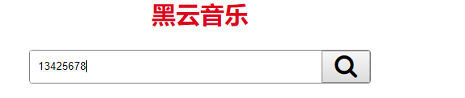

# Vue学习第五天

## 反馈


## 回顾


## 锚链接与hash

锚链接是超链接的一种，快速定位到页面某个位置

1. 可以改变url的hash来定位到页面的某个位置，这个位置的id和hash一致
2. window.onhashchange监听hash的改变
3. location.hash获取hash


## SPA与MPA

1. SPA(Single-Page Application) 单页应用

   一个外壳和多个页面片段组件

   1. 切换页面并不会打开新的页面, URL只是改变了hash
   2. 首屏加载会慢，切换页面比较快
   3. 适合用于后台管理

   

2. MPA(Multi-Page Applicatoin) 多页应用

   多个完整的页面组件

   1. 切换页面会打开新的页面，URL改变，loading

   2. 首屏加载快，切换页面慢

      

## hash实现SPA

改变hash, 显示对应的div


## Vue路由基本使用 

[传送门](https://router.vuejs.org/zh/)

Vue路由就是用来做单页面应用的，不同的hash显示对应的组件

Vue路由的使用只要求会copy改就行。


### Vue路由高仿网易云音乐

1. 点击菜单显示对应的组件
2. 组件就是一张图片


## Demo-高级播放器-路由整合

### 实现步骤

1. 整合Vue路由
   1. 不同的hash展示不同的组件
   2. 引入vue-router.js
   3. router-view来展示组件
   4. 使用vue路由js里面的一大坨copy过来改就行
2. 整合组件
   1. 把页面的html内容copy到组件的模板中
   2. template关联到模板的id


## 编程式导航与声明式导航

[传送门](https://router.vuejs.org/zh/guide/essentials/navigation.html)

编程式导航和声明式导航就是用来**改变hash**，那么就可以显示对应的组件

用法：

1. 声明式导航相当于 `<a href>`

   ```html
   <router-link to="/sing">Go to Foo</router-link>
   ```

2. 编程式导航相当于 `location.href`10.

   ```js
   router.push('/sing')
   ```

   

## 动态路由匹配

[传送门](https://router.vuejs.org/zh/guide/essentials/dynamic-matching.html#%E5%93%8D%E5%BA%94%E8%B7%AF%E7%94%B1%E5%8F%82%E6%95%B0%E7%9A%84%E5%8F%98%E5%8C%96)

**组件从hash里面获取到参数**

编程式导航和声明式导航传参

| 模式            | 匹配路径   | $route.params          |
| --------------- | ---------- | ---------------------- |
| /user/:username | /user/evan | `{ username: 'evan' }` |


## Demo-歌曲搜索



### 实现步骤

1. 输入关键字，回车/点搜索按钮, 展示搜索结果组件
   1. 获取用户输入的关键字 v-model:keywords
   2. 事件 @keyup.enter/@click:queryMusic
   3. 编程式导航
      1. router.push('/result')
2. 输入关键字，回车/点搜索按钮，搜索结果组件获取到关键字
   1. 动态路由匹配
      1. `router.push('/result') `=> `router.push('/result/keywords')`
      2. 模式 '/result'=> '/result/:keywords'
      3. 确认组件获取到了关键字 Vue开发工具查看

### 注意点

1. 展示搜索结果组件在事件处理方式里面做的，js的方式，所以要用编程式导航改变hash


## 生命周期钩子 -created

最早能在这里获取到data的属性


## Demo-高级播放器-结果搜索

### 实现步骤

1. 在搜索组件里面尽早地发请求，渲染搜索结果
   1. created里面发请求
   2. axios.get(url)
   3. 接口： https://autumnfish.cn/search?keywords=海阔天空
   4. 组件里面获取用户输入的关键词 this.$route.params.keywords
   5. 获取请求数据 .then(res=>{})
   6. 列表数组songList, 用vfor渲染
   7. mvid不为0时，展示mv的图标

### 注意点

1. 路由的组件切换，是重新创建了一个Vue实例


## 过滤器基本使用

[过滤器](https://cn.vuejs.org/v2/guide/filters.html)

自定义过滤器，可被用于一些常见的文本格式化

过滤器大部分时候用来做**文本格式化**

1. 使用方法
   1. {{数据|过滤器名字}}
   2. `|`管道符
2. 定义
   1. 过滤器作为一个方法声明在filters属性，filters和methods,el,data,computed,mounted,updated,created平级的
   2. 过滤器方法默认接受一个参数，就是过滤器作用的数据
   3. 过滤器方法必须返回一个值，这个值就是最终显示的值
3. 过滤器只能用在{{}}和v-bind指令，大部分时候是前者，大部分时候是用于文本格式化


## Demo-过滤器处理result中搜索的结果


### 实现步骤

1. 处理时长 毫秒->04:03
   1. 使用{{数据|formatTime}}
   2. 定义
      1. filters:{formatTime}
      2. 处理逻辑
         1. 毫秒->总秒数   `毫秒/1000`
         2. 总秒数->分  ` Math.floor(总秒数/60)`
         3. 总秒数-秒   `Math.floor(总秒数%60)`
         4. 分和秒保持两位，小于10的话，补0
2. 把歌手列表的name以`|`拼接起来
   1. 使用{{数据|formatSinger}}
   2. 定义
      1. filters:{formatSinger}
      2. 处理逻辑
         1. 遍历歌手列表，取得name拼接

### 注意点

1. arr.join(拼接符)把arr里面的每一项用拼接符边接
2. 过滤器就是对文本格式化


## Demo-参数改变重新触发请求

[导航守卫](https://router.vuejs.org/zh/guide/advanced/navigation-guards.html#全局前置守卫)

`beforeRouteUpdate`可以监听到hash里面的参数改变

1. to可以接受新的参数
2. from是旧的路由
3. this.$route也是旧的路由
4. next()一定要调用，不然hash不会变

## TODO

1. 点MV插放MV
2. 点播放icon，播放音乐
3. 点歌名，展示评论


## Vue-cli 安装

### 基本概念


### 安装

[官网](https://cli.vuejs.org/zh/)

[安装](https://cli.vuejs.org/zh/guide/installation.html)

在小黑窗中输入`npm install -g @vue/cli`, 在任意的路径都可以

为了让安装速度提升，设置npm包下载的镜像为taobao镜像

```html
npm config set registry https://registry.npm.taobao.org/
```

### 注意点


## 单文件组件


## Vue-cli 安装

## Vue-cli 项目创建

[传送门](https://cli.vuejs.org/zh/guide/creating-a-project.html)

## 总结
