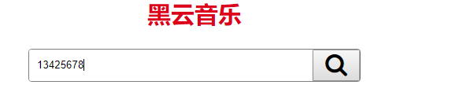
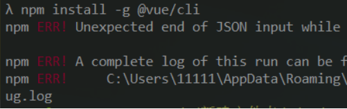

# Vue学习第五天

## 反馈


## 回顾


## 锚链接与hash

锚链接是一种超链接，能快速滚动页面某个位置

1. 可以在url上直接修改hash
2. onhashchange能监听到hash改变
3. location.hash获取到当前页面的hash

```html
<!DOCTYPE html>
<html lang="en">

<head>
  <meta charset="UTF-8">
  <meta name="viewport" content="width=device-width, initial-scale=1.0">
  <meta http-equiv="X-UA-Compatible" content="ie=edge">
  <title>Document</title>
</head>

<body>

  <h2 id="top">这里是页面顶部</h2>
  <br><br><br><br><br><br><br><br><br><br><br><br><br><br><br>
  页面内容.........
  <br><br><br><br><br><br><br><br><br><br><br><br><br><br><br>
  <a href="#top">滚动顶部</a>
  <h2 id="bottom">这里是页面底部</h2>
  <script>
    // 可以用onhashchange监听到hash改变
    window.onhashchange = function () {
      //获取当前页面的hash
      console.log(location.hash)
    }
  </script>
</body>

</html>
```


> 1. 接下来我们要学习一个重要的知识点，Vue路由。Vue路由是什么呢？这个得从锚点说起。
> 2. 锚链接是一种超链接，超链接a href用来跳转到新的页面对吧。锚链接是a href值并不一个url，是一个字符串，能快速滚动页面某个位置。可能有同学忘记了，来我们复习一下。
> 3. 举例锚链接，能快速滚到顶部。注意到url上加了`#top`，这个是什么，就是我们的锚链接吧，在url上这个叫做hash.我们也可以直接修改hash来定位。增加一个bottom块。
> 4. 用onhashchange监听到hash改变。location.hash获取当前页面的hash

## SPA与MPA

1. SPA(Single-Page Application) 单页应用

   一个外壳页面和多个页面片段构成

   1. 切换页面不会打开新的页面，URL中只改变hash(hash是实现SPA的方案之一)

    2. 首屏加载慢，页面切换快
    3. 适就用于做后台管理端

2. MPA(Multi-Page Applicatoin) 多页应用

   多个完整的页面构成

   1. 页面跳转会打开新的页面，URL改变
   2. 首屏加载快，页面切换慢

> 1. 接下来我们看SPA与MPA, 这个SPA并不是大家所理解的SPA.
> 2. MPA就是我们传统的页面组织结构，比如百度搜索，一路都会打开新的页面，URL改变，且加载新的页面需要loading
> 3. 而SPA常见于后台管理系统 https://taylorchen709.github.io/vue-admin>，这个是后端管理系统，当我们切换菜单的时候，注意一下url有变化吗？只有hash变了。页面加载速度怎么样？很快对吧。我们点菜单就展示不同的内容
> 4. 所以SPA是一个外壳页面和多个页面片段构成的。
> 5. 对于SPA我们得在页面初始化时加载所有页面片段的内容，后续切换页面就快了。所以首屏加载慢，但是页面切换快。这种特性，对于后台管理比较适合，一般在管理端几个页面上停留时间会很长，能接受首次打开慢，后续切换快。

## hash实现SPA

改变hash切换div显示

```html
<!DOCTYPE html>
<html lang="en">

<head>
  <meta charset="UTF-8">
  <meta name="viewport" content="width=device-width, initial-scale=1.0">
  <meta http-equiv="X-UA-Compatible" content="ie=edge">
  <title>Document</title>
  <style>
    .container {
      display: flex;
    }

    .left {
      width: 200px;
      height: 800px;
      background-color: #aaa;
    }

    .left li {
      height: 50px;
    }

    .main>div {
      display: none;
    }
  </style>
</head>

<body>

  <div class="container">
    <div class="left">
      <ul>
        <li><a href="#tab1">导航1</a></li>
        <li><a href="#tab2">导航2</a></li>
        <li><a href="#tab3">导航3</a></li>
      </ul>
    </div>
    <div class="main">
      <div id="tab1">内容1</div>
      <div id="tab2">内容2</div>
      <div id="tab3">内容3</div>
    </div>
  </div>

  <script>
    window.onhashchange = function () {
      document.querySelector('#tab1').style.display = 'none'
      document.querySelector('#tab2').style.display = 'none'
      document.querySelector('#tab3').style.display = 'none'
      document.querySelector(location.hash).style.display = 'block'
    }
  </script>

</body>

</html>
```

> 1. 我们注意到，刚才的那个管理端，切换页面时hash在变。我们模仿一个改变hash，切换页面的效果呢
> 2. 加了菜单和内容区，点菜单只定位到具体的div.这里我们需要只展示其中一个div.需要结合onhashchange
> 3. 到此我们实现在改变hash，切换显示对应的div. 虽然比较简陋，但是这个就是SPA，一个外壳加多个页面片段，切换页面不用打开新的URL


## Vue路由基本使用 

[传送门](https://router.vuejs.org/zh/)

Vue路由是用来构建单页应用, 不同hash显示不同的组件

使用方法，大家只要**学会复制粘贴**就行。

```html
<!DOCTYPE html>
<html lang="en">

<head>
  <meta charset="UTF-8">
  <meta name="viewport" content="width=device-width, initial-scale=1.0">
  <meta http-equiv="X-UA-Compatible" content="ie=edge">
  <title>Document</title>
</head>

<body>
  <div id="app">
    <h1>Hello App!</h1>
    <p>
      <!-- 菜单 -->
      <!-- 相当于<a href="#foo"> -->
      <router-link to="/foo">Go to Foo</router-link>
      <router-link to="/bar">Go to Bar</router-link>
    </p>
    <!-- 内容 -->
    <router-view></router-view>
  </div>
  <script src="https://unpkg.com/vue/dist/vue.js"></script>
  <script src="https://unpkg.com/vue-router/dist/vue-router.js"></script>

  <script>
    // 1. 声明组件
    const Foo = {
      template: '<div>foo</div>'
    }
    const Bar = {
      template: '<div>bar</div>'
    }

    // 2. 定义路由
    // hash和组件的映射关系
    const routes = [{
        path: '/foo',
        component: Foo
      },
      {
        path: '/bar',
        component: Bar
      }
    ]

    // 3. 创建 router 实例
    // 实例化 路由对象,传递路由规则
    const router = new VueRouter({
      routes // (缩写) 相当于 routes: routes
    })

    // 4. 创建根实例
    const app = new Vue({
      el: '#app',
      // 把路由 和Vue实例关联起来
      router
    })
    //.$mount('#app') 相当于el:'#app'

    // 现在，应用已经启动了！
  </script>
</body>

</html>
```

> 1. 我们刚才用hash实现了一个丑陋的SPA，onhashchange这块实现页面切换，这个Vue路由的基本原理，只是Vue路由它更强大好用。
> 2. Vue路由是用来构建单页应用
> 3. vue路由是一个vue插件，vue-router.js并不包含在vue.js里面。渐进式，有些项目不用啊vue-router官方文档
> 4. vue路由的官方文档，copy路由的代码，能看懂的代码不多，一块div,两个不认识的标签，引入lib,一大坨js是吧。我们先看效果。
> 5. 效果比我们实现的SPA还丑陋，代码倒是挺多的。
> 6. 解释代码
> 7. to和路由规则是不是一一对应的，我们改一下呗。
> 8. 再声明一个组件
> 9. 大家学会复制粘贴就行，因为后面的课程基本上都会用路由，有得时间记哈。
>


### Vue路由高仿网易云音乐

1. 点击tab显示对应的组件
2. 这里组件就是一个图片

```html
<!DOCTYPE html>
<html lang="en">
  <head>
    <meta charset="UTF-8" />
    <meta name="viewport" content="width=device-width, initial-scale=1.0" />
    <meta http-equiv="X-UA-Compatible" content="ie=edge" />
    <title>Document</title>
  </head>
  <body>
    <div id="app">
      <!-- 导航栏 -->
      <router-link to="/music">发现音乐</router-link>
      <router-link to="/me">我的音乐</router-link>
      <router-link to="/friend">朋友</router-link>
      <router-link to="/download">下载客户端</router-link>
      <!-- 内容区 -->
      <router-view></router-view>
    </div>
    <script src="./lib/vue.js"></script>
    <!-- 导入vue-router.js -->
    <script src="./lib/vue-router.js"></script>
    <script>
      // 定义组件
      const Music = { template: '' }
      const Me = { template: '' }
      const Friend = { template: '' }
      const Download = { template: '' }

      // 定义路由规则
      const routes = [
        {
          path: '/music',
          component: Music
        },
        {
          path: '/me',
          component: Me
        },
        {
          path: '/friend',
          component: Friend
        },
        {
          path: '/download',
          component: Download
        }
      ]
      // 实例化路由对象，传递规则
      const router = new VueRouter({
        routes
      })
      //实例化Vue，传递路由对象
      const app = new Vue({
        el: '#app',
        router,
        data: {}
      })
    </script>
  </body>
</html>

```


## Demo-高级播放器-路由整合

### 实现步骤

1. 整合路由
   1. 改变hash显示对应的组件
   2. 引入vue-router.js
   3. router-view显示组件
   4. 路由使用js里面那一大堆copy过来改
2. 整合组件
   1. 把index隔壁的那些文件，结构，样式全部都整到index.html
   2. 抽取为组件
3. 为了晚上看代码简洁，删除了除index.html之外所有文件

> 1. 演示功能，黑云音乐，会讲路由传参及过滤器
> 2. 查看模板，搜索结果，播放，mv播放及评论分别是四个页面
> 3. 我们先来结合学习过的路由知识，完成点击Tab bar切换内容的功能
> 4. 然后是不是应该把四个页面作为组件引入到index.html. 检查四个页面的结构，script template引入，样式引入。
> 5. 所有码都放在index.html中
> 6. 有没有同学有冲动想用外链的方式把模板引入呢？[template不支持引部引用](https://vuejs.org/2015/10/28/why-no-template-url/)  结尾我们再来讲用什么方案来优化它。


## 路由高亮样式

[传送门](https://router.vuejs.org/zh/api/#linkactiveclass)

1. vue-router 在我们切换`router-link`时，默认会自动的添加移除一个高亮的类名，
2. `linkActiveClass:"自定义全局router-link高亮样式"`

```js
const router = new VueRouter({
  routes,
  linkActiveClass:'active'
})
```

> 1. 大家看现在我们切换Tab的时候，无法知道当前选中的是哪个tab。，
> 2. 看HTML结构，有一个active，可以控制是否选中。另外router-link给我们添加了一个router-link-active的类。router给我们添加了当前选中的标签栏的样式，只是不是我们想要的样式。如果能自定义这个类，那就完美了。查看文档，解释
> 3. 改active-class成功


## 编程式导航

[传送门](https://router.vuejs.org/zh/guide/essentials/navigation.html)

编程式导航和声明式导航都是改变hash.

1. 编程式导航相当于是location.href
2. 声明式导航相当于是<a href>
3. 用法：

```html
router.push('地址')

<router-link to='/run'>去跑步</router-link>
```

```html
<!DOCTYPE html>
<html lang="en">
  <head>
    <meta charset="UTF-8" />
    <meta name="viewport" content="width=device-width, initial-scale=1.0" />
    <meta http-equiv="X-UA-Compatible" content="ie=edge" />
    <title>Document</title>
  </head>
  <body>
    <div id="app">
      <!-- tab - nav 导航 声明式导航  -->
      <router-link to="/music1">歌曲1</router-link>
      <router-link to="/bar">歌曲2</router-link>
      <router-link to="/run">边唱歌鞭炮</router-link>
      <h2>编程式导航</h2>
      <input type="button" value="点我去唱歌" @click="toSing">

      <!-- tab - content -->
      <router-view></router-view>
    </div>
  </body>
</html>
<!-- 放上面会影响页面的接在 js加载完毕之后页面是看不到的 -->
<script src="https://unpkg.com/vue/dist/vue.js"></script>
<script src="https://unpkg.com/vue-router/dist/vue-router.js"></script>
<script>
  // 1. 定义组件 简化的写法
  const Foo = { template: '<div>foo</div>' }
  const Bar = { template: '<div>bar</div>' }
  const run = { template: '<div>咔咔咔！！！！的跑！！！！</div>' }

  // 2. 定义规则
  // url和组件的对应关系
  // const routes = [
  const routers = [
    { path: '/music1', component: Foo },
    { path: '/bar', component: Bar },
    { path: '/run', component: run }
  ]

  // 3. 把路由规则 设置给路由对象
  const router = new VueRouter({
    // routes // (缩写) 相当于 routes: routes
    routes: routers // routers: routers
  })

  // 4. 创建和挂载根实例。

  const app = new Vue({
    el: '#app',
    methods: {
      // 跳转去唱歌
      toSing(){
        // console.log('唱歌去')
        // 用路由对象跳转
        // router.push('/bar')
        router.push('/niubiliti')
      }
    },
    router // router:router
  })

  // 现在，应用已经启动了！
</script>

```

> 1. 回车的时候，是不是应该看到搜索结果呢？是。搜索结果就是搜索结果组件，要展示搜索组件是不是就是要改变对应的hash呢。前面的学习中我们有改变hash吗？怎么做的，router-link,对。router-link是声明式导航，我们还有一种编程式导航。而当前场景是需要编程式导航的。
> 2. 查看文档, 文档写得不很直观。我们来举例。
> 3. 在之前路由例子上，增加一个按钮来切换路由。
> 4. 要实现声明式导航同样的效果，我们就router.push()
> 5. 声明式导航是写在html里面的，相当于是a href
> 6. 编程式导航是写在js里面的，相当于是location.href


## 动态路由匹配

[传送门](https://router.vuejs.org/zh/guide/essentials/dynamic-matching.html#%E5%93%8D%E5%BA%94%E8%B7%AF%E7%94%B1%E5%8F%82%E6%95%B0%E7%9A%84%E5%8F%98%E5%8C%96)

组件获取hash里面的参数

模式 、匹配路径及获取参数如上图

| 模式            | 匹配路径   | $route.params          |
| --------------- | ---------- | ---------------------- |
| /user/:username | /user/evan | `{ username: 'evan' }` |

```html
<!DOCTYPE html>
<html lang="en">
  <head>
    <meta charset="UTF-8" />
    <meta name="viewport" content="width=device-width, initial-scale=1.0" />
    <meta http-equiv="X-UA-Compatible" content="ie=edge" />
    <title>Document</title>
  </head>
  <body>
    <div id="app">
      <h1>Hello App!</h1>
      <p>
        <router-link to="/music1">歌曲1</router-link>
        <router-link to="/bar/Joven">歌曲2</router-link>
      </p>
      <router-view></router-view>
    </div>

    <script src="https://unpkg.com/vue/dist/vue.js"></script>
    <script src="https://unpkg.com/vue-router/dist/vue-router.js"></script>
    <script>
      const Foo = { template: '<div>foo</div>' }
      const Bar = { template: '<div>{{$route.params.name}}</div>' }

      const routes = [{ path: '/music1', component: Foo }, { path: '/bar/:name', component: Bar }]
      const router = new VueRouter({
        routes
      })

      const app = new Vue({
        router,
        methods: {
          toSing() {
            router.push('music1')
          }
        }
      }).$mount('#app')
    </script>
  </body>
</html>
```


> 1. 黑云音乐展示搜索结果组件，而组件的内容，是不是根据我的输入查询出来呢？所以需要把我的输入传到搜索结果组件里面，这里需要用动态路由匹配传参
> 2. 看文档
> 3. 来一个HTML例子
> 4. 同时用vue-dev看到有data.$route有数据。

## Demo-歌曲搜索



### 实现步骤

1. 输入框回车或者点搜索，显示搜索组件
   1. 回车或者点搜索 @keyup.enter/click:searchMusic
   2. 编程式导航 `router.push('/songs')`
2. 输入内容，回车或点搜索，在搜索结果组件里面获取关键字
   1. 获取输入内容 v-model:keywords
   2. 动态路由匹配
      1. 修改路由规则模式 `/result`=>`/result/:keywords`
      2. 修改路径 router.push('/result/${this.keywords}')
      3. vue开发工具查看传参

### 注意点

1. js的方式改变hash，用的是编程式导航
2. 给组件传递参数，用的是动态路由匹配

> 1. 首先我们获取用户的输入
> 2. 回车或者点击搜索的事件里，编程式导航，实现切换路由到搜索结果
> 3. 动态路由匹配，把用户输入的搜索关键词传递到搜索结果组件中


## 生命周期钩子 -created

最早能在created里面获取到data的属性

```js
beforeCreate() {
  console.log(this.message)
},
  created() {
    // 最早能在created里面获取到data的属性
    console.log(this.message)

  },
```

> 1. 搜索结果组件里，获取到搜索关键词后，是不是要根据搜索关键词，调接口搜歌呢？
> 3. 那应该在什么时机去调接口搜歌呢？查看Dom结构，切换路由，每一次组件DOM都被移走了。是不是应该在组件创建过程中尽早地调接口搜索歌曲，然后把请求的结果赋值给data里面的属性呢？
> 4. 组件也是Vue实例，Vue生命周期图标也符合。赋值时this.并不能都点到。我们看一下，初始化四个钩子哪一个能尽早获取
> 5. 新建HTML，beforeCreate和created，前者无法获取data里面的值。


## Demo-高级播放器-结果搜索

### 实现步骤

1. 当 result 组件创建出来之后（出现）之后，
   1. 使用生命周期钩子created
   2. 尽可能早一些执行的，让用户早一些看到数据
2. 获取传递过来的关键字 `this.$route.params.键`
3. 通过关键字调用接口， axios.get
4. 接口 `<https://autumnfish.cn/search?keywords=海阔天空>`
5. 数据获取到之后，渲染到页面上
   1. then
   2. v-for :musicList
6. mvid为0,不展示mv
   1. v-show条件渲染

### 注意点

由切换默认会移除dom，也就是组件重新创建。

> 1. 那么在搜索结果组件的里面写created看搜索的时候，是不是都在调用。打印，可以的。
> 2. created里面调接口，查询
> 3. 渲染搜索结果


## 过滤器基本使用

[过滤器](https://cn.vuejs.org/v2/guide/filters.html)

过滤器，可被用于一些常见的**文本格式化**

白话：用来做文本格式化的

1. 定义的方式
   
   1. vue中filters:{}
   2. 过滤器是一个方法
   3. 过滤器默认接收一个参数，参数管道符所作用的数据
   4. 内部处理完毕之后，必须return一个值，这个值就是最终显示的数据
2. 使用
   1. `{{ 数据 | 过滤器 }}`
   2. `|`管道符
3. 只能用于{{}}和v-bind表达式,大多数时候用于{{}}，作文本格式化。

```html 
<!DOCTYPE html>
<html lang="en">
  <head>
    <meta charset="UTF-8" />
    <meta name="viewport" content="width=device-width, initial-scale=1.0" />
    <meta http-equiv="X-UA-Compatible" content="ie=edge" />
    <title>Document</title>
  </head>
  <body>
    <div id="app">
      <h2>公历生日:{{formatDate1}}</h2>
      <h2>农历生日:{{formatDate2}}</h2>
      <h2>过滤器的方式</h2>
      <h2>公历生日:{{date1|formatDate}}</h2>
      <h2>农历生日:{{date2|formatDate}}</h2>
    </div>
    <script src="./lib/vue.js"></script>
    <script src="./lib/moment.js"></script>
    <script>
      const app = new Vue({
        el: "#app",
        data: {
          date1:'2019-8-13',
          date2:'2019-7-13'
        },
        computed: {
          formatDate1(){
            return moment(this.date1).format('YYYY.MM.DD')

          },
          formatDate2(){
            return moment(this.date2).format('YYYY.MM.DD')
          }
        },
        filters:{
          formatDate(date){
            return moment(date).format('YYYY.MM.DD')
          }
        }
      });
      </script>
  </body>
</html>
```

>1. 搜索结果展示时长，需要把时长由毫秒转成分秒格式，这里需要用到过滤器。
>2. 场景引入，如果我对农历出生日期和公历出日期按同样格式输出？怎么做？
>3. 两个计算属性，计算逻辑是一致的？有没有更好的解决方案呢？我们能不 能把共同的计算逻辑提取出来呢
>4. 参考文档，定义过滤器，解决日期的显示
>5. 过滤器只能作在{{}}和v-bind里面
>6. 解释过滤器的使用{{数据|过滤器}} 过滤器方法接受一个参数，就是它所作用的数据，在方法里面可以拿到这个数据，处理后，return，return的数据就是最终显示的数据

## Demo-过滤器处理result中搜索的结果


### 实现步骤

1. 处理时间 毫秒数->4:30
   1. 添加过滤器 处理 时间
      1. {{item.duration |formatTime }}
      2. filters:{ formatTime(time) }
   2. 格式化时间的处理逻辑
      1. 毫秒->秒
      2. 算出分 60的整数倍 除
      3. 剩余的部分作为秒 取余

1. 显多个歌手名称
   1. 添加过滤器 处理歌手 
      2. {{ item.artists  | formatSinger }}
      2. filters:{ formatSinger(arr) }
   3. 过滤器内部逻辑
      1. 循环数组，获取歌手的数组
      2. 歌手数组.join('/')

### 注意点

1. 时间从毫秒转为 时分秒，
   1. 先除  再取余
2. 过滤器的特点是格式化文本
3. 过滤器的使用 `|` 
   1. 这个| 也叫 `管道符`


## 单文件组件

1. 用一个文件能够包含组件的所有内容
   1. 样式
   2. 结构
   3. 逻辑
2. `.vue`
3. 设置三个结构
   1. 输入 `<vue>`就能够自动生成
4. 后续的项目都会使用单文件组件来开发，更加利于编码，利于后期维护，一个文件包含了所有的内容
5. vscode的`Vue 2 Snippets`都升级一下

```vue
<template>
  <!-- 模板 结构 -->
</template>

<script>
// 逻辑
export default {
  // 组件的属性
  methods: {
    
  },
  data(){}
  // 。。。
}
</script>

<style>
/* 样式 */

</style>

```

> 1. 首先我们来看一个概念，单文件组件，什么是单文件组件呢，拆开来看，组件我们认识吧？我们说组件是独立的功能模块，包含html,css,js。单文件组件就是一个文件包含组件的所有内容，所有组件包含html，css和js
> 2. 果真有这么了的东东，那刚才的黑云项目里面，我们把四个组件都写在一个文件里边，找一个文件的逻辑，滚半天对吧。是不是早就想拆开呢？对的，单文件组件能解决这个问题。
> 3. 但是单文件组件的文件名是以.vue结尾的
> 4. 新建一个单文件组件.vue，我们安装的插件vue snippet的提示，输入<vue>就可以自动生成单文件组件的基本结构
> 5. 解析一下基本结构
> 6. 后续的项目，和大家以后工作中使用vue都会是用单文件组件，方便组织文件结构利于编码，利于后期维护
> 7. 另外大家vscode的`Vue 2 Snippets`都升级一下，新旧版本的代码片段的命令不样，保持统一。


## Vue-cli 

### 基本概念

自动化工具的集合，也叫Vue的脚手架

1. 把.vue翻译成浏览器可以识别的内容
2. 自动刷新浏览器
3. 自动压缩代码
4. 自动的把js翻译为低版本的js
5. 作为代理服务器
6. ....

### 安装

[官网](https://cli.vuejs.org/zh/)

[安装](https://cli.vuejs.org/zh/guide/installation.html)

1. **找到系统自带的命令行，以管理员身份运行以下命令**

2. 更改npm源，使npm安装更快

   ```cmd
   npm config set registry https://registry.npm.taobao.org
   ```

2. 确定npm源更改成功。显示`https://registry.npm.taobao.org/`表示成功

   ```cmd
   npm config list
   ```

3. 安装vue-cli

   ```cmd
   npm install -g @vue/cli
   ```

4. 确定vue-cli是否安装成功. 显示版本号表示成功

   ```md
   vue --version
   ```

### 注意点

1. 所有同学都执行一下安装vue-cli，已经安装过，再执行就会更新。由于新旧版本有差异，最好都用最新版本

2. 其他命令行可能稍有差异，最好用系统自带

3. 以管理员身份运行，可能需要权限

4. 清除npm缓存之后，重新安装

   

   1. `npm cache clean -f`
   2. 重新执行安装的命令

5. 再不行的话，开手机4G网安装或者用讲师的网络

> 1. 我们说单文件组件会用起来很方便对吗？但是它的文件名后缀是.vue的，浏览器能识别吗？不能。
> 2. 我们以前写less的时候，浏览器是如何识别less的？先把它转成css对吧。
> 3. 那我们能不能写一个nodejs项目，打开我们的index.html，加载less的时候，自动转成css呢。
> 4. vue-cli就是这样一个nodejs项目，可以把less转成css,可以把.vue转成js，等等，还有其他一些前端开发所需要的好功能。
> 5. vue-cli就是一个自动化工具的集合
> 6. 安装


## Vue-cli 项目创建

[传送门](https://cli.vuejs.org/zh/guide/creating-a-project.html)

### 创建的流程

1. 合适的目录下，创建项目

   1. 执行后会创建一个项目文件夹，所以执行命令时的路径要选择好
   2. 项目名不要有中文，不要有大写字母，尽可能有意义

   ```cmd
   vue create 项目名
   ```

2. 弹出的对话框先选择默认的选项


4. 稍等一会，等进度条走完 提示如下画面说明成功了


5. 进入项目文件夹
   1. `cd 项目名` 直接根据提示即可 
6. 运行项目
   1. `npm run serve`
7. 稍等片刻 ，出现如下效果说明成功了


### 报错的原因

1. 

   创建的命令输入错误`create`输入成了`creat`

2. 

   2. 终端的权限问题；新建管理员模式的终端
   3. 当前这个文件夹，这个文件被其他软件占用：关闭所有可能影响的软件（重启）
   4. npm包管理工具的问题:
      2. 执行``npm cache clean -f`` 在重新创建项目

3. 

   创建项目是，又到了第三方模块，文件太多了git人为没有必要管，提示你一下

   vue-cli创建项目是，已经设置了git忽略文件 就在`.gitignore`中

> 1. vue-cli安装好后，就会给我们一个vue命令，可以通过个命令创建一个vue项目。这个项目是一个空架子，在这个空架子里面我们可以很方便地写我们的代码。
> 2. vue create 项目名，回车，中途会有弹出的对话框先选择默认的选项。直接回车，就选择了默认选项
> 3. 提示successfully说明创建项目成功了。
> 4. 提示cd 项目目录
> 5. 运行npm run serve 
> 6. 访问提示的路径
> 7. 示successfully说明项目运行成功了。
> 8. 单词拼写的错误，还有其他错误解决了
> 9. git提示，也是表示成功了。那为什么有提示了呢。查看目录，发现.git文件夹，因为创建项目已经初始化了git仓库。第三方模块又巨多。vsode这个提示的意思是要不要忽略node_modules。但项目目录下有一个.gitignore文件，里面有忽略node_modules的配置。git status演示这个配置的功能。让git管不管这个文件夹。所以这个提示可以直接X掉


## 总结
