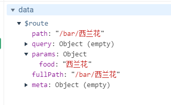
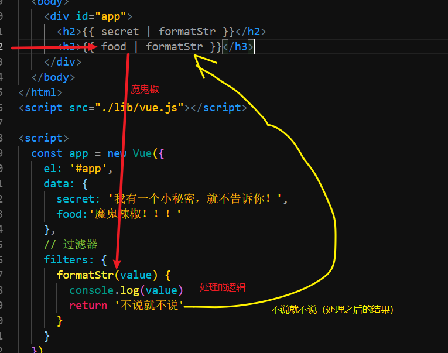

# Vue.js - day05

## 反馈

1. 这几天案例有点多呀消化不完,<天知道>都还没完全理解敲完,是不是效率好低呀
2. 感觉学的好烂
3. 恰饭了么老表.
4. 哇,再次 一脸懵逼 ,
5. 有没有看《轮到你了》?
6. 为什么你的代码没有加v-cloak,第一次刷新胡子语法也不会显示出来,,,但是我的会显示出来
7. 嫂子现在在干嘛 ?
8. 凉了呀 感觉都白学了
9. 讲的非常的好 ,能够循序渐进,希望老师能够倾尽所有,我已经最好接大招的准备了(顺便说下 ,如果楼上有人用类比的方式说了三大框架的区别,你告诉他,我的刀在路上......)
10. 工作台字体可以调大一点
11. 老湿，我有一个建议呀，现在的案例代码开始有一点复杂了，能不能每写完一个功能就保存一个一个html类似于：01.输入内容，点击回车，查询数据，渲染页面完成；02.双击歌曲列表，播放双击的歌曲完成。。。。。，以此类推把每个功能分开，这样对于没有思路的同学有很好的帮助，一目了然，不用去看视频，发更多的时间，希望采纳
   1. git
12. 嘤嘤嘤
13. 弟妹現在在幹什麽呢
14. 老师，目前前端三大框架vue、react、angular是不是就相当于国内的BAT？vue是腾讯，react是阿里，angular好像有点过气了，npm下载量被vue给超了，且github上的点赞数也远少于另外两个，大概就相当于市值跌到400亿的百度？ jquery的话曾经统治过前端，它所达到的高度自然是这三大框架不能比的，但它现在过气了，所以就相当于一个诺基亚吧！只是调侃一下，大家不要当真哈。
   1. angular没有那么流行
   2. jsx-react
15. 我本来和老师一样优秀的，直到有一天，我在网吧看到一个同学玩js，他玩的特别溜。 他告诉我，q技能叫做 阿法突袭。于是，有一种叫做命运的东西在无形中发酵，造就了今天的我。
16. 悟空和唐僧一起上某卫视非诚勿扰,悟空上台,24盏灯全灭。理由:1.没房没车只有一根破棍. 2.保镖职业危险.3.动不动打妖精,对女生不温柔. 4.坐过牢,曾被压五指山下500年。唐僧上台，哗!灯全亮。 理由:1.公务员； 2.皇上兄弟，后台最硬 3.精通梵文等外语 4.长得帅 5.最关键一点：有宝马！
17. 程序员的媳妇叫程序员去超市买东西， 程序员的媳妇说：“买西瓜。再看看他们卖不卖西红柿，如果卖的话，买10个。” 最后程序员带着10个西瓜回家了，为什么？
   欧1. vue大法好～～～😻😻😻
18. 又学会了一句口头禅： 吗呀..吗呀..
19. 看到那个拿三大框架来比较的评论没有?恕我直言,我想锤写这条评论的人
20. 当我在听课时，我在听什么。。。。
21. 不说话 都选b
22. 怎么设置一首放完自动播放下一曲
   1. 播放完毕之后，
   2. 执行一个播放下一首的逻辑
   3. 在某个时刻，干事情。首先想到的是事件
     1. 绝大多数时候都有 事件（钩子），回调函数
     2. 没有，而这个需求有很常用，一般插件
     3. 没有事件，也没有插件
       1. 需求很特殊，很少见

## 回顾

1. 组件基本使用
   1. 结构 template
   2. data(){return{} }
   3. methods:和之前一样
   4. 除了1和2其他的都和之前的写法一样
2. vue-router:
   1. 高级的tab
   2. 布局中
      1. tab-nav: router-link
      2. tab-content:router-view

## Demo-高级播放器-路由整合

### 实现步骤

1. 整合路由
   1. tab切换使用的是vue-router(路由)
   2. 显示的是组件
   3. 整合 多个页面，抽取为组件，使用路由的方式维护显示和隐藏
   4. 小紫猫记录
2. 整合组件
   1. 把index隔壁的那些文件，结构，样式全部都整到index.html
   2. 抽取为组件
   3. 为了晚上看代码简洁，删除了除index.html之外所有文件

## 路由高亮样式

[传送门](https://router.vuejs.org/zh/api/#active-class )

1. vue-router 在我们切换`router-link`时，默认会自动的添加移除一个高亮的类名，
2. 如果需要更改通过`active-class`把这个属性设置给`router-link`即可实现使用自己的类名作为高亮类名

```html
<router-link active-class='active'>导航</router-link>
```


## Demo-歌曲搜索


### 实现步骤

1. 顶部的搜索框双向数据绑定v-model.trim :search
2. 点击搜索或者点击回车
   1. @click @keyup.enter :searchMusic
   2. 把搜索的内容，传递给 搜索组件
      1. 动态路由匹配
      2. router.push('/result/${this.search}')
   3. 同时让搜索组件显示出来
      1. 编程式导航
      2. 修改路由规则 `/result`=>`/result/:search`

### 注意点

1. 路由切换时需要携带数据，用的是`动态路由匹配`
2. 代码的方式跳转，用的是`编程式导航`

## 编程式导航

[传送门](https://router.vuejs.org/zh/guide/essentials/navigation.html)

1. 编程式导航的本质是

```
router.push('地址')
```

2. 声明式导航的本质是

```
<router-link to='/run'>去跑步</router-link>
```

3. 适用情景
   1. 声明式导航：点了就跳转，没有任何逻辑 类似于(a标签设置了href)
   2. 编程式导航：跳转的同时有其他逻辑需要执行

## 动态路由匹配

[传送门](https://router.vuejs.org/zh/guide/essentials/dynamic-matching.html#%E5%93%8D%E5%BA%94%E8%B7%AF%E7%94%B1%E5%8F%82%E6%95%B0%E7%9A%84%E5%8F%98%E5%8C%96)

1. 修改路由规则 `/user`=>`/user/:key`
2. `:key`是一个占位，名字可以更改
3. 切换路由是，地址`/user`=>`/user/数据`
4. 携带者数据切换了路由之后，如何获取数据
   1. data中会自动的被添加上一个`$route`内部的.params就保存了我们传递的数据
   2. 

## Demo-高级播放器-结果搜索

### 实现步骤

1. 当 result 组件创建出来之后（出现）之后，
   1. 使用生命周期钩子（自动执行）created
   2. 尽可能早一些执行的，让用户早一些看到数据
2. 获取传递过来的关键字 `this.$route.params.键`
3. 通过关键字调用接口， axios
4. 数据获取到之后，渲染到页面上
   1. then
   2. v-for :musicList

## 生命周期钩子 -created

1. beforeCreate:
   1. Vue实例被创建，但是传入的参数还没有设置上去
2. created
   1. Vue实例被创建，传入的参数已经设置给这个Vue实例了
   2. 如果要操纵数据最起码在这个里面
3. beforeMount
   1. 开始解析结构，把数据和解构关联起来，刚刚开始，页面上看不到
4. mounted
   1. 数据和页面已经关联起来，这一步dom元素已经可以获取到


## 过滤器基本使用



1. 定义的方式
   1. vue中fileters:{}
2. 一个过滤器一个方法
3. 使用的使用`{{ 数据 | 过滤器 }}`
4. 过滤器需要接收一个参数，参数就是处理的数据
5. 内部处理完毕之后
6. return 出来页面会显示 返回出来的那个值
7. 不会修改原始值

## Demo-过滤器处理result中搜索的结果


### 实现步骤

1. 处理歌手名
   1. 为了防止多人演唱只显示第一个的问题
   2. 添加过滤器 处理歌手 
      1. filters:{ formatSinger(arr) }
      2. {{ item.artists  | formatSinger }}
   3. 过滤器内部逻辑
      1. 循环数组，拼接名字 用 '/'
      2. 移除最后的那个`/`
      3. return
2. 处理时间
   1. 添加过滤器 处理 时间
      1. filters:{ formatTime(time) }
      2. {{item.duration |formatTime }}
   2. 处理逻辑
      1. 毫秒->秒
      2. 算出分 60的整数倍 除
      3. 剩余的部分作为秒 取余

### 注意点

1. 时间从毫秒转为 时分秒，
   1. 先除  再取余
2. 过滤器的特点是，不修改数据的情况下 更改数据的显示效果
3. 过滤器的使用 `|` 
   1. 这个| 也叫 `管道符`


## Demo-点击mv 播放MV

### 实现步骤

1. result组件中 生成mv按钮时，绑定点击事件 携带mvid 跳转到mv路由那
   1. router.push('/mv/mv的id')
   2. 路由规则`/mv`->`/mv/:mvid`
2. mv组件中 
   1. 获取mvid
   2. axios接口调用
   3. 数据回来之后，渲染到页面上
      1. 歌名：songName
      2. 歌手名:singerName
      3. mv的地址:mvUrl


### 重点

实现步骤和 搜歌 类似 跳转，携带数据


## 预习

单文件组件  xxx.vue

[脚手架](https://cli.vuejs.org/zh/guide/)

[安装](https://cli.vuejs.org/zh/guide/installation.html)

[创建项目](https://cli.vuejs.org/zh/guide/creating-a-project.html)