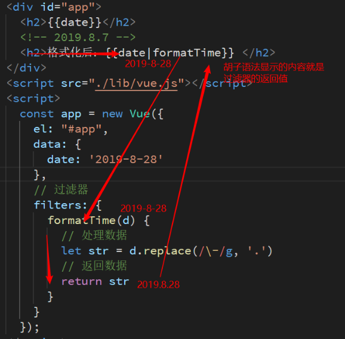

# Vue.js - day06

## 反馈

1. 老师知识面很广，能够旁征博引，由点及面，学到大量的知识。老师讲课风趣幽默，能将将枯燥的东西变得有趣，让我整堂课都聚精会神，绝不走神。老师讲课循循善诱，能将复杂难懂的知识点深入浅出的解析，让我轻松掌握。老师经验十分丰富，能够因材施教，针对不同的同学采用不同的策略，让所有同学共同进步。打好基础,老师关心爱护同学，如同慈父一般，谆谆教导自己的学生。
2. 老师辛苦了,  那个我有点小小的建议,就是在讲到某些重点的时候你的讲话音量可以突然大声,这样可以惊一下我们,别的同学不知道,我老是在一节课前一半注意力集中,吸收的挺好,但是老到每节课的后一小半左右注意力集中不了,就算是没在睡觉,脑子也是在一种放空的状态,知识它就是不进入脑子里面.然后课间趴一会又好很多,下节课又重复这样的.  我太难了  兄弟.
   1. 突然大声
3. 多加练习不能睡太早了,要有紧张感 加油,老师你笑起来真好看
4. 老师昨天把四个网页合成一个，然后今天会把一个网页分成几个么
   (●'◡'●)
   1. 网页作为一个组件，然后四合一
   2. .vue 单文件组件 一拆四
5. 编程式导航??动态路由匹配??
6. 大佬都在刷面试题了,我还在学组件,好慌啊,而且今天教的知识点就有种回到学Nodejs模块的感觉,就是一直在装模块,要求也是会用就行,可看不懂怎么能用好
   1. 把握好的自己的节奏。多做总结
   2. 今天会讲怎么用
7. 全天之后听的时间多了.....自己敲的时间少了.....有点忐忑
   1. 今天会留多一点时间敲代码
8. 你只有非常努力,才能看起来毫不费力!Let us fight together,hopefully tomorrow will be better!
   1. 加油
9. 路由还是好模糊啊
10. 动态路由匹配和编程式导航不清楚,希望再讲解讲解
11. 白在教室呆一天 毛都不会 这下好了全拉裤裆里了
12. 难度一下又上来了,很多东西记不住了,学习效率有点低
13. 希望讲完一个新的知识点，可以给敲下代码。新东西还是手敲消化比较好。
14. 额,刚开始一脸懵逼,熟悉个几十遍再说
15. 有点难 要好好消化一顿
16. 感觉知识点太多了，有点记不过来。老师可以讲下怎样储存代码示例么，以后要用的时候能一下想起来的那种。还有想知道老师刚学vue的时候是怎样让自己快速上手的？
    1. 用户自定义代码片段  不需要 vue_tpl
    2. 在项目中有问题--->查文档，查资料 --解决问题  Loop....  如果有总结的话，更好。


## 回顾

1. **路由的概念、声明式导航，编程式导航、动态路由匹配**
   
   1. Vue路由就是给我们做高级的导航栏
   
   2. 点导航栏的时候，展示不同的组件
   
   3. 声明式导航 to属性需要去匹配路由规则的数组里面的Path，如果匹配的话，就展示它旁边的component对应的组件
   
      ```html
      <router-link to="/sing">唱</router-link>
      ```
   
   4. 编程式导航 router.push(地址) 如果这个地址和路由规则的数组的path相匹配的话，就会展示对应的组件
   
      ```js
       router.push('/sing')
      ```
   
   5. 动态路由匹配就是给组件传参
   
      1. 通过地址去传参 `/sing`=> `/sing/qiqi`
      2. 匹配传过的值（给一个账号）  路由规则得改 /sing=> /sing/:username
      3. 取得数据 data.$route.params.username
   
   
   
2. **过滤器就是用来格式化文本的**

3. 


## 黑云音乐-评论功能

### 实现步骤

1. 点击歌名，跳转到评论
   1. 点击@click: toComment
   2. 编程式导航
      1. router.push('/comment')
2. 把歌曲的id传到评论组件
   1. 动态路由匹配
      1. 传参 router.push('/comment/id')
      2. 模式 /comment =>  /comment/:id
3. 在评论组件内发请求，渲染页面,
   1. 接口 https://autumnfish.cn/comment/hot?id=186016&type=0
   2. 尽早发请求拿到数据 created 
   3. axios.get(`url${this.$route.params.id}`)
   4. hotComments数组，遍历数组，渲染.item
4. 格式化发表评论的时间
   1. 使用 item.time|formatTime
   2. 定义在filters:{formatTime(time)}
   3. 处理数据的逻辑 124244431234=> 2017年7月20日
      1. 时间戳->Date new Date()
      2. getYear()....

### 注意点

1. <template>标签不能注册事件


## 黑云音乐-歌曲播放功能

### 实现步骤

1. 点击播放图标，跳转到歌曲播放

   1. 点击@click: toPlayer
   2. 编程式导航
      1. router.push('/player')

2. 把歌曲的id传到歌曲播放组件

   1. 动态路由匹配
      1. 路径 router.push('/player/id')
      2. 模式 /player=>  /player/:id

3. 在歌曲播放组件内发请求，渲染页面

   1. 播放功能
      1. 接口：获取歌曲的url https://autumnfish.cn/song/url?id=444267215 
      2. v-bind:sc="musicUrl"

   2. 封面 歌名，歌手，专辑的名字
   3. 歌词
      1. 接口： https://autumnfish.cn/lyric?id=435307747
      2. 歌词的处理，用正则，然后数组遍历，vfor渲染

### 注意点

1. 在组件里尽早发请求，用钩子函数created


## 单文件组件

1. 一个文件包含组件的所有内容
   1. 结构 模板
   2. js逻辑
   3. 样式
2. 单文件组件是.vue的结尾的
3. 单文件结构包含三部分，可能用vue插件生成  用`<vue>`来呼出提示
4. 单文件组件的这种形式更利于写代码，也更利于维护。接下来学习我们都会用.vue文件来写组件


## Vue-cli（脚手架）

[传送门](https://cli.vuejs.org/zh/)

1. 能把.vue解析成浏览器能识别的代码
2. 压缩js,css,图片的压缩
3. 自动刷新浏览器
4. 服务器代理

Vue官方为了让我们更加专注于写逻辑，把一些杂七杂八的工具集成脚手架，供我们使用。


### 实在无法创建项目的解决方案（重要）

1. vue-cli做的事情

   1. 创建项目的文件结构

   2. 帮我们装了npm包，第三方模块

   3. git相关的初始化

      ...

2. 可以copy同桌已经生成好的脚手架项目

   1. 把node_modules删除再copy

   2. 在copy过来的项目里面执行npm install

   3. 运行 cd项目目录 npm run serve

      

## Vue-cli项目结构

写代码在src里面，其他的目录基本上不会改动

components组件写在这里

App.vue是主组件，页面看到的内容都是App.vue渲染的

main.js就是入口js，初始化根实例


## Vue-cli项目编码位置(练习)


注意点：

1. **项目目录下运行**`npm run serve`
2. 运行完后，会提示在http://location:8080打开页面
3. 如果项目下已经运行过npm install, 就不要再运行啦
4. 不能创建项目的话，copy别人的项目


## Vue-cli src代码结构

1. App.vue这个主组件
2. main.js
   1. 实例化根实例
   2. 把主组件渲染到根实例里面
   3. el：#app 关联到public/index.html里面的div id=app这个dom

3. assets是静态资源
4. components存放组件


## 全局组件的注册

一次注册，到处都可以使用

1. 在components里面写一个组件 counter.vue
2. 先在main.js引入组件 import Counter from '..//'
3. 注册组件 Vue.component('name',Counter )
4. 其他组件里面可以直接把name当标签名来使用组件


## 局部组件的注册

哪里需要组件，就在哪里注册

1. 在components里面写一个组件rap.vue
2. 如果我在App.vue使用，import Rap from '.../'
3. App.vue的 components属性下注册
4. 在App.vue模板里面就可以使用了


## 组件的name属性

Vue官方推荐每个组件都给一个name属性

给一个name的话，那么Vue开发工具可以看到组件的名字。


## Vue-cli项目的路由整合(练习)

### 准备工作

1. 获取一个脚手架生成的新的项目vue-cli备份.zip
2. 改个名字demo
3. 进入demo项目，`npm install`, 安装第三方模块
4. `npm run serve`运行项


### 整合路由

1. 装包在工程目录下执行，也就cmd, 执行一个命令。npm install vue-router
2. 导包 import  VueRouter from 'vue-router
   1. 需要加上 Vue.use(VueRouter)
3. 用包
   1. 放在html 放App.vue
      1. 导航栏 router-link
      2. 内容区 router-view
   2. 放在js中 都话main.js
      1. 声明组件
      2. 路由规则数组
      3. 实例VueRouter
      4. 实例化根实例，传递router


#### 编码位置

1. main.js 使用路由的四个步骤
2. 导包也是在main.js
3. App.vue放了router-link和router-view

### 注意


### Vue-cli项目整合player


### 实现 步骤

1. 导航栏
   1. 把index.html的dom结构 放到App.vue的template里面
   2. App.vue的style里面引入css
   3. 设置声明式导航router-link 在App.vue
   4. 同时设置内容区 router-view
2. main.js 
   1. 修改了路由规则 /results =>Results
   2. 引入了Results这个组件
3. 搜索组件
   1. 新建一个results.vue单文件组件
   2. 把原来results.html的html代码copy过来
   3. 在results.vue里面引入样式
4. 高亮样式
   1. 实例化VueRouter的时候，设置 linkActiveClass=“active"
5. 歌曲播放组件
   1. 新建一个player.vue单文件组件
   2. 把原来player.html代码copy到template里面
   3. 在player.vue引入样式
   4. 声明式导航和路由规则要匹配
6. mv组件和commnent组件


#### 整合导航区域


### 注意点

1. 导航栏和内容区都在App.vue
2. 跟路由规则，路由初始化都在main.js
3. 搜索歌曲，播放歌曲，mv，评论分别是四个单文件组件


## 总结

