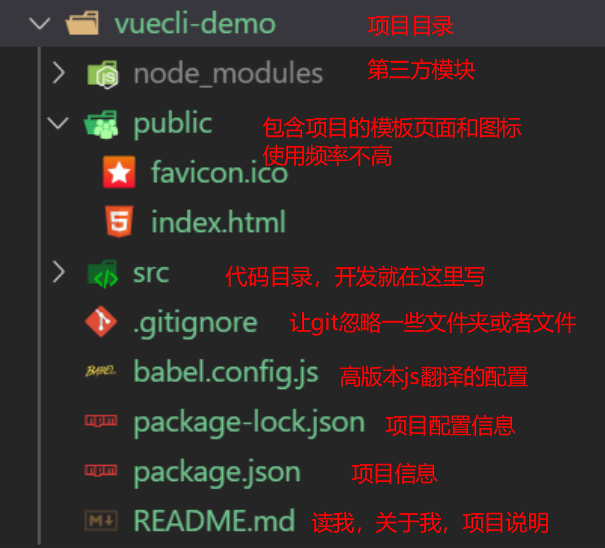
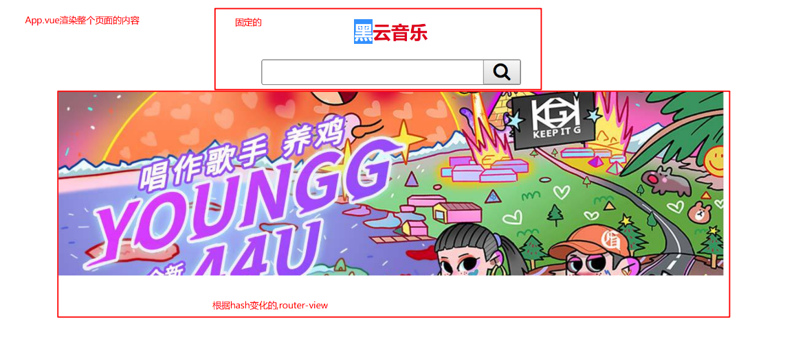

# Vue学习第6天

## 反馈


## 回顾


### 实在无法创建项目的解决方案（重要）

1. vue create干了啥

   1. 创建一个项目文件夹

   2. 并且创建了很多文件

   3. git初始化了项目，添加了.git文件

      ...

2. 直接copy别人已经生成好的vuecli项目

   1. 删除vuecli项目里面的node_moudules文件夹

   2. 获取到vuecli项目后，需要安装第三方npm包。**在项目目录下安装**

      ```
      npm install
      ```

   3. 安装完了，项目目录下执行`npm run serve`
   4. 运行成功，打开url，显示页面正确就OK


## Vue-cli项目结构




## Vue-cli src代码结构

1. main.js是页面入口文件,public/index.html是它的dom结构
   1. el选择器和public/index.html里面id属性是关联的
   2. 创建了根实例
   3. 在根实例里面实例化了App.vue组件
2. App.vue是主组件，页面内容都是由它渲染的
3. `components` 组件都写在这里，除了App.vue
4. `assets`静态资源，存放图片,css,字体文件

### 注意点：

1. vue-cli的项目，js库都是通过npm install来安装的


## Vue-cli项目编码位置

1. 组件都应该写在xx.vue
2. 静态资源的引入直接找到路径来引入
3. css也是放在`assets`里面，引入方法
   1. css语法 @import url('路径')
   2. main.js引入 import '路径'


## 组件的全局与局部注册

1. 全局注册。一次注册，到处使用

   ```js
   Vue.component(组件名,{组件属性})
   ```

2. 局部注册。哪个组件注册，就只能在那个组件里面使用

   ```js
   new Vue({
     componnents:{
       组件名:{组件属性}
     }
   })
   ```

注意点：

1. 一个html里面可以有多个Vue实例


## Vue-cli项目的组件注册

1. 在main.js全局注册组件
   1. 引入组件 import 组件对象 from '地址'
   2. Vue.component(名字，组件对象)
   3. 在任意组件里面，可以把组件名当标签进行使用
2. 在需要用到这个组件的地方引入
   1.  import 组件对象 from '地址'
   2. 把组件对象设置给components属性
   3. 在组件里面可以把组件名当标签进行使用
3. 全局的组件就全局注册，loading,dialog; 哪个组件需要就引入; 大部分时候都是局部注册


## 组件的name属性

1. Vue建议每个组件都给一个name属性
2. Vue开发工具的组件名默认为组件的name属性


## Vue-cli项目的路由整合(练习)

### 准备工作

1. 创建一个新的vue-cli工程
2. 或者复制一份干净的vuecli工程，需要在工程目录下npm install 
3. npm run serve运行起项目，同时也是检验我们的代码是否OK


### 整合路由

1. 安装包,就是安装第三方模块到node_modules 

   1. ```bash
      npm install vue-router
      ```

2. 导包

   1. ```js
      import VueRouter from 'vue-router'
      ```

3. 用包

   1. 需要use,明确地安装路由功能

      ```js
      Vue.use(VueRouter)
      ```

   2. dom结构放在App.vue
      1. router-link
      2. router-view
   3. js逻辑
      1. 组件的创建在components
      2. 在main.js里面引入组件
      3. 定义路由规则 const routes=[{hash=>component}]
      4. 实例化VueRouter,传递routes
      5. 创建根实例，传递路由实例


#### 编码位置

1. 导入路由和注册路由都在main.js
2. router-link和router-view放在App.vue
3. components放组件
4. assets静态资源

### 注意

1. 项目在运行时，如果需要安装npm包，最好先停止项目，安装好了，再启动
2. 一般引入第三方模块，尽量去官网找安装教程，npm install 模块名，这个模块名一定要确定好.


## player-界面分析

1. 项目准备
   1. 新建一个02.player-cli文件夹
   2. copy usevue-router的项目，除了node_modules
   3. 在02.player-cli下npm install 
   4. npm run serve运行 02.player-cli项目





## player-搜索区域整合

1. copy index.html到App.vue
2. 在App.vue导入样式
3. 添加router-view


## player-搜索区域抽取为组件

1. 新建一个search.vue
2. 抽取搜索区域的html到search.vue的template
3. 局部注册，因为组件主要是在App.vue使用
   1. 引入组件 import Search from './components/Search'
   2. 设置给App.vue的components属性
   3. 在template里面当标签使用


## player-路由整合

### 注意


## 总结

