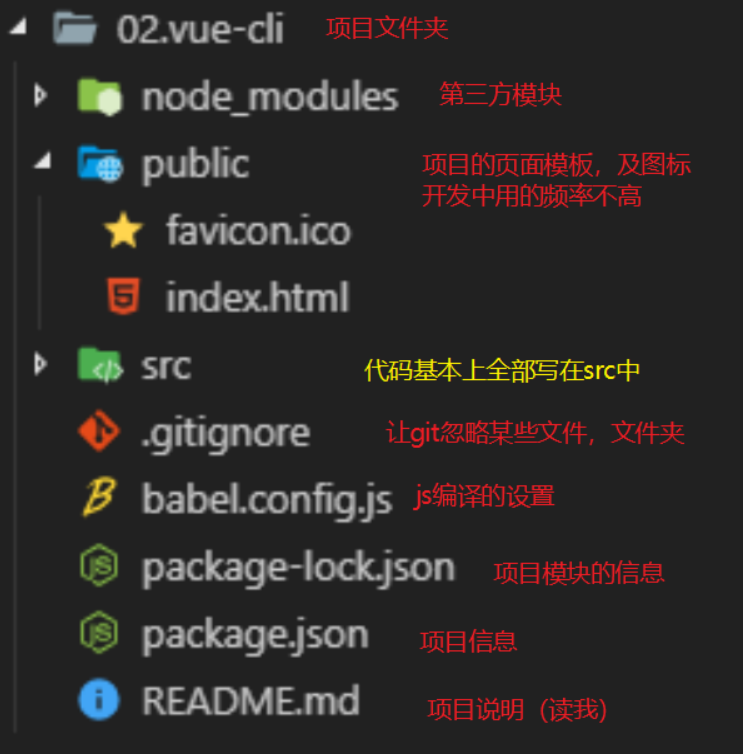
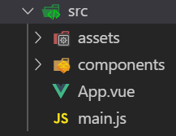

# Vue学习第6天

## 反馈


## 回顾


### 实在无法创建项目的解决方案（重要）

1. vue create 做的事情

   1. 创建项目的文件结构

   2. 帮我们装了npm包，第三方模块

   3. git相关的初始化

      ...

2. 可以copy同桌已经生成好的脚手架项目

   1. 把node_modules删除再copy

   2. 在copy过来的项目目录下执行npm install

      ```
   cd 项目目录
      ```
   
   3. 运行 cd项目目录 npm run serve

> 1. 同学们都能创建vue-cli项目，并运行项目吗？如果没有的话，还有终极方案
>
> 2. 先说一下vue-cli 创建项目做了啥, 创建了项目文件结构，安装了第三方模块，git相关的初始化工作。
>
> 3. 那么是不是可以copy同桌的已经创建好的项目文件夹呢？但是由于node_modules文件很大，先删除再copy。然后在copy过来的项目目录下执行npm install,然后运行npm run serve
>


## Vue-cli项目结构




## Vue-cli src代码结构



1. main.js是页面的入口
   1. el选择器和public/index.html是关联的
   2. Vue.config.productionTip = true 显示生成模式信息
   3. 创建了Vue根实例
   4. 在根实例内部渲染了主组件App.vue
2. App.vue主组件，页面内容都是由App.vue渲染的
3. `assets`静态资源文件夹
4. `components`组件文件夹，除了`App.vue`之外的组件，都写到这个文件夹中即可

> 1. 我们说src下面写代码对吗？那我们展示src目录看一看。
> 2. 有assets和components文件夹，App.vue和main.js文件
> 3. 那么它们分别是什么关系呢？我们看一下浏览器里页面最终渲染的dom结构。这个html不就是public/index.html吗？但是这个渲染的html里面有引入一个app.js，而public/index.html并没有。它其实是vue-cli把main.js翻译成浏览器可识别的内容。 main.js和public/index.html不就是我们vue基本页面吗？ 所以main.js里面的el选择器和index.html里面id是关联的。
> 4. main.js是入口js，把src里面的资源拎在一起。那么近距离看一下，main.js代码，import，还有生产模式信息
> 5. 那么render这一句是啥意思呢，看下Vue调试工具，有根实例，还有App实例，根实例就是我们new Vue这句，所以render相当于是渲染了App组件
> 6. 我们看哈，public/index和main.js是根实例的代码对吧，但是两个文件里面，基本没有在页面上渲染什么。所以页面渲染主要由App.vue完成，根实例是App.vue背后的男人。
> 7. assets就是存放静态资源的，包括images, 样式，字体文件等
> 8. components, 放组件的，除App.vue之外的所有的组件。


## Vue-cli项目编码位置

1. 组件的逻辑直接写在`xx.vue`

2. 静态资源放到`assets`文件夹下面，直接使用对应路径即可引入

3. css也放在``assets``这个文件夹，如何引入

   1. `style标签中引入`

   ```css
     /* 使用css支持的语法导入 */
     /* @import url('./assets/base.css'); */
   ```

   2. `main.js`中引入

   ```js
   // 导入 样式
   import './assets/base.css'
   ```

> 1. 我们说App.vue渲染了页面内容，我们来在App.vue里面写点东东。
> 2. 直接删掉App.vue的内容，重新生成基本结构，在template里面写。
> 3. 引入图片，直接使用对应路径
> 4. css文件也放在assets，style标签引入，又或者在main.js里面引入。


## 组件的全局与局部注册

1. 全局注册。一次注册，到处使用

   ```js
   Vue.component(组件名,{组件属性})
   ```

2. 局部注册。哪个组件注册，就只能在那个组件里面使用

   ```js
   new Vue({
     componnents:{
       组件名:{组件属性}
     }
   })
   ```

注意点：

1. 一个html里面可以有多个Vue实例

```html
<!DOCTYPE html>
<html lang="en">

<head>
  <meta charset="UTF-8" />
  <meta name="viewport" content="width=device-width, initial-scale=1.0" />
  <meta http-equiv="X-UA-Compatible" content="ie=edge" />
  <title>Document</title>
</head>

<body>
  <div id="app">
    <h2>实例1</h2>
    <news></news>
    <counter></counter>
  </div>
  <div id="app2">
    <h2>实例2</h2>
    <news></news>
    <counter></counter>
  </div>
  <script src="./lib/vue.js"></script>
  <script>
    Vue.component('news', {
      template: `<div>全局注册</div>`
    })
    const app = new Vue({
      el: "#app",
      data: {},
      components: {
        counter: {
          template: `<h2>你点击了3次</h2>`
        }
      }
    });
    const app2 = new Vue({
      el: "#app2",
      data: {}
    });
  </script>
</body>

</html>
```


> 1. 这节课我们学习一下，组件的全局注册与局部注册
> 2. 大家还记得组件的使用吗？来我们一起回顾一下。
> 3. 目前页面上new了一个Vue实例，那它能new多个Vue实例吗？当然可以。我们在Vue的基本使用里学习，dom结构和Vue实例关联起来就行。OK.
> 4. copy一份结构和实例化代码。注意到在第二个实例的dom里面，也把组件名当标签使用了，渲染也没问题。第一个Vue实例解析它的dom，发现组件名，找到组件的声明，第二Vue实例也是这么干。所以组件的声明在两个Vue实例里面都有效，说明组件被全局注册了。所以Vue.component这种方式，注册组件叫做全局注册。
> 5. 相对于全局注册还有一个局部注册，跟变量的全局和局部很像对吧。那么组件的局部注册也是这样的，哪里需要用到就在哪里注册。比如第一个实例注册Counter组件，语法是。。。，然后在dom里边把组件名当标签使用即可。
> 6. 那有些同学会想，我一定要在第二个实例的dom里面使用，可以吗。试试，不行。


## Vue-cli项目的组件注册

2. 全局注册组件，在main.js引入注册
1. 引入组件 import 组件对象 from '地址'
   2. Vue.component(名字，组件对象)
   3. 在任意组件里面，可以把组件名当标签进行使用
2. 局部注册组件，在需要用到这个组件的地方引入
   1. import 组件对象 from '地址'
   2. 把组件对象设置给components属性
   3. 在组件里面可以把组件名当标签进行使用
3. 全局的组件就全局注册，loading,dialog; 哪个组件需要就引入; 大部分时候都是局部注册

> 1. 我们再来看一下在vuecli项目里面的组件注册。
> 2. 说是components里面可以写组件的吧，我们来写一个
> 3. 别的地方需要使用，需要注册吧。那注册分为全局注册和局部注册


## 组件的name属性

Vue官方推荐每个组件都给一个name属性

给一个name的话，那么Vue开发工具可以看到组件的名字。

> 1. 官方推荐总是组件一个起个名字，name属性
> 2. 好处多多，目前我们能了解到的好处就是，如果我们给组件一个name属性，那么Vue调试工具看到的就是我们起的这个名字。


## Vue-cli项目的路由整合(练习)

### 准备工作

1. 创建或者复制一份脚手架项目

2. 复制的项目需要，cd 项目目录，`npm install`, 安装第三方模块

3. `npm run serve`运行项目

   

### 整合路由

1. 装包：在工程目录下执行，也就cmd, 执行一个命令。npm install vue-router
2. 导包： import  VueRouter from 'vue-router’
3. 用包
   1. Vue.use(VueRouter) 明确地安装路由功能
   2. 创建路由规则
      1. 创建一个组件`xxx.vue`
      2. 引入组件
      3. routes=[ {path:"/xx",component:组件} ]
   3. 创建路由对象
      1. router
   4. 设置给Vue实例
      1. new Vue({ router })

#### 编码位置

1. 导入 注册路由 `main.js`
2. routerlink router-view `app.vue`
3. 添加组件`components/`
4. 静态资源`assets`

### 注意

1. npm run serve时会占用命令行，一般停掉，再安装好包好后，再执行npm run serve启动项目
2. 安装包的名字一般去包的官网去找，一般都有

> 1. 目前这个项目里面只是引入了vue.js对吧，我们昨天还学习一个重要的Vue插件叫作路由，那么我们把路由也整合进vuecli项目。
> 2. 我们新建一个项目，不在前一个项目的里面改动。copy一个项目运行成功。
> 3. 看vue-router官网，如何安装
> 4. 由于需要把路由实例传递给Vue实例，那么导入注册路由应该放在main.js
> 5. 菜单和内容是页面内容部分，应该放在App.vue里面


##  player-界面分析

1. 项目准备
   1. 新建一个02.player-cli文件夹
   2. copy usevue-router的项目，除了node_modules
   3. 在02.player-cli下npm install 
   4. npm run serve运行 02.player-cli项目


> 1. 演示黑云音乐的功能
> 2. 画图说明哪块是router-view和搜索框等


## player-搜索区域整合

1. copy index.html到App.vue
2. 在App.vue导入样式
3. 添加router-view

## player-搜索区域抽取为组件

1. 新建components/search.vue
2. 局部注册组件

> 1. 如果搜索框这部分，其他页面也需要用呢？怎么办。我们可不可以把它抽取为一个组件呢，交给一个同事负责开发，用的时候，其他人只需要调用就行。
> 2. 新建components/search.vue，html部分copy过来。
> 3. App.vue里面包含搜索框吧，就在app.vue引入search.vue，然后局部注册components，使用
> 4. 看一下vue开发者工具。
> 5. 实际工作中会拆得特别细，拆分组件除了重用，另外还有一个好处，分工明确。一个组件交给一个同事开发，责任分明，git提交不用解决冲突，对吗？


## player-轮播图

### 轮播图组件及路由

1. 创建轮播图组件 components/Slider.vue
2. main.js中导入组件 
3. main.js添加路由规则
   1. path:"/slider"
   2. component:slider

#### 注意

1. 添加了路由规则之后, 修改url上的hash，验证轮播图组件及路由是正确的。

> 1. 看到页面，这里有个轮播图。我们先来加一个轮播图组件定义路由规则，然后再看怎么具体怎么实现组件
> 2. 在compoents里面声明组件，main.js导入组件，修改路由。
> 3. 修改url hash为#/slider，能够显示slider组件

### 路由重定向

[传送门](https://router.vuejs.org/zh/guide/essentials/redirect-and-alias.html)

当访问hash1时，跳转到hash2（想象成电话的呼叫转移）

使用方法

```js
const routes = [{
  path: '/',
  redirect: '/slider'
}, {
  path: '/slider',
  component: Slider
}]
```

#### 注意点

重定向的地址 如果没有对应组件，页面会显示空白

> 1. 如果我想打页面，展示slider呢。
> 2. 那默认hash是#/.我们可以用一个路由重定向的技术来完成。
> 4. 我们一起来看一眼文档，文档例子里面，当hash为/a时，跳转到/b; /b再会去匹配path为/b的规则，找到对应的组件显示
> 5. 实现 定规则里面增加一条，匹配到/，就跳转到Slider


### 饿了么ui 介绍

[传送门](https://element.eleme.cn/#/zh-CN)

1. 饿了吗前端团队开发的pc端的基于vue的组件库
2. 内部封装了很多现成的组件，直接就可以使用比如轮播图，tab栏，省市联动，开关，table
3. 因为在vue开发时用的很多，所以和几个其他的库合并到一起被称之为 **vue全家桶**
   1. vue
   2. axios
   3. vue-router
   4. 饿了么ui
   5. vuex

> 1. 轮播图，具体要怎么实现呢？我们的基础课程里，用JS写过轮播图吧。那在jquery的案例里边，是用自己js的轮播图，还是用jquery的轮播图插件呢？对的，用js写轮播图是为了理解原理，真正项目里面的轮播图还是挺复杂的，有轮播图插件当然直接用啦。
> 2. 这里案例里我们也用一个基于Vue的很流行的UI框架，包含轮播图组件。叫做饿了么ui。
> 3. 饿了么ui是所有vue ui框架里面最出名的，大多用来做后台管理。我当时在公司里写组件，也会参考饿了么ui的源码
> 4. 看看饿了么ui文档，内部封装了很多组件。
> 5. vue和基于vue的库，统为vue全家桶，包括..


### 轮播图组件使用 

1. 安装包 `npm i element-ui -S`

2. 引入element-ui

   ```js
   import ElementUI from 'element-ui';
   import 'element-ui/lib/theme-chalk/index.css';
   Vue.use(ElementUI);
   ```

3. copy走马灯示例代码到Slider.vue
4. 尽早发请求初始化轮播图组件
   1. created请求接口初始化
   2. axios.get调用接口https://autumnfish.cn/banner 
   3. 要用axios
      1. 安装axios
      2. 引入
      3. 使用
   4. 渲染页面上 拿到数据 banners 结合vfor渲染
   5. 可能还需要调整轮播图的样式

> 1. 那么element-ui怎么使用呢？看文档
> 2. 安装，引入和使用
> 3. 找到使用走马灯，看走马灯效果。文档的示例由简入繁，我们先看基本使用。展示源码。
> 4. 在项目里面安装，引入，copy代码，开始轮播了。
> 5. 你怎么知道云听音乐每天要播什么呢？每天看的轮播内容不一样，当然是接口数据
> 6. 查文档，调接口，和网易云音乐对比
> 7. 组件初始化就要获取数据，哪个钩子可以做到呢？created
> 8. 安装axios，引入，使用

#### 注意点

1. 饿了么ui的轮播图模板默认提供的是h3标签，需要自行替换为别的标签
2. 默认有一个高度 150px，可能需要根据需求调整
3. 组件一出现就要调用接口，一般放到哪个钩子
   1. created:这里可以访问data

## 总结

