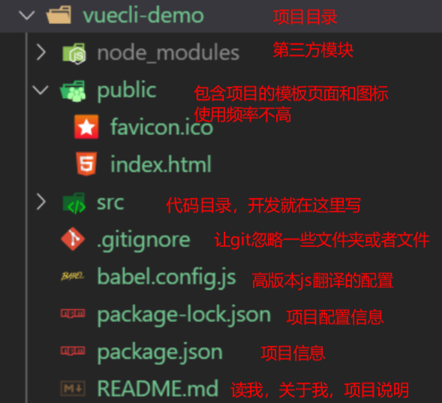

# Vue学习第6天

## 反馈


## 回顾


### 实在无法创建项目的解决方案（重要）

1. vue create 做的事情

   1. 创建项目的文件结构

   2. 帮我们装了npm包，第三方模块

   3. git相关的初始化

      ...

2. 可以copy同桌已经生成好的脚手架项目

   1. 把node_modules删除再copy

   2. 在copy过来的项目里面执行npm install

      ```
   cd 项目目录
      ```
   
   3. 运行 cd项目目录 npm run serve

> 1. 同学们都能创建vue-cli项目，并运行项目吗？如果没有的话，还有终极方案
>
> 2. 先说一下vue-cli 创建项目做了啥
>
> 3. 那么是不是可以copy同桌的已经创建好的项目文件夹呢？
>
>    

## Vue-cli项目结构




## Vue-cli src代码结构

1. main.js是页面的入口
   1. el选择器和public/index.html是关联的
   2. Vue.config.productionTip = true 显示生成模式信息
   3. 创建了Vue根实例
   4. 在根实例内部渲染了主组件App.vue
2. App.vue主组件，页面内容都是由App.vue渲染的
3. `assets`静态资源文件夹
4. `components`组件文件夹，除了`App.vue`之外的组件，都写到这个文件夹中即可

> 1. 我们说src下面写代码对吗？那我们展示src目录看一看。
> 2. main.js是我们的入口js，最终生成的页面插入的app.js就是main.js生成的，而页面本身是public/index.html, main.js和public/index.html不就是我们vue基本页面吗？ 所以main.js里面的el选择器和index.html里面id是关联的。
> 3. 解释main.js代码，import，还有生产模式信息
> 4. 查看vue开发工具解释
> 5. render app.vue相当于<app>,渲染了App.vue
> 6. assets和components


## Vue-cli项目编码位置

1. 组件的逻辑直接写在`xx.vue`

2. 静态资源放到`assets`文件夹下面，直接使用对应路径即可引入

3. css也放在``assets``这个文件夹，如何引入

   1. `style标签中引入`

   ```css
     /* 使用css支持的语法导入 */
     /* @import url('./assets/base.css'); */
   ```

   2. `main.js`中引入

   ```js
   // 导入 样式
   import './assets/base.css'
   ```


## 全局组件的注册

一次注册，到处都可以使用

1. main.js注册组件

   1. `import 组件 from '地址'`
   2. `Vue.component('名字',组件)`

2. 任意的地方使用

   1. 用名字作为标签

   

## 局部组件的注册

哪里需要组件，就在哪里注册

1. 在需要用到这个组件的地方 导入 

   1. `import 组件 from '地址'`
   2. 设置给`components`这个属性

2. 在当前这个导入的组件中使用 该组件

   1. 用名字作为标签

      

## 组件的name属性

Vue官方推荐每个组件都给一个name属性

给一个name的话，那么Vue开发工具可以看到组件的名字。


## Vue-cli项目的路由整合(练习)

### 准备工作

1. 创建或者复制一份脚手架项目

2. 复制的项目需要，cd 项目目录，`npm install`, 安装第三方模块

3. `npm run serve`运行项目

   

### 整合路由

1. 装包：在工程目录下执行，也就cmd, 执行一个命令。npm install vue-router
2. 导包： import  VueRouter from 'vue-router’
3. 用包
   1. Vue.use(VueRouter) 明确地安装路由功能
   2. 创建路由规则
      1. 创建一个组件`xxx.vue`
      2. 引入组件
      3. routes=[ {path:"/xx",component:组件} ]
   3. 创建路由对象
      1. router
   4. 设置给Vue实例
      1. new Vue({ router })

#### 编码位置

1. 导入 注册路由 `main.js`
2. routerlink router-view `app.vue`
3. 添加组件`components/`
4. 静态资源`assets`

### 注意

1. npm run serve时会占用命令行，一般停掉，再安装好包好后，再执行npm run serve启动项目
2. 安装包的名字一般去包的官网去找，一般都有


## player-界面分析


> 1. 演示黑云音乐的功能
> 2. 画图说明哪块是router-view和搜索框等


### Vue-cli路由项目整合player

### 实现 步骤

1. 导航栏
   1. 把index.html的dom结构 放到App.vue的template里面
   2. App.vue的style里面引入css
   3. 设置声明式导航router-link 在App.vue
   4. 同时设置内容区 router-view
2. main.js 
   1. 修改了路由规则 /results =>Results
   2. 引入了Results这个组件
3. 搜索组件
   1. 新建一个results.vue单文件组件
   2. 把原来results.html的html代码copy过来
   3. 在results.vue里面引入样式
5. 歌曲播放组件
   1. 新建一个player.vue单文件组件
   2. 把原来player.html代码copy到template里面
   3. 在player.vue引入样式
   4. 声明式导航和路由规则要匹配
6. mv组件和comment组件


### 注意点

1. 导航栏和内容区都在App.vue
2. 跟路由规则，路由初始化都在main.js
3. 搜索歌曲，播放歌曲，mv，评论分别是四个单文件组件


## player-搜索区域抽取为组件

1. 新建components/search.vue
2. 局部注册组件

> 1. 如果搜索框这部分，其他页面也需要用呢？怎么办。我们可不可以把它抽取为一个组件呢，交给一个同事负责开发，用的时候，其他人只需要调用就行。
> 2. 新建components/search.vue，html部分copy过来。
> 3. App.vue里面包含搜索框吧，就在app.vue引入search.vue，然后局部注册components，使用
> 4. 看一下vue开发者工具。
> 5. 实际工作中会拆得特别细，拆分组件除了重用，另外还有一个好处，分工明确。一个组件交给一个同事开发，责任分明，git提交不用解决冲突，对吗？


## player-轮播图

### 整合轮播图组件

1. 创建轮播图组件 02.slider.vue
2. main.js中导入组件
   1. path:"/slider"
   2. component:slider

#### 注意

1. 添加了路由规则之后，可以用router-link,或者router.push来修改地址，跟通用的方法是，**直接修改url**

> 1. 看到页面，这里有个轮播图。我们先来加一个轮播图组件，然后再看怎么实现它
> 2. main.js导入组件，结合路由，默认路径显示轮播图组件

### 路由重定向

1. [传送门](https://router.vuejs.org/zh/guide/essentials/redirect-and-alias.html)
2. `{ path: '地址1', redirect: '跳转到的地址2' }`
3. main.js中增加一个重定向规则即可
4. 能够实现，匹配到地址1之后，立即跳转到地址2

#### 注意点

重定向的地址 如果没有对应组件，页面会显示空白

> 1. 想让用户一进来就，展示slider,路由的重定向
> 2. 文档
> 3. 实现 定规则里面增加一条，匹配到/，就跳转到slider

### 饿了么ui 介绍

[传送门](https://element.eleme.cn/#/zh-CN)

1. 饿了吗前端团队开发的pc端的基于vue的组件库
2. 内部封装了很多现成的组件，直接就可以使用比如轮播图，tab栏，省市联动，开关，table
3. 因为在vue开发时用的很多，所以和几个其他的库合并到一起被称之为 **vue全家桶**
   1. vue
   2. axios
   3. vue-router
   4. 饿了么ui
   5. vuex

> 1. 轮播图，怎么实现呢？我们以前用过jquery和原生的轮播图对吧。实际工作中，我们一般不会自己写轮播图，使用第三方的轮播图。基于Vue也有一个很流行的UI框架，包含轮播图。-- 饿了么ui。
> 2. 搜索饿了么ui，内部封装了很多组件。我当时在公司里写组件，也会参考饿了么ui的源码
> 3. vue和基于vue的库，统为vue全家桶，包括

### 轮播图组件使用 

1. 下包 npm i element-ui -S
   1. 展示轮播图
      1. slider组件初始化尽早初始化
      2. created请求接口初始化
      3. axios.get调用接口https://autumnfish.cn/banner 
      4. 要用axios
         1. 安装axios
         2. 引入
         3. 使用
      5. 渲染页面上
      6. 可能还需要调整轮播图的样式

> 1. 那么element-ui怎么使用呢？看文档
> 2. 安装，引入和使用
> 3. 找到使用走马灯，看走马灯效果。文档的示例由简入繁，我们先看基本使用。展示源码。
> 4. 在项目里面安装，引入，copy代码，开始轮播了。
> 5. 你怎么知道云听音乐每天要播什么呢？每天看的轮播内容不一样，当然是接口数据
> 6. 查文档，调接口，和网易云音乐对比
> 7. 组件初始化就要获取数据，哪个钩子可以做到呢？created
> 8. 安装axios，引入，使用
> 9. 调整样式，自定义一个class.修改样式

#### 注意点

1. 饿了么ui的轮播图模板默认提供的是h3标签，需要自行替换为别的标签
2. 默认有一个高度 150px，可能需要根据需求调整
3. 组件一出现就要调用接口，一般放到哪个钩子
   1. created:这里可以访问data

## 总结

