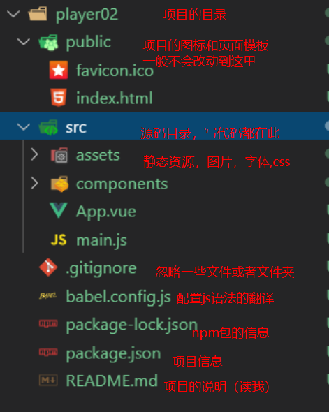

# Vue学习第6天

## 反馈


## 回顾


### 实在无法创建项目的解决方案（重要）

1. vue create 做的事情

   1. 创建项目的文件结构

   2. 帮我们装了npm包，第三方模块

   3. git相关的初始化

      ...

2. 可以copy同桌已经生成好的脚手架项目

   1. 把node_modules删除再copy

   2. 在copy过来的项目里面执行npm install

      ```
   cd 项目目录
      ```
   
   3. 运行 cd项目目录 npm run serve

> 1. 同学们都能创建vue-cli项目，并运行项目吗？如果没有的话，还有终极方案
>
> 2. 先说一下vue-cli 创建项目做了啥
>
> 3. 那么是不是可以copy同桌的已经创建好的项目文件夹呢？
>
>    

## Vue-cli项目结构

写代码在src里面，其他的目录基本上不会改动

components组件写在这里

App.vue是主组件，页面看到的内容都是App.vue渲染的

main.js就是入口js，初始化根实例




## 保证Vue-cli项目运行起来(练习)

1. 组件的逻辑直接写在`xx.vue`

2. 静态资源放到`assets`文件夹下面，直接使用对应路径即可引入

3. css也放在``assets``这个文件夹，如何引入

   1. `style标签中引入`

   ```css
     /* 使用css支持的语法导入 */
     /* @import url('./assets/base.css'); */
   ```

   2. `main.js`中引入

   ```js
   // 导入 样式
   import './assets/base.css'
   ```

   

注意点：

1. **项目目录下运行**`npm run serve`

2. 运行完后，会提示在http://location:8080打开页面

3. 如果项目下已经运行过npm install, 就不要再运行啦

4. 不能创建项目的话，copy别人的项目

   

## Vue-cli src代码结构

1. main.js中
   1. 创建了最外层的Vue实例
   2. 把App.vue这个组件，当做Vue实例内部的最顶级组件并渲染出来
   3. 和public/index.html 中的那个id为`app`的div关联起来
2. App.vue 最顶级的那个组件，仅次于`Vue实例`
3. `assets`静态资源文件夹
4. `components`组件文件夹，除了`APp.vue`之外的组件，都写到这个文件夹中即可


## 全局组件的注册

一次注册，到处都可以使用

1. main.js注册组件

   1. `import 组件 from '地址'`
   2. `Vue.component('名字',组件)`

2. 任意的地方使用

   1. 用名字作为标签

   

## 局部组件的注册

哪里需要组件，就在哪里注册

1. 在需要用到这个组件的地方 导入 

   1. `import 组件 from '地址'`
   2. 设置给`components`这个属性

2. 在当前这个导入的组件中使用 该组件

   1. 用名字作为标签

      

## 组件的name属性

Vue官方推荐每个组件都给一个name属性

给一个name的话，那么Vue开发工具可以看到组件的名字。


## Vue-cli项目的路由整合(练习)

### 准备工作

1. 创建或者复制一份脚手架项目

2. 复制的项止需要，cd 项目目录，`npm install`, 安装第三方模块

3. `npm run serve`运行项目

   

### 整合路由

1. 装包：在工程目录下执行，也就cmd, 执行一个命令。npm install vue-router
2. 导包： import  VueRouter from 'vue-router’
3. 用包
   1. 创建路由规则
      1. 创建一个组件`xxx.vue`
      2. routes=[ {path:"/xx",component:组件} ]
   2. 创建路由对象
      1. router
   3. 设置给Vue实例
      1. new Vue({ router })

#### 编码位置

1. 导入 注册路由 `main.js`
2. routerlink router-view `app.vue`
3. 添加组件`components/`
4. 静态资源`assets`

### 注意

1. npm run serve时会占用命令行，一般停掉，再安装好包好后，再执行npm run serve启动项目


### Vue-cli路由项目整合player

### 实现 步骤

1. 导航栏
   1. 把index.html的dom结构 放到App.vue的template里面
   2. App.vue的style里面引入css
   3. 设置声明式导航router-link 在App.vue
   4. 同时设置内容区 router-view
2. main.js 
   1. 修改了路由规则 /results =>Results
   2. 引入了Results这个组件
3. 搜索组件
   1. 新建一个results.vue单文件组件
   2. 把原来results.html的html代码copy过来
   3. 在results.vue里面引入样式
4. 高亮样式
   1. 实例化VueRouter的时候，设置 linkActiveClass=“active"
5. 歌曲播放组件
   1. 新建一个player.vue单文件组件
   2. 把原来player.html代码copy到template里面
   3. 在player.vue引入样式
   4. 声明式导航和路由规则要匹配
6. mv组件和commnent组件


### 注意点

1. 导航栏和内容区都在App.vue
2. 跟路由规则，路由初始化都在main.js
3. 搜索歌曲，播放歌曲，mv，评论分别是四个单文件组件


## player-项目创建

1. vue create 02.player

2. cd 02.player

3. npm run serve

   

## player-界面分析


> 1. 演示黑云音乐的功能
> 2. 画图说明哪块是router-view和搜索框等


## player-搜索区域整合

1. 删除多余部分
2. 拷贝结构和样式
3. 搜索区域放到App.vue的顶部即可
4. 抽取顶部的搜索区域为组件
   1. 创建组件`01.search.vue`
   2. 原本App.vue顶部的搜索区域 c+v到组件中
   3. 在App.vue中导入并局部注册搜索组件
   4. 页面中使用即可

> 1. 接入来我们参考模板，把搜索区域展示出来
> 2. vue-cli生成的项目player，删除多余的部分
> 3. html放app.vue，标签栏的代码去掉
> 4. 在main.js中引入样式？


## player-搜索区域抽取为组件

> 1. 如果搜索框这部分，其他页面也需要用呢？怎么办。我们可不可以把它抽取为一个组件呢，交给一个同事负责开发，用的时候，其他人只需要调用就行。
> 2. 新建components/search.vue，html部分copy过来。
> 3. App.vue里面包含搜索框吧，就在app.vue引入search.vue，然后局部注册components，使用
> 4. 看一下vue开发者工具。
> 5. 实际工作中会拆得特别细，拆分组件除了重用，另外还有一个好处，分工明确。一个组件交给一个同事开发，责任分明，git提交不用解决冲突，对吗？


## player-路由整合

1. 下载路由 npm i vue-router
2. 导入路由
3. 使用路由 `main.js`
   1. use一下
   2. 导入组件
   3. 注册路由规则
   4. 实例化路由对象
   5. router传给vue根实例

### 注意

路由的整合套路是一样的，写多了自然就记住了

> 接下来需要把路由整合进去，对吗？ 大家还记得步骤吗？来。。


## 总结

