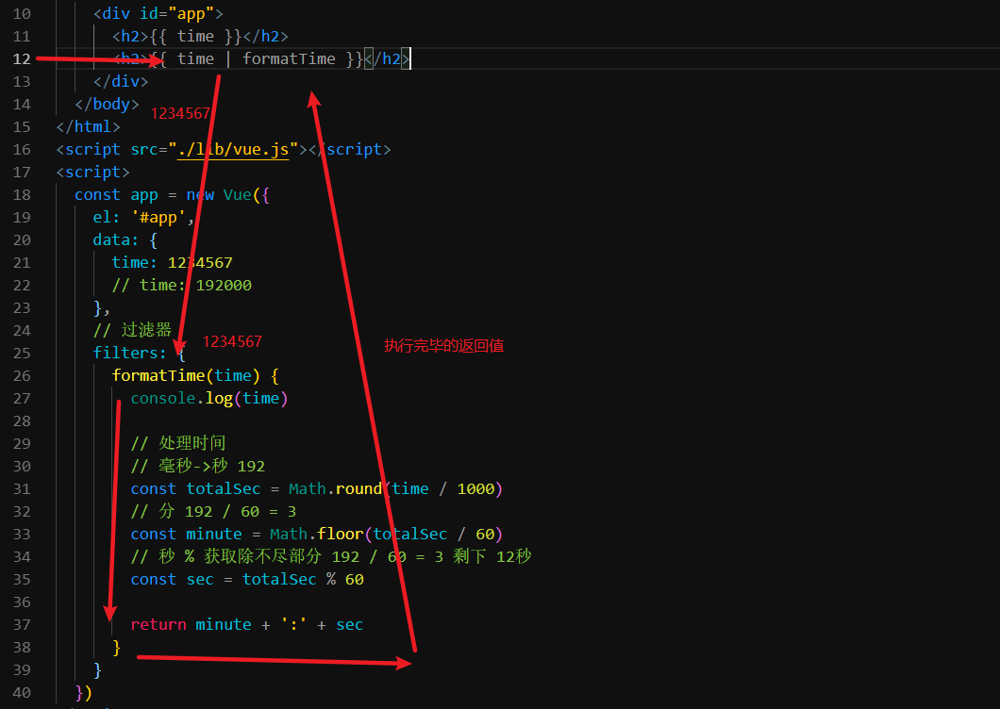
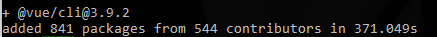
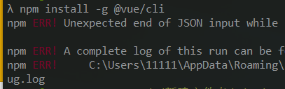
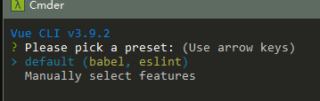

# Vue.js - day06

## 反馈

1. 我发起疯来,连自己都打
2. 师母也是程序员吗?
3. 我用node.js的时间来预习Vue,结果还是凉凉,我有一句哈卖批不知当讲不当讲~~~ o(╥﹏╥)o
4. 老师录制视频的时候能不能把你的分辨率调低点。
5. 知道黑马为什么叫黑马吗!!!
6. 好乱好乱好乱 , 心也乱 , 头发也乱
7. 婶婶原来是全职太太啊,真幸福!
8. 老师 , 上课可不可以 不要 嘿~嘿~嘿~.... 很容易出戏啊 .
9. 有点点的乱哈 ,不过相信整理一下,敲几下就好啦.顺便问下,webpack是打包工具 ,但是是个什么工作的逻辑(是不是很重要呀)
10. methods 可以写方法 mounted 里面也可以写方法 想问下啥区别 还有 computed 和 updated
11. 今天的课程完全是懵逼的，给绕傻了
12. 那些和前端不想干的东西可以私聊或者下课的时候去扩展不???? 可以多扩展些前端的知识点!!!! 除了这一点 老师其他都很好 上课很有思绪的带着我们学新知识点 很不错!!!!!
13. e'e'e'e'e
14. 羡慕老师年纪轻轻，就有一份好工作，有个好妻子，有一个幸福的家庭。 我心里就变成了恨，后面知道老师是江西人我就释怀了。江西太穷了， 想达到老师这么优秀可谓是修仙难度。
15. 听听,听听..楼上这说的是人话吗
16. 对编程式路由和动态路由匹配有点模糊
    1. 2种切换的方式
    2. 编程式：类比于window.location.href
    3. 声明式:类比于 a href="xx"
    4. 动态路由
       1. 跳转时，还携带数据
17. 搜索后点击MV跳到MV页面，然后再点击 搜索结果 页面，会发现搜索结果页面都被清空了，怎么做才不会让搜索结果页面清空呢？
    1. 缓存组件`keep-alive`
18. 日常工作中应该是以写组件为主吧,vue大部分代码和数据是在各个组件中,vue根实例基本只是起一个整合各个组件的作用,不知道是不是这样
19. 每天一句鸡汤 : 每个人都在奋不顾身，都在加倍努力，得过且过只会让你和别人的差距越来越大。成长路上，不要总想着何处有捷径，你只管向前跑。记住，梦想不是空口无凭的大话，而是在寂静的奋斗里努力生长的果实。
20. 好
21. 咦咦咦,哈哈哈,组件和路由follow me,姐姐天天瑜伽,还是那句话牛逼师父true man
22. 花姐 vscode左侧的应用是怎么设置到那里的？ 为什么我的控制台的vue不会显示呢。。。。没有引入生产版的vue.js
    1. 图标安装插件即可
23. 老师昨天把四个网页合成一个，然后今天会把一个网页分成几个么 (●'◡'●)
24. 老师 记得iScroll插件的时候 把获取元素放在前面 是无法获取到vue渲染后的那个元素的（基础不用讲 我问的是后面的） 我试了下 发现在创建vue实例以前通过id获取的那个元素 和 updated 后以同样id获取的元素不是同一个 元素 这是老师说的vue的虚拟dom的原因么 想听老师讲虚拟dom的原理 详细点 老师我不需要笼统的 谢谢老师 么么哒
    1. 虚拟dom
    2. diff算法
    3. 数据响应式原理
       1. Object.defineProperty
       2. Proxy

## 回顾

1. 图标

   1. 
   2. 编辑器配色
   3. 
   4. vscode配置同步插件
   5. 

2. 过滤器

   1. filters:{ formatTime(形参){ 处理数据； 返回处理之后的数据  } }
   2. 不修改数据的情况下，修改数据的显示效果
   3. 

3. vue实例属性

   ```js
    // 组件
    Vue.component('fly', {
       template: '<div>2</div>',
       data() {
         return {}
       },
       methods: {
         sayHi() {}
       },
       computed: {},
       filters: {},
       created() {},
       mounted() {},
       updated() {}
     })
     // 对象的
     const app = new Vue({
       // 选择器
       el: '#app',
       // 数据
       data: {
         info: '',
         arr: [],
         obj: {}
       },
       // 方法
       methods: {
         sayHi() {
           alert('你好')
         }
       },
       // 计算属性
       computed: {
         // 计算属性一般会使用data中的数据
         // data中的数据改变时，重新执行
         infoLength() {
           // 获取info的长度
           return this.info.length
         }
       },
       // 过滤器
       filters: {
         // 格式化对象
         formatObj(obj) {
           // 处理对象数据
   
           // 返回处理完毕的数据
           return '数据'
         }
       },
       // 生命周期钩子(函数)
       // vue实例创建完毕，传入的数据设置给了这个vue实例
       created() {},
       // vue实例和dom关联起来，执行一次 最早获取dom写在这里
       mounted() {},
       // 数据改变，同步到了页面上
       // 页面更新完毕之后要添加逻辑，就可以写在这里
       updated() {}
     })
   
   ```

   


## 单文件组件

1. 用一个文件能够包含组件的所有内容
   1. 样式
   2. 结构
   3. 逻辑
2. `.vue`
3. 设置三个结构
   1. 输入 `scaffold `就能够自动生成
4. 复杂一点的项目都会使用单文件组件来开发，更加利于编码，利于后期维护，一个文件包含了所有的内容

```vue
<template>
  <!-- 模板 结构 -->
</template>

<script>
// 逻辑
export default {
  // 组件的属性
  methods: {
    
  },
  data(){}
  // 。。。
}
</script>

<style>
/* 样式 */

</style>

```


## Vue-cli 安装

### 基本概念

1. `脚手架`
2. 把.vue翻译成浏览器可以识别的内容
3. 自动刷新浏览器
4. 自动压缩代码
5. 自动的把js翻译为低版本的js
6. 作为代理服务器
7. ....

### 安装

[官网](https://cli.vuejs.org/zh/)

[安装](https://cli.vuejs.org/zh/guide/installation.html)

在小黑窗中输入`npm install -g @vue/cli`, 在任意的路径都可以

### 注意点

1. 
   1. 第一次安装，安装成功了
2. 
   1. 已经安装过，重新安装
3. 
   1. 类似于这样的一堆`err!`安装失败了
   2. 解决方案:
      1. 更换网络环境：有线，换无线，无线换4G
      2. 更换安装的工具
         1. `cnpm` ：`cnpm install -g @vue/cli`
         2. `yarn` :`yarn global add @vue/cli`
      3. 清除npm缓存之后，重新安装
         1. `npm cache clean -f`
         2. 重新执行安装的命令
4. 命令查看是否成功
   1. `vue --version`

## Vue-cli项目创建

[传送门](https://cli.vuejs.org/zh/guide/creating-a-project.html)


### 正常的流程

1. 创建之后会多一个项目文件夹，路径不要乱选
2. 项目名不要有中文，不要有大写字母，尽可能有意义

```
vue create 项目名
```

3. 弹出的对话框先选择默认的选项



4. 稍等一会，等进度条走完 提示如下画面说明成功了


5. 进入项目文件夹
   1. `cd 项目名` 直接根据提示即可 
6. 运行项目
   1. `npm run serve`
7. 稍等片刻 ，出现如下效果说明成功了


### 报错的原因

1. 

   创建的命令输入错误`create`输入成了`creat`

2. 

   1. 网络问题，有线换无线，无线换4G
   2. 终端的权限问题；新建管理员模式的终端
   3. 当前这个文件夹，这个文件被其他软件占用：关闭所有可能影响的软件（重启）
   4. npm包管理工具的问题:
      1. 用yarn来安装
      2. 执行``npm cache clean -f`` 在重新创建项目

3. 

   创建项目是，又到了第三方模块，文件太多了git人为没有必要管，提示你一下

   vue-cli创建项目是，已经设置了git忽略文件 就在`.gitignore`中


### 实在无法创建项目的解决方案（重要）

1. vue-cli创建项目的本质是：

   1. 创建文件夹
   2. 下载第三方模块
   3. 创建项目的基本结构
   4. 设置各个文件之间的关系
   5. 创建git仓库

2. 找一个可以创建项目的人，创建一个项目

   1. 删除`node_modules`

   2. 发给你

   3. 你使用`npm i `安装项目中用到的第三方模块

   4. `npm run serve`

      

## Vue-cli项目结构


## Vue-cli项目编码位置

1. 组件的逻辑直接写在`xx.vue`

2. 静态资源放到`assets`文件夹下面，直接使用对应路径即可引入

3. css``assets``也是这个文件夹，如何引入

   1. `style标签中引入`

   ```css
     /* 使用css支持的语法导入 */
     /* @import url('./assets/base.css'); */
   ```

   2. `main.js`中引入

   ```js
   // 导入 样式
   import './assets/base.css'
   ```

   

## Vue-cli src代码结构

1. main.js中
   1. 创建了最外层的Vue实例
   2. 把App.vue这个组件，当做Vue实例内部的最顶级组件并渲染出来
   3. 和public/index.html 中的那个id为`app`的div关联起来
2. App.vue 最顶级的那个组件，仅次于`Vue实例`
3. `assets`静态资源文件夹
4. `components`组件文件夹，除了`APp.vue`之外的组件，都写到这个文件夹中即可

## 全局组件的注册

1. `main.js`中
2. `import 组件 from '地址'`
3. `Vue.component('名字',组件)`即可完成组件
4. 任意的地方使用
   1. 用名字作为标签
5. 希望一次注册，全部使用 全局

## 局部组件的注册

1. 在需要用到这个组件的地方 导入 `import 组件 from '地址'`
2. 导入之后，设置给`components`这个属性，即可在当前这个导入的组件中使用 该组件
3. 根据使用的位置，决定局部或者是全局注册
   1. 只在某些地方用，用局部

## 组件的name属性

1. 直接在组件的内部写`name:值`即可
2. 不能用中文
3. 写了之后，chrome的vue插件中可以看到这个名字，更加利于检索，利于编码

## Vue-cli项目的路由整合

### 准备工作

1. 创建项目`vue create 项目名`
2. 进入项目文件夹`cd 项目名`
3. 运行项目`npm run serve`
4. 稍等片刻，通过提示的地址 在浏览器中 打开
5. 删除多余的组件`components/`内部的文件
6. 删除`app.vue`中的内容

### 整合路由

1. 下包 `npm i vue-router`
2. 导包 `import VueRouter from 'vue-router'` const VueRouter = require('vue-router‘)
3. 用包
   1. 创建路由规则
      1. 创建一个组件`xxx.vue`
      2. routes=[ {path:"/xx",component:组件} ]
   2. 创建路由对象
      1. router
   3. 设置给Vue实例
      1. new Vue({ router })

#### 编码位置

1. 导入 注册路由 `main.js`
2. routerlink router-view `app.vue`
3. 添加组件`components/`
4. 静态资源`assets`

### 注意

1. 如果页面不够美观 可以找到对应的组件调整结构
2. 如果路由对应的组件不够美观，找到对应的组件调整结构

### Vue-cli项目整合player

1. 除了`node_modules`
2. 重新npm i下包 重新运行

### 实现 步骤

1. vue-router整合 `main.js`
   1. 下包 `npm i vue-router`
   2. 导包 `import VueRouter from'vue-router'`
   3. 用包 
      1. Vue.use(VueRouter )[出处](https://router.vuejs.org/zh/installation.html)
      2. 路由规则
         1. 创建对应的组件xxx.vue
      3. 创建路由对象 传入规则
      4. 路由对象设置给Vue实例
2. 设置导航栏和内容
   1. `App.vue`
3. 组件的位置
   1. `components/` xxx.vue


#### 整合导航区域

1. player中的index.html 结构拷贝到app.vue的结构中
2. 用到的`index.css`和`iconfont.css`拷贝到`assets`中，在`app.vue`导入


### 注意点

1. vue-cli开发项目文件的数量 多一些
2. `main.js`
   1. 路由
   2. 这个文件中可以访问到Vue实例
3. `app.vue`
   1. 页面中顶级的组件（最顶级的盒子）
4. `components/`
   1. 组件们`xxx.vue`
5. `assets/`
   1. 静态资源


## 总结

1. 单文件组件的组成

   1. 结构
   2. 逻辑
   3. 样式
2. vue-cli(脚手架)

   1. 把很多开发中需要用到的功能整合到了一起
   2. 让vue的开发人员直接专注于逻辑代码即可
   3. webpack配置出来的
3. 创建项目

   1. `vue created 项目名`

      1. 不能中文，不能大写
   2. 项目创建不好用别人创建好的，自己npm i
4. 运行项目
   1. 小黑窗进入项目文件夹
   2. `npm run serve`
5. vue-cli创建的项目
   1. 下包怎么下`npm i 模块名`
   2. 如何导包`import 名字 from '模块名'`
6. 整合路由
   1. 组件新建一个文件
   2. 路由的设置`main.js`
   3. App.vue router-link router-view
7. 项目运行
   1. `npm run serve`
   2. 根据小黑窗中提示的路径 ，在浏览器中打开即可

## 预习

1. 黑马买买买
   1. 静态资源写好了
   2. 接口也是现成
2. 抽取的逻辑
   1. es6的模块化语法
3. axios的一些高级设置
   1. 基地址
   2. 挂载到原型上