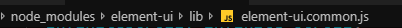

# Vue学习第七天

## 反馈

## 回顾

1. vue-cli项目创建	

   1. vue create 项目名
      1. 下包，创建各种各样的文件，
      2. 配置文件之间的关联
      3. 弄不出来，用别人创建好的，装包运行
   2. cd 项目 
   3. npm run serve

2. vue-cli文件组成

   1. main.js 主要的文件，所有和顶级vue实例相关的都放到这里
   2. App.vue 主组件，包裹在根组件里面，看到的页面结构一般放在这里
   3. components 组件的文件夹
   4. assets 静态资源

3. 路径提示

   


## player-搜索区域整合

1. 删除多余部分
2. 拷贝结构和样式
3. 搜索区域放到App.vue的顶部即可
4. 抽取顶部的搜索区域为组件
   1. 创建组件`01.search.vue`
   2. 原本App.vue顶部的搜索区域 c+v到组件中
   3. 在App.vue中导入并局部注册搜索组件
   4. 页面中使用即可


## player-搜索区域抽取为组件


## player-路由整合

1. 下载路由 npm i vue-router
2. 导入路由
3. 使用路由 `main.js`
   1. use一下
   2. 导入组件
   3. 注册路由规则
   4. 实例化路由对象
   5. 挂载给顶级的vue实例

### 注意

路由的整合套路是一样的，写多了自然就记住了


## player-轮播图

### 00 -整合轮播图组件

1. 创建轮播图组件 02.slider.vue
2. main.js中导入组件
   1. path:"/slider"
   2. component:slider

#### 注意

1. 添加了路由规则之后，可以用router-link,或者router.push来修改地址，跟通用的方法是，**直接修改url**


### 01 - 饿了么ui 介绍

1. 饿了吗前端团队开发的pc端的基于vue的组件库
2. 内部封装了很多现成的组件，直接就可以使用比如轮播图，tab栏，省市联动，开关，table
3. 因为在vue开发时用的很多，所以和几个其他的库合并到一起被称之为 **vue全家桶**
   1. vue
   2. axios
   3. vue-router
   4. 饿了么ui
   5. vuex


### 02 - 轮播图组件使用 

 	1. 下包 npm i element-ui -S
	4. 获取轮播图 <https://autumnfish.cn/banner> 
	    	1. axios调用接口
              		1. 安装axios
                  		2. 导入axios
                      		3. created中接口调用
	        	2. 数据回来之后
        	3. 渲染到页面上
       5. 可能还需要调整轮播图样式


#### 注意点

1. 饿了么ui的轮播图模板默认提供的是h3标签，需要自行替换为别的标签
2. 默认有一个高度 150px，可能需要根据需求调整
3. 如果需要修改轮播图的样式，建议 加一个自己的类名，为这个类设置样式
   1. 为什么不直接饿了么的类？ 覆盖
4. 组件一出现就要调用接口，一般放到哪个钩子
   1. created:这里可以访问data

### 03 - 路由重定向

1. [传送门](https://router.vuejs.org/zh/guide/essentials/redirect-and-alias.html)
2. `{ path: '地址1', redirect: '跳转到的地址2' }`
3. main.js中增加一个重定向规则即可
4. 能够实现，匹配到地址1之后，立即跳转到地址2

#### 注意点

重定向的地址 如果没有对应组件，页面会显示空白


## player-歌曲搜索

### 01 - 搜索路由

1. 写组件 03.results.vue
2. 注册路由规则
   1. path:'/results/:search'
   2. component:results

#### 注意

路由规则测试直接url输入地址即可，对于动态路由匹配，地址`/results/内容`


### 02 - 搜索路由切换

1. 01.search.vue
2. 点击搜索
3. 按下回车时
4. 携带输入的内容 修改路由地址
5. `router.push('/results/搜索关键字')`
6. vue-router源码中的关键部分
7. 把$router设置给Vue的原型，所有的Vue实例就都可以使用这个属性了
8. 组件中编程式导航，this.$router.push('地址')

```js
  Object.defineProperty(Vue.prototype, '$router', {
    get: function get () { return this._routerRoot._router }
  });
```


### 03 - 饿了么ui 弹框

1. [传送门](https://element.eleme.cn/#/zh-CN/component/message)
2. 使用方式`  this.$message('这是一条消息提示'); `
3. 需要弹框的时候，调用上述的代码，即可弹出一个普通的消息提示框
4. 如果要弹出一些比较高级的框

```js
this.$message({
  message: '恭喜你，这是一条成功消息',
  type: 'success'
});
  this.$message({
  message: '警告哦，这是一条警告消息',
  type: 'warning'
});
  this.$message.error('错了哦，这是一条错误消息');
```


### 04 - 搜索结果非空判断

1. 01.search.vue
2. 点击搜索，或者是按下回车
3. 判断搜索关键字是否为空
4. 不为空跳转
5. 为空，提示用户
6. 使用饿了么的弹框，只需要在需要的使用调用方法即可
7. 

#### 注意点

1. $message之所以可以使用是因为设置给vue的原型
2. 在直接搜索`$message`即可找到


### 05 - 渲染搜索结果

1. 通过路由获取数据
2. axios调用接口 created  <https://autumnfish.cn/search?keywords=
3. 数据获取到之后
4. 渲染到页面上

#### 注意

1. created 很多时候都可以用来获取初始的数据 


### 06 - 过滤器手处理

filters:formatSinger(singers)\{ return}

### 07 - 过滤器时间处理

filters:formatTIme(time){ return}

 定义和用法类似，但是内部的逻辑需要根据需求来调整


### --- 09 - 重复搜索功能实现

1. 当search改变时重新调用接口
2. created中已经实现了接口调用
3. 抽取为函数，在2个地方调用即可

#### 注意

1. created组件如果不被销毁，只会触发一次
2. 如果有需求在特定数据改变时重新执行逻辑，可以使用 侦听器`watch`
3. watch和updated相比触发的频率 低


## player - 播放歌曲

### 01 - 点击去播放器

1. 在03.results.vue的歌曲列表的 左侧播放按钮上绑定 点击事件
2. 点击事件中获取歌曲的id
3. 触发之后，使用编程式导航跳转去播放器 放歌，携带id
4. 动态路由匹配 main.js
   1. 创建04.player.vue组件
   2. path:'/player/:id'
   3. component:player


### 02-axios抽取 基地址设置

1.  main.js中 把axios设置给
   1. `Vue.prototype.$axios=axios`
2. 所有的组件都可以使用了
3. 基础地址一样，没有必要每次都写，可以直接抽取出来
4. `axios.defaults.baseURL = '设置的基地址';`
5. main.js中

#### 注意

1. $的目的是和自己的属性区分，这是一个大伙都遵守的约定 
2. 设置了之后，所有的组件内部都可以通过`this.$axios`访问axios
3. axios设置了基地址之后，请求有2种情况
   1. 请求的地址是完整的,`https://autumnfish.cn/song/search?id=123`
      1. 不会去拼接基地址
   2. 请求的地址只有一部分：`/song/url?id=123`
      1. axios就会自动补全基地址部分
4. 绝大多数的项目中，后台接口部署在一台服务器上，基地址是一样的，设置一次即可
   1. 对于不同基地址的接口，直接给完整地址


### 03 - 歌曲信息显示

### 04 - 歌曲url获取

### 05 - 歌词显示

处理歌词用的正则`/\[\d{2}\:\d{2}\.\d{2,3}\]/, `

上面的 3 4 5步骤类似

created中 调用 歌曲url接口，歌曲封面接口，及 歌词接口即可


## player - 歌曲评论

### 01 - 歌曲评论路由设置

1. main.js 路由规则
   1. 05.comment.vue
   2. path:/comment/:id
   3. component:comment

### 02-点击携带歌曲id去评论组件

1. 在 04.player.vue组件中
2. 为歌名 绑定点击或者双击事件(dblclick)
3. 编程式导航`this.$router.push('/comment/${id}')`

#### 注意点

1. 根据需求找到设置的文件即可

### 03 - 获取评论信息

1. created获取评论信息 /comment/hot?id=186016&type=0 
2. then方法中
3. data中加数据
4. 页面中写vue指令 渲染

### 04 - 格式化评论时间

1. 下载moment.js  

   1. npm i moment

2. 05.comment.vue中添加一个过滤器

   1. filters:{  formatTime(time){ 处理并返回 } }

3. {{ 数据 |过滤器}}

4. 时间的处理，第一时间想到moment这个库


## player - mv播放

### 01 - mv路由设置 

1. main.js
   1. 新建06.mv.vue
   2. path:"/mv/:mvid"
   3. component:mv

### 02-点击携带mvid去mv组件

1. 04.results.vue中 为mv的图标绑定点击事件 传入id
   1. this.$router.push('/mv/${id}')

### 03 - 获取mv信息 

1. created中调用接口 获取数据  /mv/detail?mvid=5436712 

### 04 - 播放最高清的mv

1. then中获取清晰度最高的mv进行播放

#### 注意点

1. 对象的属性获取可以用点语法也可以中括号的语法

   

## 播放器优化

### 统一设置宽度

App.vue中

把router-view包在盒子里

为这个盒子设置尺寸即可

### 设置滚动

1. iScroll很流行的滚动库，已经不更新了
2. better-scroll [更好的滚动库](https://www.npmjs.com/package/better-scroll)
   1. 下包 npm i better-scroll 
   2. 导包
   3. 准备结构
   4. 用包

#### 注意

1. 获取dom元素最早在mounted中
2. 更美观的滚动效果，工作中偶尔会碰到
   1. iScroll
   2. better-scroll(推荐)
   3. 单纯的滚动库
3. 为了实现滚动效果，
   1. 3层盒子
      1. 容器
      2. 内容容器
      3. 内容
      
   2. 容器的高度必须写死，内容超过了容器之后，自动滚动
   
      

### 接口缓存问题

1. [传送门](https://binaryify.github.io/NeteaseCloudMusicApi/#/?id=%E8%B0%83%E7%94%A8%E5%89%8D%E9%A1%BB%E7%9F%A5)
2. 在请求的url后面跟上一个时间参数
   1. 有参数 用&作为连接
   2. 没有参数用?作为分隔符
3. **慎用！**
   1. 避免**云把花姐的服务器限制
   2. 开启了自动保存 很容易出现频繁调用

```
// 接口本来不需要参数 额外的增加时间戳参数
https://autumnfish.cn/banner?timestamp=${Date.now()}
// 接口本来需要参数 增加时间戳
https://autumnfish.cn/search?keywords=key&timestamp=${Date.now()}
```


## watch补充

### watch的2个参数

1. 参数不写，直接通过 this.数据的方式 也可以获取到最新的数据

```js
// 侦听器
    watch: {
      // 和数据的名字一样
      // 参数1 新值
      // 参数2 旧值 上一次的值
      // 参数不写，直接通过 this.数据的方式 也可以获取到最新的数据
      // 需要新旧对比时 可以用到第二个参数
      message(newValue, oldValue) {
        console.log(newValue)
        console.log(oldValue)
        // 尝试访问data中的数据
        console.log(this.message)
      }
    }
```

### 深度侦听

1. deep:true
2. 执行的方法是handler
3. 2个参数都是相同的内存地址，值一样（复杂数据类型）

```js
 // 侦听复杂类型数据的时候，传入的参数，是数据的内存地址
      // 2个参数的值是一样的
      // 基本数据类型2个参数是不同的
      // 复杂类型无法通过2个参数进行对比
      food: {
        handler(newVal, oldVal) {
          console.log(newVal)
          console.log(oldVal)
        },
        // 开启深度侦听
        deep: true
      }**
```


### 侦听器解决第二次搜索没反应的问题（zhentingqi）

1. 检测指定的数据改变，执行自定义的逻辑
2. watch:{  数据名(){} }

#### 注意

1. watch的作用是，观察data中的数据改变，添加自定义的逻辑
2. 要观察那个数据，就写哪个数据的名字即可
3. 如果数据的访问涉及到点语法，使用引号包裹
4. updated，只要任何数据改变都会触发，watch只在**特定数据改变时**触发


## 过滤器补充

[过滤器中的this](https://github.com/vuejs/vue/issues/5998)

### 过滤器的串联

1. 依次写一堆过滤器即可

2. ` <h2>{{ info | addFont | addBack | addBack2 }}</h2> `

   ```js
   filters: {
         addFont(value) {
           return '唱,' + value
         },
         addBack(value) {
           return value + ',rap'
         },
         addBack2(value) {
           return value + ',打篮球'
         }
       }
   ```

### 过滤器传参

1. 调用过滤器是，和调用方法类似，传入参数即可

```html
<h2>过滤器的传参</h2>
<p>{{ food | cookFood('爆炒')}}</p>
<p>{{ food | cookFood('清蒸')}}</p>
<p>{{ food | cookFoodPlus('清蒸','红烧')}}</p>
```

2. 定义过滤器时

```js
// 处理food的过滤器
  cookFood(foodName, do1) {
    return foodName + do1
  },
  // 高级烹饪
  cookFoodPlus(foodName, do1, do2) {
    return foodName + do1 + do2
  }
```

3. 自己传入的参数，从第二个开始，第一个参数固定是，处理的数据

### 全局过滤器，局部过滤器

1. 定义一次

   1. 所有地方都可以用
   2. 如下语法 即可定义全局过滤器
   3. 第二个参数是函数，如果要传参和上面写法一样

   ```js
    Vue.filter('cookFoodPro', (value)=>{
       return value+'削皮，切碎，爆炒，油炸，装盘，美滋滋！！！'
     })
   ```

2. 全局过滤器的定义一定要放在实例化Vue`new Vue`的前面，否则不会生效

3. 局部过滤器

   1. 定义一次，只在当前这个Vue实例中可以使用（组件）
   2. 实例内部的`filters` 局部过滤器


## 总结

1. 饿了么ui，饿了么开发的基于vue的组件库
2. 路由重定向 redirect
   1. 地址1 跳转到地址2
3. axios抽取到原型上
   1. Vue.prototype.$axios = axios
   2. axios.defaults.baseURL
   3. $是一个建议
4. 侦听器,watch 
   1. 特定的数据改变，会触发的回调函数（钩子）
   2. 和methods,fillters
5. 饿了么ui的走马灯-轮播图


