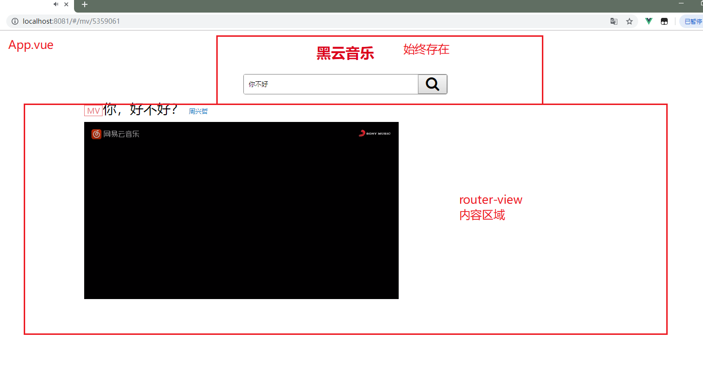

# Vue.js - day07

## 反馈

1. 等vue学完之后,有谁一起跟我出去找工作的呀??现在市场行情很不错.我们得抓住机会,旁边的工厂现在已经涨到4000个月了,一起去4000包吃住??
2. 想要生活过得去，人生总要带点绿，成功绿
3. 感觉我不是我了!
4. 敲这些好慢呀, 前几天的都还没敲完 , 今天的又来了, 赶不上进度唉,又不想放弃昨天的,凉凉
5. 有一天小吉和一群人去山洞，发现山洞有个尸体，就和其他人抬出去了。回家后，其他人都死了，爷爷问：“吉你抬没？”小吉摇了摇头。这时小吉的身上变绿了，爷爷说：“不好，是绿尸寒警告！”
6. 你为何如此优秀
7. 老师 还是不要用拟声词 ,
8. 是不是项目中不用相对路径 ,稍微整合下 就要改很多的图片路径 ,要是大点的项目 ,那不得搞死人
9. 老师会搞黑苹果吗
   1. windows的电脑安装mac的系统
   2. mac配置开发环境很简单
10. eeee
11. 其实一开始老师上课的语气，我是拒绝的。太温柔了接受不了，我是  钢铁直男。 那么后来，我知道要学习vue，对我特别重要，所以我就开始当舔狗。当了几次以后发现很舒服。就喜欢上了老师。 现在我学vue效率特别高，老师说的什么都记得特别牢。
12. 老湿,猫没有男朋友,哈哈哈哈哈哈,嗝~~~
13. 相信我的建议,一定可以一针见血 (不支持富文本)
14. nice
15. 工作中网页的结构都是要在html文件中写好再复制粘贴过去吗,那感觉还不如直接在template里写.... 音乐播放器的逻辑完成后,组件的路径都变成动态的了,一开始的声明式的导航都失效了,想让它重新启用就必须传数据,但是也不好写死一个数据啊,这个问题该怎么解决
16. vue-cli感觉不出来好处,就是蛮多,容易混淆🤸‍♂️
17. 老师,为什么我的viscode在输入img的src地址的时候不会自动补全,好烦呐,得一个一个输
    1. 插件
18. <div id="app"> <!-- 2.使用组件像html标签一样 --> <index></index> <indexB></indexB> 为什么这里会报错！！！ </div> <script> Vue.component('index', { template: '<div>这是首页<index-b></index-b></div>' }) Vue.component('indexB', { //template属性指定组件模板，模板只能有一个根节点 template: '<div>这是首页B</div>' }) let vm = new Vue({ el: '#app', data: { } })
19. 嘿嘿嘿(●ˇ∀ˇ●)

## 回顾

1. vue-cli项目创建	

   1. vue create 项目名
      1. 下包，创建各种各样的文件，
      2. 配置文件之间的关联
      3. 弄不出来，用别人创建好的，装包运行
   2. cd 项目 
   3. npm run serve

2. vue-cli文件组成

   1. main.js 主要的文件，所有和顶级vue实例相关的都放到这里
   2. App.vue 最顶级的组件，仅次于 Vue实例，看到的顶级页面结构一般放在这里
   3. components 组件的文件夹
   4. assets 静态资源

3. vscode 红色波浪警告关闭&禁用

   1. 
   2. `vetur`插件提供的异常提示

4. 路径提示

   

   安装之后就可以生效

   可以使用相对路径的方式来触发这个提示插件`./`就会有提示了

   

## player-项目创建

1. vue create 02.player
2. cd 02.player
3. npm run serve

## player-界面分析



## player-搜索区域整合

1. 删除多余部分
2. 拷贝结构和样式
3. 搜索区域放到App.vue的顶部即可
4. 抽取顶部的搜索区域为组件
   1. 创建组件`01.search.vue`
   2. 原本App.vue顶部的搜索区域 c+v到组件中
   3. 在App.vue中导入并局部注册搜索组件
   4. 页面中使用即可

## player-搜索区域抽取为组件

## player-路由整合

1. 下载路由 npm i vue-router
2. 导入路由
3. 使用路由 `main.js`
   1. use一下
   2. 导入组件
   3. 注册路由规则
   4. 实例化路由对象
   5. 挂载给顶级的vue实例

### 注意

路由的整合套路是一样的，写多了自然就记住了

## player-轮播图

### 00 -整合轮播图组件

1. 创建轮播图组件 02.slider.vue
2. main.js中导入组件
   1. path:"/slider"
   2. component:slider

#### 注意

1. 添加了路由规则之后，可以用router-link,或者router.push来修改地址，跟通用的方法是，**直接修改url**

### 01 - 饿了么ui 介绍

1. 饿了吗前端团队开发的pc端的基于vue的组件库
2. 内部封装了很多现成的组件，直接就可以使用比如轮播图，tab栏，省市联动，开关，table
3. 因为在vue开发时用的很多，所以和几个其他的库合并到一起被称之为 **vue全家桶**
   1. vue
   2. axios
   3. vue-router
   4. 饿了么ui
   5. vuex

### 02 - 轮播图组件使用 

 	1. 下包 npm i element-ui -S
		2. 导包 [传送门](https://element.eleme.cn/#/zh-CN/component/quickstart)
		3. 用组件
     		1. 找到你要的组件 找到你要的结构
     		2. c+v
     		3. 走马灯 组件
	4. 获取轮播图 <https://autumnfish.cn/banner> 
    	1. axios调用接口
       		1. 安装axios
       		2. 导入axios
       		3. created中接口调用
    	2. 数据回来之后
    	3. 渲染到页面上
	5. 可能还需要调整轮播图样式

#### 注意点

1. 饿了么ui的轮播图模板默认提供的是h3标签，需要自行替换为别的标签
2. 默认有一个高度 150px，可能需要根据需求调整
3. 如果需要修改轮播图的样式，建议 加一个自己的类名，为这个类设置样式
   1. 为什么不直接饿了么的类？ 覆盖
4. 组件一出现就要调用接口，一般放到哪个钩子
   1. created:这里可以访问data

### 03 - 路由重定向

1. [传送门](https://router.vuejs.org/zh/guide/essentials/redirect-and-alias.html)
2. `{ path: '地址1', redirect: '跳转到的地址2' }`
3. main.js中增加一个重定向规则即可
4. 能够实现，匹配到地址1之后，立即跳转到地址2

#### 注意点

重定向的地址 如果没有对应组件，页面会显示空白

## player-歌曲搜索

### 01 - 搜索路由

1. 写组件 03.results.vue
2. 注册路由规则
   1. path:'/results/:search'
   2. component:results

#### 注意

路由规则测试直接url输入地址即可，对于动态路由匹配，地址`/results/内容`

### 02 - 搜索路由切换

1. 01.search.vue
2. 点击搜索
3. 按下回车时
4. 携带输入的内容 修改路由地址
5. `router.push('/results/搜索关键字')`
6. vue-router源码中的关键部分
7. 把$router设置给Vue的原型，所有的Vue实例就都可以使用这个属性了
8. 组件中编程式导航，this.$router.push('地址')

```js
  Object.defineProperty(Vue.prototype, '$router', {
    get: function get () { return this._routerRoot._router }
  });
```

### 03 - 饿了么ui 弹框

1. [传送门](https://element.eleme.cn/#/zh-CN/component/message)
2. 使用方式`  this.$message('这是一条消息提示'); `
3. 需要弹框的时候，调用上述的代码，即可弹出一个普通的消息提示框
4. 如果要弹出一些比较高级的框

```js
this.$message({
  message: '恭喜你，这是一条成功消息',
  type: 'success'
});
  this.$message({
  message: '警告哦，这是一条警告消息',
  type: 'warning'
});
  this.$message.error('错了哦，这是一条错误消息');
```


### 04 - 搜索结果非空判断

1. 01.search.vue
2. 点击搜索，或者是按下回车
3. 判断搜索关键字是否为空
4. 不为空跳转
5. 为空，提示用户
6. 使用饿了么的弹框，只需要在需要的使用调用方法即可
7. 

#### 注意点

1. $message之所以可以使用是因为设置给vue的原型
2. 在直接搜索`$message`即可找到

### 05 - 渲染搜索结果

1. 通过路由获取数据
2. axios调用接口 created  <https://autumnfish.cn/search?keywords=
3. 数据获取到之后
4. 渲染到页面上


#### 注意

1. created 很多时候都可以用来获取初始的数据 

### 06 - 过滤器歌手处理

filters:formatSinger(singers)\{ return}

### 07 - 过滤器时间处理

filters:formatTIme(time){ return}

 定义和用法类似，但是内部的逻辑需要根据需求来调整

### 08 - 侦听器（zhentingqi）

1. 检测指定的数据改变，执行自定义的逻辑
2. watch:{  数据名(){} }

#### 注意

1. watch的作用是，观察data中的数据改变，添加自定义的逻辑
2. 要观察那个数据，就写哪个数据的名字即可
3. 如果数据的访问涉及到点语法，使用引号包裹
4. updated，只要任何数据改变都会触发，watch只在**特定数据改变时**触发

### 09 - 重复搜索功能实现

1. 当search改变时重新调用接口
2. created中已经实现了接口调用
3. 抽取为函数，在2个地方调用即可

#### 注意

1. created组件如果不被销毁，只会触发一次
2. 如果有需求在特定数据改变时重新执行逻辑，可以使用 侦听器`watch`
3. watch和updated相比触发的频率 低

## player - 播放歌曲

### 01 - 点击去播放器

1. 在03.results.vue的歌曲列表的 左侧播放按钮上绑定 点击事件
2. 点击事件中获取歌曲的id
3. 触发之后，使用编程式导航跳转去播放器 放歌，携带id
4. 动态路由匹配 main.js
   1. 创建04.player.vue组件
   2. path:'/player/:id'
   3. component:player

### 02-axios抽取 基地址设置

1.  main.js中 把axios设置给
   1. `Vue.prototype.$axios=axios`
2. 所有的组件都可以使用了
3. 基础地址一样，没有必要每次都写，可以直接抽取出来
4. `axios.defaults.baseURL = '设置的基地址';`
5. main.js中


#### 注意

1. $的目的是和自己的属性区分，这是一个大伙都遵守的约定 
2. 设置了之后，所有的组件内部都可以通过`this.$axios`访问axios
3. axios设置了基地址之后，请求有2种情况
   1. 请求的地址是完整的,`https://autumnfish.cn/song/search?id=123`
      1. 不会去拼接基地址
   2. 请求的地址只有一部分：`/song/url?id=123`
      1. axios就会自动补全基地址部分
4. 绝大多数的项目中，后台接口部署在一台服务器上，基地址是一样的，设置一次即可
   1. 对于不同基地址的接口，直接给完整地址
   2. axios可以创建克隆对象（现在了解即可）
   3. 

### 03 - 歌曲信息显示

### 04 - 歌曲url获取

### 05 - 歌词显示

处理歌词用的正则`/\[\d{2}\:\d{2}\.\d{2,3}\]/, `

上面的 3 4 5步骤类似

created中 调用 歌曲url接口，歌曲封面接口，及 歌词接口即可


## player - mv播放

### 01 - mv路由设置 

### 02-点击携带mvid去mv组件

### 03 - 获取mv信息 

### 04 - 播放最高清的mv

## player - 歌曲评论

### 01 - 歌曲评论路由设置

### 02-点击携带歌曲id去评论组件

### 03 - 获取评论信息

### 04 - 格式化评论时间

使用moment.js


## 总结

1. 饿了么ui，饿了么开发的基于vue的组件库
2. 路由重定向 redirect
   1. 地址1 跳转到地址2
3. axios抽取到原型上
   1. Vue.prototype.$axios = axios
   2. axios.defaults.baseURL
   3. $是一个建议
4. 侦听器,watch 
   1. 特定的数据改变，会触发的回调函数（钩子）
   2. 和methods,fillters
5. 饿了么ui的走马灯-轮播图


## 补充

低成本，电脑加速

 	1. 加内存
		2. 加固态


