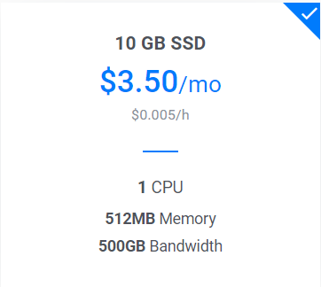

## 自我介绍

## 姓名

**王侨文**

### 工作经历

1. 八年研发工作经验，曾就职于汇丰银行、360、乐信。
   1. 两年Java后端开发，六年移动前端开发。
   2. 在乐信是前端组长，开发的产品有分期乐App会员、乐卡App及后台管理，均是**Vue技术栈**

## 工作流程(看情况)

1. ##### 产品提出需求
   
   1. 产品老大给出产品方向，产品通过数据，提出新增或者优化的需求
   2. 内部跟他的上级过需求，找UI沟通需求设计，找研发沟通是否能实现
   3. 输出tapd及原型图（sketch或者axure画）
   4. 设计人力足够的话，可能给出了设计稿
   
2. ##### 需求答疑

   1. 每周的需求会议安排在周五下午
   2. 研发、测试、产品过一下产品数据，包括上周上线的需求及需求数据
   3. 关于具体的需求，产品给研发后端和前端及测试需求答疑
   4. 需求有设计的疑问的话，设计也会参与
   5. 确定啥时候给设计图、开发人员、上线时候、外部支持，研发SE

3. ##### 前端开发

   1. 跟产品、后端、UI进一步沟通需求。并不是上来就写代码的。沟通需求的时候至少占到整个开发时间的1/3。确定UI设计稿给的时间、哪些接口及接口文档、是否需要外部支持、与后端联调时间、发测试环境上线，上线时间。
   2. 先开发静态页面，后端接口没有完成的情况下，模拟数据来开发
   3. 联调时，需要后端接口自测能走通。ajax请求，拿数据渲染。
   4. 发布测试环境，测试一般会给几个冒烟测试用例，需要自测通过
   5. 发Code Review

4. ##### 上线

   1. 发布预发布环境

   2. 测试提bug->修bug  循环

   3. 预发布ok，**确定发布顺序，回滚策略**，再推灰度

   4. 灰度验证ok,推线上。

   5. 已经是凌晨两点。。。

      

## 996及行业前景（看情况）

1. 曾就职汇丰银行、360、及乐信的工作情况实际上并没有996

2. 程序员群体幽默、上网最方便，也就自黑比较多些。

3. 堂弟和表妹都是在黑马学的UI，拿到薪资后，上周还请我吃早茶

4. 我喜欢讲课，而且黑马想让我传授企业经验

5. 研发团队，前端大多结婚有女友，后端单身或者没有稳定的女友。

   

## 学历及专业对钱景的影响

1. 技能和学历，技能更重要

2. IT这个行业，几个大牛`风中叶`、`阮一峰`、`尤雨溪`都不是计算机专业的，我们研发团队，连续三次绩效最好的同事是专科的，很可能也是黑马毕业的。

3. 如果想进大公司的话，先在小公司磨砺两年，同时自考本科

   

## 关于IT行业青春饭

1. 平安公司团队的平均年龄在31岁

2. 实际的工作不是做算法的，都是应用，copy改而已，同事谁技术比我好，我还真不承认。一个人上升的瓶颈技术只占一小部分，而我们拿技术作敲门砖

3. 哪个行业不是吃青春饭的，心大点。做好当下。

   

## 搭建VPN

#### 应用场景

1. 安装chrome插件
2. google或者stackoverflow一些技术问题
3. 看视频(**X**)

#### 安装教程

推荐vultr服务器，大概1天一元吧。流畅

[Vultr搭建酸酸乳(ssr)的详细教程](https://show.gitbook.io/vultr/wen-zhang-xiang-xi/geng-xin-ban-vultr-da-jian-suan-suan-ru-ssr-de-xiang-xi-jiao-cheng)

[SSR 客户端下载](https://juejin.im/post/5d4bc513f265da03f04cb8ec)

